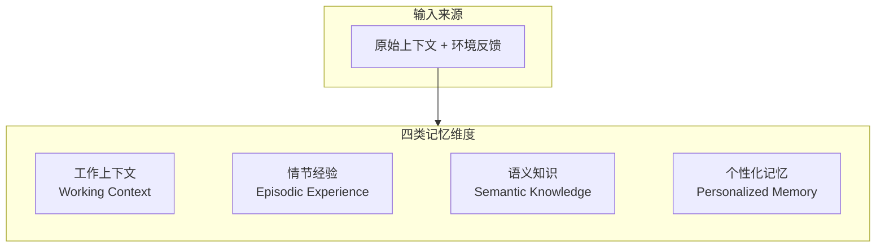
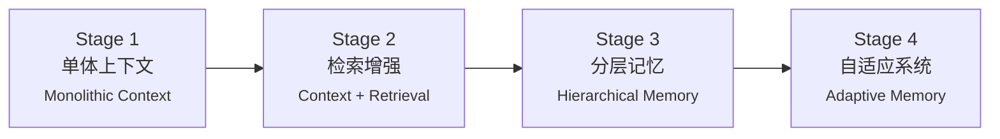
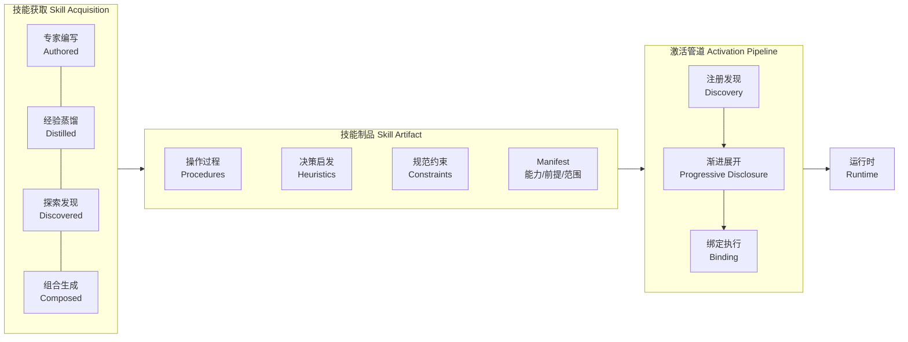
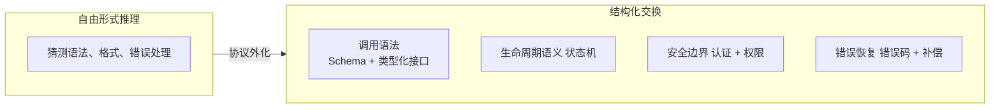
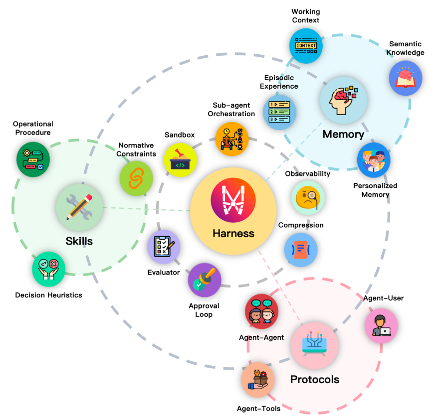
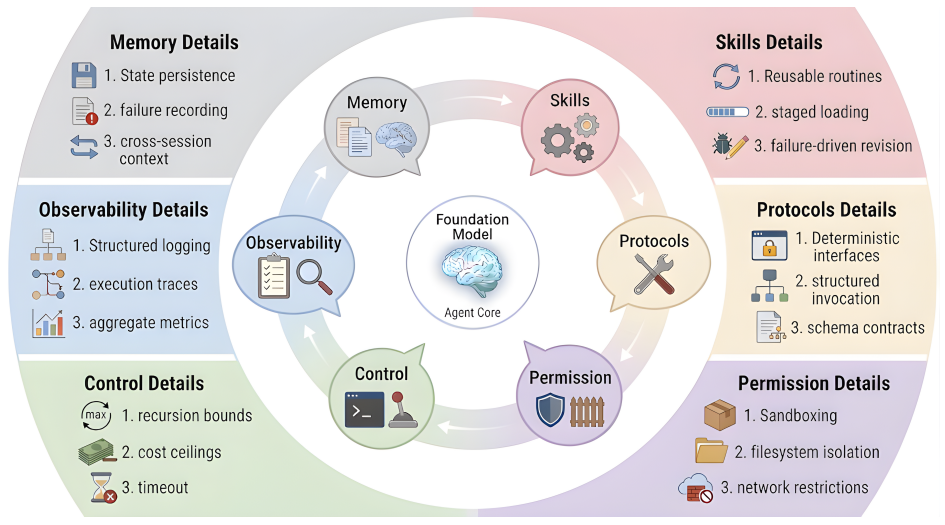
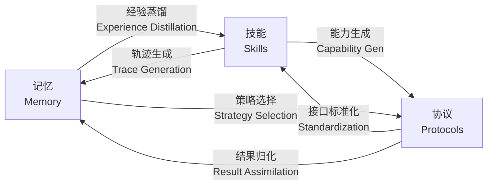

# Externalization in LLM Agents

**论文信息**
- 论文标题：Externalization in LLM Agents: A Unified Review of Memory, Skills, Protocols and Harness Engineering
- 中文标题：LLM智能体中的外部化：记忆、技能、协议与Harness工程综述
- 作者：20余位作者
- 机构：上海交通大学、中山大学、上海创智学院、卡内基梅隆大学、OPPO
- 发布时间：2026年4月9日
- 论文页数：54页
- 论文地址：[arXiv:2604.08224](https://arxiv.org/abs/2604.08224)

---

> **导读**
>
> **问题**：LLM Agent 的能力越来越不取决于模型本身的参数规模，而取决于模型外部的配套设施——持久化记忆、可复用技能、标准化协议、执行环境（Harness）。但缺乏统一的理论框架来解释这一趋势，导致工程实践各自为政。
>
> **核心结论**：
> 1. **外部化统一框架**：借用认知科学"认知人工制品（Cognitive Artifacts）"理论，将 Agent 基础设施的演进统一解释为"把模型不擅长解决的认知负担，通过基础设施转化为更简单的形式"
> 2. **四个技术支柱**：记忆外化时间状态、技能外化程序性专业知识、协议外化交互结构、Harness 作为统一协调层
> 3. **历史演化**：开发者边际精力从 Weights（训练更大模型）→ Context（更好的提示工程）→ Harness（构建更好的运行环境）
> 4. **六条耦合流**：三个模块之间存在系统级耦合，模块设计可独立但系统可靠性只能在 Harness 层整体保障
>
> **结构**：§2 历史背景 → §3-5 分述（记忆/技能/协议）→ §6 Harness 集成 → **§7 交叉作用（核心）** → §8-9 展望
>
> **阅读建议**：工程实践看 §3-6，理解框架看 §7，理论高度看 §2.4/§3.4/§4.5（认知人工制品）

---

## 1. 引言：从“模型主义”到“系统主义”的范式转移

长久以来，AI领域遵循的是一种“模型主义”信仰：模型越强，能力越强。但在Agent的实际部署中，工程师们发现一个普遍现象：**换一个更强的基座模型，效果往往不如改进外部基础设施来得显著**。持久化记忆、可复用的技能文档、标准化的工具接口……这些“不属于模型”的东西，越来越决定着Agent的成败。

论文将这一现象归因于大语言模型固有的**三个结构性错配**：

1.  **连续性错配**：上下文窗口是有限的，模型无法跨会话稳定保持状态，每次对话都是一次“全新开始”。
2.  **一致性错配**：复杂任务需要多步推理，但模型对同一任务在不同时间、不同上下文下的执行结果难以保证一致。
3.  **协调性错配**：模型与工具、服务和其他Agent的交互依赖临时的自然语言约定，API一变，整个链路可能立即失效。

论文的核心贡献，是借用认知科学家唐纳德·诺曼（Don Norman）的**认知人工制品（Cognitive Artifacts）** 理论，提出了“**外部化（Externalization）**”这一统一分析框架。

### 1.1 核心理论框架：外部化

诺曼的理论指出，一张购物清单的作用，不是扩展了你的记忆容量，而是**把一个困难的“回忆”问题，变成了一个简单的“识别”问题**。外部工具通过**表征变换（Representational Transformation）**，改变了任务本身的性质。

论文将这一理论平移至AI领域，提出了“外部化”作为理解Agent架构演进的统一逻辑。**外部化的本质，就是把那些模型不擅长解决的高难度认知负担，通过设计精妙的外部基础设施，转化为模型更容易处理的形式。**


**上图解读（原论文 Figure 1）**：这是一张三面板组合图，构成了整篇论文的核心论点可视化表达：

- **上方面板 — 人类认知外部化弧**：展示了从思维（Thought）→ 语言（Language）→ 文字（Writing）→ 印刷（Printing）→ 计算（Computing）的演进路径。每个阶段都是一种“认知人工制品”，将原本需要大脑内部完成的困难任务转化为更简单的形式。例如文字将“回忆”转化为“识别”，计算将“手动推导”转化为“自动执行”。

- **中间面板 — LLM Agent 外部化弧**：对应人类弧线，展示 LLM Agent 的能力载体演进——权重（Weights）→ 记忆/技能/协议（Memory/Skills/Protocols）→ Harness。这正是论文的核心主张：Agent 的演进趋势是从依赖模型内部参数，逐步走向构建外部基础设施。

- **下方面板 — 文献景图（Literature Landscape）**：将 Agent 领域代表性文献映射到三层能力层（Weights / Context / Harness），展示社区研究重心的实际迁移。与 Figure 2（演进时间线）形成互补视角——Figure 1 给出静态的快照分类，Figure 2 展示随时间的变化趋势。

三条弧线的平行关系编码了一个递归主张：**LLM Agent本身就是运行在人类最新外部化产物（数字计算）之上的人工制品。**


**上图解读（原论文 Figure 2）**：这张图将 2022–2026 年 Agent 领域的研究重心迁移可视化呈现为三层堆叠结构：

- **底部 — Weights 层（2022–2023）**：能力主要来自模型参数。代表性工作包括 GPT-3、LLaMA 等基础模型及 RLHF 对齐技术。此阶段的研究焦点是“训练更好的模型”。

- **中部 — Context 层（2023–2024）**：模型保持冻结，能力通过精心设计的上下文输入来实现。Prompt Engineering、Chain-of-Thought、RAG、ReAct 等技术的兴起标志着研究焦点转向“给模型更好的提示”。

- **顶部 — Harness 层（2024–至今）**：能力来源于围绕模型构建的持久化基础设施。Auto-GPT、LangGraph、Agent 框架、记忆系统、技能注册表、MCP 协议等构成了这一层的研究主体。焦点是“给模型更好的运行环境”。

三层并非相互替代而是叠加共存——Weights 的重要性在任何阶段都不会消失，改变的是开发者投入边际精力的位置。**与 Figure 1 下方面板的文献景图互为补充：Figure 1 是静态分类快照，Figure 2 是随时间变化的动态视图。**

### 1.2 “外部化”的三种能力载体

基于这一理论，论文将LLM Agent演进分为三个历史阶段，清晰地展示了外部化趋势。

| 阶段 | 时间窗口 | 核心载体 | 基本原理 | 典型技术 |
| :--- | :--- | :--- | :--- | :--- |
| **权重层** | 2022-2023 | `Weights` | 能力几乎完全等同于模型参数。知识、推理习惯、程序性步骤都被压缩进静态的权重里。 | 基础LLM（GPT-3, LLaMA）、RLHF |
| **上下文层** | 2023-2024 | `Context` | 保持模型冻结，不修改参数，而是在Prompt中注入指令和示例。将“回忆/生成”问题转化为“遵循/识别”问题。 | Prompt Engineering、CoT、RAG、ReAct |
| **Harness层** | 2024-至今 | `Harness` | 把模型视为一个计算引擎，围绕它构建一套完整的软件基础设施层，用于管理状态、技能、交互和执行策略。 | Auto-GPT、LangGraph、各种Agent框架 |

### 1.3 外部化的四个支柱

论文进一步将外部化的具体形态，归为**四个相互耦合的技术支柱**：

*   **记忆（Memory）**：外化**跨时间的状态**。将那些需要长期或短期保存的信息，从模型有限的瞬时记忆中搬出来，存入外部的记忆系统。
*   **技能（Skills）**：外化**程序性专业知识**。将经过验证的、可重复执行的任务流程（即“程序性知识”），包装成标准化的可调用模块，避免每次都需要模型重新生成。
*   **协议（Protocols）**：外化**交互结构**。为Agent与外部世界（工具、API、其他Agent）的通信，提供标准化的契约，确保交互的确定性和可预测性。
*   **Harness**：外化的**统一协调层**。它不直接提供能力，而是像“操作系统”一样，负责将记忆、技能、协议以及其他基础设施组件，编织成一个可靠的执行环境。

接下来，我们将逐一深入这四个支柱的技术细节。


## 2. 记忆机制：状态在时间维度上的外化

### 2.1 为什么需要外化记忆？

大语言模型（LLM）本质上是一个**无状态（Stateless）** 系统。它的上下文窗口（Context Window）就像一个极小的、临时的、易失的RAM。这导致了两个核心问题：

1.  **“大海捞针”效应（Lost in the Middle）** ：随着窗口内容增加，模型对中间位置信息的注意力会显著下降，长文本中的关键信息可能被忽略。
2.  **成本与延迟**：每次都将所有历史记录打包输入，Token消耗和推理时间会呈线性增长，很快超出经济与性能边界。

因此，为LLM Agent构建独立的外部记忆系统，就如同为CPU配备大容量的硬盘和数据库，是走向自主智能的必经之路。

### 2.2 记忆系统的分类体系

原论文从三个不同的粒度来理解记忆系统，下文依次展开。

#### 2.2.1 四类记忆维度：存储什么

Agent 需要记忆的内容可以归纳为四个维度，它们在同一个系统中**协同共存**：



| 维度 | 管什么 | 生命周期 | 举例 |
|------|-------|---------|------|
| **工作上下文 (Working Context)** | 当前任务活跃状态 | 会话级，用完即弃 | 正在编辑的文件、当前查询 |
| **情节经验 (Episodic Experience)** | 过去的执行轨迹和失败教训 | 持续积累 | 上次踩过的坑、验证过的成功策略 |
| **语义知识 (Semantic Knowledge)** | 领域事实、通用启发式 | 长期稳定 | API 文档、项目规范、最佳实践 |
| **个性化记忆 (Personalized Memory)** | 特定用户/环境的偏好和习惯 | 持久但可更新 | 用户习惯的代码风格、常用配置 |

Agent 执行任务时通常同时依赖全部四个维度：工作上下文知道"正在做什么"，情节经验知道"以前怎么做的"，语义知识知道"领域的最佳做法"，个性化记忆知道"这个用户喜欢什么风格"。

#### 2.2.2 架构的四个演进阶段：如何组织

如果说维度回答的是"存什么"，架构回答的是"怎么组织"。架构方案按成熟度可分为四个递进阶段：



论文对各阶段的定位非常精炼：**Monolithic Context 解决了"有没有"，Retrieval Stores 解决了"装不装得下"，Hierarchical Systems 解决了"怎么组织"，Adaptive Systems 开始解决"怎么优化"。**

架构的演进与四类维度是**正交关系**——可以用任一种架构去组织任一类记忆。例如可以用分层架构管理情节经验，同时用单体内存取工作上下文。

以下依次展开这四种范式的技术细节。

#### 2.2.3 四种架构范式

**范式一：Monolithic Context（单体上下文）**
不依赖外部存储，所有记忆都直接在上下文窗口中处理。这是最简单直接的零基础设施方案，可以达到最高的准确率（72.9%），但代价是P95延迟极高（17.12秒）。它只适合任务粒度小、交互轮次少的场景。

**范式二：Context with Retrieval Storage（上下文 + 检索存储）**
这是最普遍的外部记忆架构。将Agent的对话历史和知识，通过Embedding模型转化为高维向量，存入单一的向量数据库（如FAISS、Milvus）。查询时，通过余弦相似度计算，检索出语义上最相似的Top-K个信息片段。这种模式在准确率和延迟之间取得了比较好的平衡，准确率为66.9%，P95延迟仅为1.44秒。它的核心局限在于缺乏对复杂逻辑关系（如因果关系、层级结构）的建模能力。

**范式三：Hierarchical Memory and Orchestration（分层记忆与编排）**
引入了“热/温/冷”的分层思想，由Agent自身（如通过MemGPT/Letta框架）来自主管理不同数据的存储层级。例如，最近几轮对话放在“热”层（如Redis缓存）以实现毫秒级快速存取；重要的历史信息摘要放在“温”层；长期沉淀的知识库则放在“冷”层（如对象存储）。这种方式能在保证效率的同时，管理超大规模的长期记忆。

**范式四：Adaptive Memory Systems（自适应记忆系统）**
前三种范式仍依赖人工设计的启发式规则。自适应系统更进一步，让检索策略、模块路由乃至遗忘策略对经验反馈做出响应。两个主要方向：

*   **动态模块**：系统在运行时自主调整记忆架构本身。如 MemEvolve 将记忆生命周期分解为独立的编码、存储、检索和管理模块；MemVerse 维护短期缓存和多模态知识图谱，定期将碎片化经验蒸馏为抽象知识。

*   **反馈驱动策略优化**：保持架构相对固定，但通过学习优化检索行为。如 MemRL 通过非参数强化学习更新检索策略；部分框架使用 MoE 门控动态路由查询；GAM 在多轮交互中迭代优化检索条件。

**知识图谱 + 向量混合**是自适应范式下的一种典型实现。Agent 面对多跳推理问题时（如“A公司的CEO和B公司的产品之间有什么间接联系？”），可以在知识图谱中执行 BFS 等图遍历算法，而非依赖语义相似度的模糊匹配。

> **补充**：企业级场景中（如 Atlan 等平台），记忆进一步扩展为受治理的元数据图，记录数据的来源、权限、生命周期等元信息。这一方向不在本论文的四种范式框架内，属于工程实践层面的延伸。

> **论文核心洞见**：记忆系统的成功标准不在于“存了多少”，而在于**当前步骤的上下文是否清晰可读**。存得多但检索弱的系统，给模型呈现的是错误的问题——这比没有记忆更具破坏性。

### 2.3 记忆作为认知人工制品

论文在这个小结回到理论层面，借用 Norman 的认知人工制品（Cognitive Artifacts）理论和 Kirsh 的互补策略（Complementary Strategies）来解读记忆外部化的本质。

LLM 本质上是**无状态生成器**：每次调用从头开始，连续性必须重建而非继承。在短交互中这个限制可以被 prompt 掩盖，但在长周期任务中它成为结构性瓶颈——过去的尝试、未完成的工作、用户特有的事实和环境状态不可能全部留在上下文中而不付出成本、漂移和最终的截断代价。模型面临的任务本质上不可解：在保持无限历史可用的同时，仍能清晰推理当前问题。

记忆外部化改变了这个任务的结构。在 Norman 的框架下，这是一种**表征变换（Representational Transformation）**——将内部的“回忆（recall）”问题转化为外部的“识别与检索（recognition-and-retrieval）”问题。模型不再需要从参数或原始历史中恢复相关信息，而是识别和使用记忆系统已经策展好的历史切片。这与 Norman 对购物清单的分析如出一辙：**关键不是多了额外信息，而是认知任务本身的形式被重组了**。相同的变换在第 2.2 节（上下文层）已经出现；记忆将它扩展到跨会话、跨时间窗口的维度。

这解释了为何**检索质量比存储容量更重要**。一个存储庞大但检索薄弱的系统，仍然给模型呈现了错误的表征——历史存在，但任务没有被转化。相反，一个规模有限但索引、摘要和上下文选择能力强的记忆系统，可以大幅降低下游推理的难度。记忆的成功标准不是“存了多少”，而是“**当前决策是否变得清晰可读**”。

Kirsh 的互补策略提供了另一重视角：智能体不仅可以通过内部更努力地思考来提升性能，还可以**重组外部环境以将认知工作卸载出去**。记忆系统在时间维度上实现了这一策略——Harness 外化了持久性管理、新鲜度控制和相关性过滤，而将解读和上下文判断留给模型。两侧各司其职，形成互补分工。

认知人工制品的视角还解释了常见的失效模式——这些不是简单的实现 bug，而是**表征设计的失败**：

*   **陈旧记忆（Stale memories）**：用过时的表征歪曲当前状态。
*   **过度抽象的記憶（Over-abstracted memories）**：丢失当前决策所需的操作细节。
*   **抽象不足的记忆（Under-abstracted memories）**：用噪声淹没 prompt，反而削弱了外部化本应简化的识别任务。
*   **冲突/被污染记忆（Poisoned/conflicting memories）**：将错误前提嵌入被检索的切片，污染后续推理。

每一次失败都不是因为存得太多或太少，而是因为**没有将历史转化为可用的当下**。

最终，记忆不仅仅是扩展有效上下文的工程便利。**它是一个重塑智能体时间负担的认知人工制品**。通过将无限的回忆转化为有边界的策展检索，它改变了模型在每个决策点面对的任务。连接全部分类体系——从单体上下文到自适应系统——的底层设计目标是同一个：**在正确的时刻让正确的历史变得清晰可读，让模型有限的推理能力花在推理上，而不是花在回忆上。**

## 3. 技能工程：程序性专业知识的外化

### 3.1 为什么需要技能？

技能外部化解决的是智能体的**程序性负担**。LLM 原则上“知道”如何完成一个任务，但可靠执行仍然需要在每次尝试时重建工作流、默认值和约束条件。随着任务长度、环境特性和分支决策数量的增长，这种负担表现为**程序性方差（procedural variance）**：遗漏步骤、工具使用不稳定、停止条件不一致。

与此对应，技能引入的表征变换是：从**重复综合（repeated synthesis）** 转向**可复用的过程（reusable procedure）**。不再要求模型每次从权重或临时 prompt 中重新生成任务特定的 know-how，技能系统将其打包成可发现、可加载、可修订、可组合的显式制品。这主要不扩展 Agent 的动作集，而是**改变了模型在运行时面对的任务：从发明工作流变成选择和遵循工作流**。

### 3.2 从执行原语到能力包

论文将技能系统的成熟度演进概括为三个阶段，每个阶段提升一层抽象：

| 阶段 | 核心问题 | 代表性工作 | 局限 |
|------|---------|-----------|------|
| **Stage 1：原子执行原语（Atomic Execution Primitives）** | 模型能否可靠地调用工具？ | **Toolformer**（学会何时调用工具、构造参数、整合结果） | 单元是动作原语而非技能，没有可复用的过程知识 |
| **Stage 2：大规模原语选择（Large-scale Primitive Selection）** | 工具增多后如何选？ | **Gorilla**、**ToolLLM**、**ToolNet**（检索、排序、动态选择） | 单元仍然是工具而非过程，多步行为仍然隐含在 prompt 或参数中 |
| **Stage 3：技能作为打包的专业知识（Skill as Packaged Expertise）** | 过程知识能否被显式打包复用？ | 程序式技能归纳、SOP 引导 Agent、计算机使用技能图 | 真正的技能阶段：know-how 成为可加载、可组合的外部化制品 |

第三阶段是关键转折——能力的组织不再是“能调什么工具”，而是“**有一类任务应该如何被完成**”。

论文 Figure 5 展示了技能的完整生命周期：



一个标准化的技能，其外部表现形式通常是一组规范化的文件：
```text
/skills
  └── pdf_parser/         # 技能根目录
        ├── SKILL.md      # 元数据定义：名称、版本、依赖、输入输出schema
        ├── handler.py    # 核心执行逻辑（Python代码）
        ├── config.json   # 技能专属参数配置
        └── templates/    # 可选：模板资源文件
```

其中 `SKILL.md` 用标准 Schema 描述技能的接口，将过程知识从不可见的状态变为可检查、可修订、可治理的显式对象。

### 3.3 技能的外部化机制

技能外部化不仅是"写下指令"——关键在于过程知识能否在运行时被**发现、加载、解释、绑定和执行**。论文识别了五个核心机制：

#### 规范（Specification）
外部化的起点是描述层。一个成熟的技能规范通常以 `SKILL.md` 等形式存在，覆盖五类信息：能力边界（解决什么问题）、适用范围（什么场景可用）、前置条件（安全运行的前提）、执行约束（操作限制）、以及正反示例（减少模型的歧义解释）。规范的价值在于将过程知识从不可见的状态提升为可检查、可修订、可治理的显式对象。

#### 注册与发现（Discovery）
技能成为显式制品后，自然面临注册与发现的问题。Agent 不可能为每个任务加载所有可用技能，因此需要某种注册中心和检索机制。发现过程可能基于语义检索、结构化元数据或任务分解——与工具调用的区别在于，这里检索的是"哪一单元的过程知识适合当前问题"，而非"哪个工具可以调用"。

#### 渐进展开（Progressive Disclosure）
发现一项技能不意味着立即将其完整内容注入上下文。长上下文不一定可靠，详细指令反而可能成为推理噪声。因此技能系统采用分层加载策略：最低层只暴露技能名称和简短描述（足以判断是否相关）；中间层暴露适用条件和主要约束；最深层次才加载完整的步骤指南、异常处理和示例。**是否加载更多细节，本身成为一个运行时决策。**

#### 执行绑定（Execution Binding）
技能通常本身不是动作执行者，需要绑定到更低层的运行时基底——工具、文件、API、子 Agent、协议端点等。以 MCP 等 Schema 化接口为典型代表，绑定层使技能可发现、可调用，而不将技能本身退化为工具或协议。

#### 组合（Composition）
技能的真正价值在组合中得以充分发挥。与原子化的工具不同，技能可以参与高阶的结构化协调：串行执行、并行分工、条件路由、递归调用子技能。这使得技能成为可调度的运行时单元，而非孤立的指令集合。例如一个数据分析报告技能可拆分为数据清洗、统计分析、可视化、叙述合成等子技能的协调组合。

> **与 MCP 的关系**：MCP（Model Context Protocol）是 Agent 与工具之间的标准化调用协议，解决的是“怎么调工具”的问题（详见第 4 章）。技能解决的是“一组工具调用应该按什么流程组织”的问题。两者互补：技能在 MCP 暴露的工具接口之上编排流程，而 MCP 为技能提供可调用的标准化工具表面。

### 3.4 技能作为认知人工制品

从 Norman 的认知人工制品理论看，技能系统本质上是一次**沿能力组织维度的表征变换**。没有外部化技能时，模型必须每次从内部参数中概率性地恢复过程知识，同一 prompt 在不同上下文下可能产生不同的分解、分支决策或停止条件。有了技能，过程负担被移入显式的外部表征中，模型的任务转向**解读当前情境、判断技能是否适用、遵循相关指导并处理局部异常**。

这与 Kirsh 的**互补策略**一致：智能体不仅可以通过内部更努力推理来提升性能，还可以重组外部环境以卸载认知工作。LLM 在稳定复现长多步过程方面并不可靠，但在**读取显式指导、匹配当前上下文、在约束下适配执行**方面相对擅长。技能正是这一定位的工程化实现——它将过程定义、约束和最佳实践外化到制品中，而将解读、上下文匹配和异常处理留给模型。

技能不仅仅是更长的 prompt 或更复杂的工具包装。**它是一种用于组织 Agent 程序性能力的认知人工制品。** 在系统规模上，程序性专业知识从不透明、难审计的参数空间中移出，进入可检查、可修订、可组合的外部结构——这就是技能外部化的根本意义。

## 4. 协议工程：交互结构的外化

### 4.1 交互困境：为什么需要标准协议？

没有标准协议时，每次外部动作都部分成为一个**自然语言推理问题**：模型必须推断操作意图、猜测正确的参数格式、重建可接受的约束条件，并希望接收方能正确理解结果。这在短流程中尚可容忍，但当工作跨越多步、多个工具、多个 Agent 或审批边界时，基于 prompt 约定和脚本拼接的交互方式变得脆弱且不可扩展。

协议通过将开放式推理替换为有边界的结构化任务来解决这一问题：填充类型化字段、遵循声明的状态转换、接收结构化反馈。模型仍然需要判断是否以及何时行动，但不再需要在每一步都即兴发明交互的语法和语义。



协议的设计空间可沿**四个维度**展开，这也是协议工程要外化、结构化的核心内容：

1.  **调用语法**：协议通过预定义的模式（Schema）和类型化接口，明确了每个参数的名称、类型、顺序和返回结构，使模型从“猜测语法”变为“填充字段”。
2.  **生命周期语义**：在复杂任务中，协议通过显式的状态机（State Machine）或事件流，定义了每一步的操作权限、状态转换和执行者，确保了任务流程的可预测性。
3.  **安全边界与权限**：协议规定了Agent能做什么、不能做什么，并对敏感操作强制要求审批和审计，确保系统在安全边界内运行。
4.  **错误恢复策略**：协议会定义标准化的错误类型和格式（如机器可读的错误码），使Agent能识别错误并自动采取补偿措施，而非简单崩溃。

### 4.2 协议家族一览

论文按交互对象梳理了协议生态。不同协议外化不同维度的交互负担：

- **Agent-Tool 协议**：以 **MCP（Model Context Protocol）** 为代表（Anthropic 发起、已贡献给 Linux Foundation）。它标准化工具的发现（`tools/list`）、Schema 检查和调用（`tools/call`，基于 JSON-RPC 2.0），使工具生态系统与模型供应商特定的 function calling 格式解耦。
- **Agent-Agent 协议**：以 **A2A**（Google，已移交 Linux Foundation）为代表。它通过 Agent Card 标准化能力发现，支持面向任务的通信、状态更新和流式进度追踪。**ACP**（IBM）和 **ANP** 提供了不同权衡的替代方案。
- **Agent-User 协议**：以 **A2UI** 和 **AG-UI** 为代表。前者让 Agent 以受约束的声明式格式描述 UI 结构，后者标准化运行时的状态流事件（run start、text emission、tool call、error 等）。两者互补，使人机交互变得可观察、可复用、可移植。
- **领域协议**：如 **UCP**（电商流程标准化）和 **AP2**（支付流程标准化），为高风险垂直场景编码专门的治理规则。

厘清这些协议的边界有助于避免概念混淆：**MCP 管“怎么调工具”，Skills 管“走什么流程”，Memory 管“上次聊到哪了”**——三者各司其职，共同构成 Harness 的交互基础设施。

### 4.3 MCP：Agent工具调用的“通用语言”

在众多协议方案中，论文重点分析了 **MCP**——它已成为事实上的主流标准之一。MCP 采用**客户端-服务器（Client-Server）** 架构，但不是将所有工具 API 直接暴露给 LLM，而是通过 MCP Server 作为代理层。Server 遵循 MCP 规范，将工具的元数据和调用接口进行标准化封装。Agent（MCP Client）通过 `tools/list` 端点发现工具，通过 `tools/call` 端点按标准化 JSON-RPC 2.0 格式调用工具，实现了客户端与工具间的彻底解耦。

这一分离也改善了治理能力：调用通过协议层中介而非模型自由生成的调用文本，敏感数据处理、权限检查和审计边界因此可以被更显式地管理。

### 4.4 协议在 Harness 中的工程集成

当协议被嵌入一个运行中的 Agent 系统时，它不再是孤立的通信规范，而是 Harness 层三个治理面的一部分。论文识别了三个关键集成点：

**意图捕获与规范化（Intent Capture and Normalization）**：将模型产出的自由文本翻译为运行时可以验证和执行的显式指令。成熟 Harness 在执行前将自由形式的提议映射为协议对象，检查其是否满足当前上下文和权限边界，不符合契约的请求被拒绝或修正。这并不消除模型判断，而是将交互中脆弱的部分从隐式推理迁移到可检查的接口上。

**能力发现与工具描述（Capability Discovery and Tool Description）**：协议化的发现取代了“知识写在 prompt 中”的旧模式。在会话启动或阶段切换时，运行时通过标准化消息暴露当前可用工具及其 Schema。这既减少了上下文膨胀，也使能力边界可通过结构化元数据来治理。

**会话与生命周期管理（Session and Lifecycle Management）**：长周期 Agent 并非孤立的单次调用。运行时必须在多轮、多上下文窗口、多执行阶段之间保持交互状态。协议层将执行视为带命名状态和转换规则的生命周期对象，推进该对象、发出状态变更事件，并在必要时协调检查点或恢复。

### 4.5 协议作为认知人工制品

在三种外化形式中，协议的效力最为直接，因为它**将一整类推理负担从模型的思考路径中彻底移除**。没有协议时，每次交互都带有自然语言推理的成分；有了协议，模型只需要填充类型化字段、遵循声明的状态转换、接收结构化反馈。

这与 Kirsh 的**互补策略**一致：LLM 擅长解读意图、在选项中做出选择、适应上下文，但在不同接口要求下始终产生格式良好的结构化输出方面并不可靠。协议实现了一种互补分工——模型贡献判断和意图，协议表面贡献格式、验证和生命周期控制。任何一方单独都不足够，两者结合才产生既灵活又有纪律的交互。

正因如此，协议不能被简化为记忆或技能：**记忆外化随时间学到的内容，技能外化任务应如何执行，协议外化使前两者以受控行动进入世界的纪律。** 记忆需要受治理的读写路径，技能需要可绑定的接口，两者都依赖协议以可检查、可审计、可恢复的方式跨越系统边界。协议不是围绕“真正智能核心”的次要管道，而是一种**认知交互人工制品——使其他外部化智能形式变得可操作的表征基础设施**。

## 5. Harness工程：统一的外化协调层

如果说记忆、技能、协议分别解决了特定类型的能力外化，那么**Harness就是将所有外化组件集成到一个统一框架中的关键系统层**。



**上图解读（原论文 Figure 3）**：展示了外部化Agent的完整架构。Harness位于中心，协调三个外部化维度——Memory（跨时间状态外部化）、Skills（程序性专业知识外部化）、Protocols（交互结构外部化）。外围环绕着沙箱（Sandbox）、可观测性（Observability）、评估器（Evaluator）、审批循环（Approval Loop）等操作元素，共同构成完整的“感知-决策-执行”闭环。



**上图解读（原论文 Figure 7）**：展示了Harness的完整架构布局。基础模型（Agent Core）位于中心，六个Harness维度构成协同环：三个外部化模块——Memory（状态持久化、失败记录、跨会话上下文）、Skills（可复用例程、分阶段加载、迭代修订）、Protocols（确定性调用、结构化契约）；以及三个运维面——Permission（沙箱隔离、系统隔离、网络限制）、Control（递归边界、成本悬崖、超时）、Observability（日志、指标、追踪等）。箭头表示Harness循环中各维度之间的持续流动。

### 5.1 Harness 的功能组成与六个分析维度

从功能层面看，Harness 包含四类外部系统：**持久化记忆和项目级上下文、可复用的技能和执行例程、用于与工具和服务确定性交互的协议化接口、以及使这些元素可操作的运行时基础设施**。

论文不从组件清单的角度讨论 Harness，而是从运维面（Figure 7 中的 Permission、Control、Observability）中分解出六个反复出现的分析维度，并辅以当前系统的具体实现来说明每个维度的设计空间：

**1. Agent 循环与控制流（Agent Loop and Control Flow）**
循环是 Harness 的时间骨架，实现 perceive-retrieve-plan-act-observe 的迭代闭包。实际系统存在多种变体：单层循环将推理和动作交织在一次生成中；层次式设计分离规划 Agent 和执行 Agent；多 Agent 设计将子任务路由到具有不同工具集和权限范围的专门 Agent。Harness 在裸循环之上增加了治理：最大步数、递归深度限制、单步成本上限和超时约束。这些控制定义了 Agent 推理得以展开的操作边界。

**2. 沙箱与执行隔离（Sandboxing and Execution Isolation）**
当 Agent 写文件、执行命令或调用 API 时，Harness 必须决定暴露多少环境、如何限制意外副作用。当代系统在不同粒度实现隔离：Codex 风格的 Agent 在每个任务内使用专用云沙箱（独立文件系统快照、网络限制、资源配额）；另一些系统暴露渐进式权限模式——从完全自主执行到每次工具调用都需审批。沙箱不仅是安全围栏，更是**认知边界**——通过移除不相关状态、限制危险动作、使工作空间可检查，它改变了模型必须推理的内容。

**3. 人工监督与审批门控（Human Oversight and Approval Gates）**
完全自主在部署中很少合适。论文描述的生产系统通常在 Agent 循环中插入钩子系统（hook system），将验证逻辑附加到特定生命周期事件上——如工具调用、文件写入、子 Agent 生成——并通过应用层将高风险动作路由到审批工作流。因此 Agent 的自主程度成为一个可调参数，按任务、按工具、按组织策略分别配置。

**4. 可观测性与结构化反馈（Observability and Structured Feedback）**
Agent 行为的高可变性使可观测性不仅是调试工具，更是操作基础。生产系统产生结构化的执行追踪——每一次模型调用、工具调用、记忆读写和决策分支的日志——用于调试、合规审计和事后分析。这些追踪也构成内部反馈回路：失败的工具调用触发记忆写入，重复失败的模式标记技能需要修订。可观测性因此是 Harness 从自身运行中学习的机制。

**5. 配置、权限与策略编码（Configuration, Permissions, and Policy Encoding）**
部署中的 Harness 通常跨多个作用域分层配置——用户级、项目级、组织级——使同一基础 Agent 在不同策略体制下运行，而无需修改模型或技能制品。权限和策略充当**外部化治理**：否则需嵌入 prompt 的约束被编码为运行时强制执行的声明式规则。

**6. 上下文预算管理（Context Budget Management）**
上下文窗口是所有 Agent 系统中最稀缺的共享资源。记忆检索、技能加载、协议 Schema、工具描述和模型自身的推理轨迹都竞争同一有限的 token 预算。现系统通过多种策略联合管理：摘要压缩旧历史、阶段式加载（仅在检测到匹配任务模式时才加载详细过程指导）、优先级淘汰（降级相关性衰减的上下文条目）。Harness 协调这些策略，因为最优分配取决于当前执行阶段——早期规划阶段可能需要更多记忆而非技能细节，后期执行阶段则相反。

> 论文强调：这六个维度不是实现清单，而是设计空间的分析框架。关键不是组件的准确清单（那会因实现而异），而是它们的集体角色——**创造使模型推理能够稳定支撑持续工作的条件**。

### 5.2 Harness 作为认知环境

Harness 的意义超越了通常软件工程意义上的基础设施。它不仅仅是支撑一个已形成的智能，而是**通过决定推理展开的环境来塑造 Agent 的有效认知**。它调节什么进入 Agent 的感知域、什么在轮次和会话间保留、哪些操作可调用、哪些动作需审批、哪些中间状态暴露给修订、哪些形式的失败可检测和可恢复。Agent 能知道、记住和做的事情不受模型权重单独决定，而受周边系统提供的访问、持久化和行动条件的制约。

从 Norman 的认知人工制品理论看，Harness 以系统规模符合这一描述：它不只是用更多上下文或更多工具增强模型，而是**重组模型面临的表征问题**。通过外化记忆、形式化流程、引入显式控制点、约束执行，Harness 将无限任务转化为结构化环境中的引导行动。

从 Kirsh 的互补策略看，Harness 是一个**认知生态位（cognitive niche）**——信息、工具、权限和流程被安排好，使期望行为更容易执行、不期望行为更难产生。Agent 的能力因此部分是一种生态成就：它源于嵌入一个其组织能有效引导认知的环境。

从分布式认知（Distributed Cognition）的框架看，Agent 系统的操作智能分布在模型参数、外部记忆存储、可执行技能、协议定义、工具表面、监控系统和治理运行时约束之间。**Harness 是协调这个分布式系统的媒介。** 说它是认知环境比说它是基础设施层更准确——基础设施是其表现形式之一，而**环境结构化——设计认知展开的条件——是其更深层的功能**。

## 6. 模块间交叉作用：六条耦合流

§2–§4 分别孤立分析了记忆、技能、协议三个外部化模块，§5 展示了 Harness 如何将它们集成到统一框架中。但论文强调：**真实系统的能力来源于模块之间的交互，而非模块自身的堆叠**。这一节是完成"外部化统一框架"论证闭环的关键——如果模块间不存在有意义的耦合，Harness 就只是"锦上添花"而非"必要条件"；而六条耦合流的存在表明，外部化本质上是一个**系统架构设计问题，而非组件选型问题**。

§2–§4 分别孤立分析了记忆、技能、协议三个外部化模块，§5 展示了 Harness 如何将它们集成到统一框架中。但论文强调：**真实系统的能力来源于模块之间的交互，而非模块自身的堆叠**。

### 6.1 模块交互图



六条耦合流的细节：

*   **Memory ↔ Skills（经验蒸馏）**：记忆中积累的成功执行记录，经提炼后可以抽象为可复用的技能流程。一段反复出现的调试路径，最终被固化为一个“标准排查技能”；反过来，技能执行产生的新记录又写回记忆，为未来的蒸馏提供更丰富的原料。
*   **Memory ↔ Protocols（轨迹影响协议选择）**：过往的协议调用结果（成功/失败/超时）被记录在记忆中，影响未来同一场景下的协议选择。如果某个工具在类似任务中反复失败，Agent 可以通过记忆中的历史数据学会优先选择备选路径。
*   **Skills ↔ Protocols（标准接口催生新技能）**：协议定义了工具调用的标准化接口，而技能正是在这些接口之上编排而成的业务流程。每一个稳定的新接口（如 MCP 新增的 tools/call 端点）都是一族新技能的“种子”。

*   **Protocol → Memory（结果归化）**：每次协议交互产出状态——工具输出、审批事件、错误载荷、委托结果——必须被 Harness 归化写入记忆，否则下游流程（特别是经验蒸馏和策略选择）将在不可靠的前提上运行。协议层提供了记忆存储的证据，记忆反过来影响新的技能选择和协议路由，形成一个完整的闭环。

这一闭环引出了三个系统级的动力学特性：

1. **自我强化循环**：更好的记忆产生更精准的技能蒸馏，更好的技能产生更丰富的执行轨迹，更丰富的轨迹进一步改善记忆。这种正反馈可以加速能力增长，但也会放大错误——一条有毒的记忆可能导致有缺陷的技能，其执行轨迹进一步污染记忆，这种级联无法被单一模块阻断。

2. **上下文预算竞争**：记忆检索、技能加载和协议 Schema 都占用 token。扩展一个模块的上下文空间必然压缩其他模块。Harness 必须在每步执行中协调它们之间的预算分配。

3. **不同时间尺度**：协议交互通常是同步且快速的；技能加载发生在任务或子任务边界；记忆蒸馏和技能演化跨越多个会话或更长时间。一个只优化快循环的 Harness 可能忽视决定长期能力增长的慢循环。

### 6.2 模块在模型输入/输出边界的表现

三个模块不仅相互耦合，还各自在模型的输入和输出边界上施加影响：

*   **记忆在输入侧**：通过向上下文注入策展的历史切片，改变了模型感知的“当下”。记忆的质量决定了模型是在正确的问题表征上推理，还是在噪声或过时的信息上推理。
*   **技能在输入/输出侧**：在输入侧加载过程指导，约束模型的推理路径；在输出侧规范化动作格式，降低工具调用错误。技能既限制又引导模型的生成空间。
*   **协议在输出侧**：通过强制结构化契约（JSON Schema、MCP 消息、OpenAPI 调用），约束模型的生成空间，使下游执行可治理。输出不再是待解释的语言，而是位于显式接口中的机器可读动作提议。

### 6.3 参数化能力 vs. 外化能力的权衡

论文并没有一味推崇外化，而是严肃地指出了这是一个**系统级的分区问题**——不是模型智能与基础设施智能之间的零和竞争。以下几个维度帮助决定哪些能力应外化、哪些应保留在参数中：

*   **变化频率**：快速变化的知识（API、组织结构、环境状态）是外化的强候选——外部存储可以即时更新且保留版本和来源，而持续微调来保持模型时效性面临灾难性遗忘且不切实际。稳定的基础能力（语言理解、通用推理）仍自然地由参数承载。
*   **可复用性**：跨任务、用户或 Agent 反复需要的能力，外化可改善可移植性和组合性。显式的技能和接口制品可以被共享、版本化和跨运行时复用。一次性或高度特化的行为则未必值得打包和维护的开销。
*   **审计与治理**：当检查、审批、回滚或策略执行重要时，外部化制品比不透明的参数化行为具有明确优势。符号化接口支持断路器、Schema 验证和可追溯的执行记录——这是权重本身做不到的。Agent 行动后果越重大，就越应将治理逻辑外化。
*   **延迟与上下文负担**：外化将计算成本从模型前向传播转移到周边系统。检索、路由、解析和工具调用都会引入延迟。每项被检索的制品也竞争有限的上下文预算。对于极快、低方差或纯语义的任务，让模型依赖内部参数知识仍然更简单可靠。

最优分区不是静态的——随着模型能力增强和外部化基础设施成熟，边界将持续移动。

## 7. 总结与启发

这篇综述为我们提供了一个强大的理论框架：“外部化”。**所有的外部基础设施，本质上都是通过改变任务的性质，来弥补模型的先天不足。** 记忆用检索代替回忆，技能用选择代替生成，协议用填充字段代替临场猜测。Harness则将这些机制编织在一起。

对于Agent系统的开发者而言，这篇综述带来了一个核心的实践启发：**当你的Agent表现不佳时，第一反应不应该是去等待或寻找一个“更强大”的模型，而是应该系统性地审视你所构建的外部基础设施。** 你可以从这四个维度着手进行优化：检查它的**记忆系统**是否足够持久和精准？技能库是否完整且可复用？交互**协议**是否清晰、标准且易于调试？以及最重要的，**Harness**是否将这些能力有效、稳定地编织在了一起？大多数情况下，在这些“非模型”层面上的投入，其回报会比简单地更换模型更大、更快、也更可控。


## 延伸资源

- **原始论文**：`arXiv:2604.08224` (54页，技术报告) | [PDF链接](https://arxiv.org/pdf/2604.08224)

