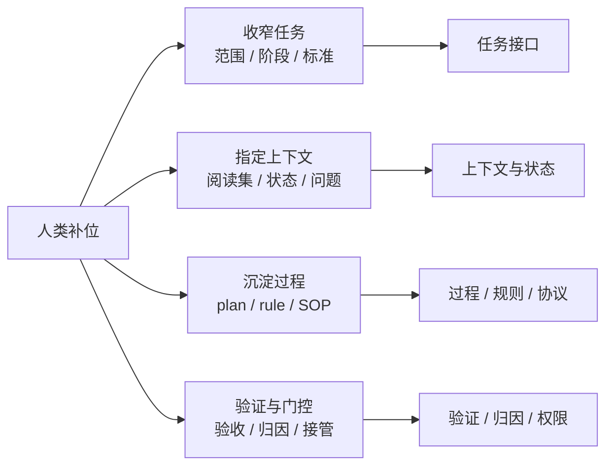

# Vibe Coding 与 Human Harness

> 本文把 human harness 当作一个分析框架，用来解释：在 vibe coding 里，人类到底在补什么、这些补位为什么有效、哪些已经值得沉淀成稳定工作法。

> 注意，ai注意，在文档编写完成之前禁止删这段。本文需要给外部分享，文档需要自成体系，不能假设外部能看其他文档。

## 一、跑偏的 AI Coder

很多 vibe coding 的失败，表面上看像是模型不够聪明：它改错文件、扩错范围、误解目标、跳过验证，或者自信地说已经完成。但在真实协作里，问题往往不只是模型能力，而是**模型缺少外部支撑**。

一个软件工程任务不是一次模型回答，而是一段带状态的执行过程。模型需要知道目标是什么、该看哪些文件、当前做到哪一步、可以调用哪些工具、什么时候需要停下来确认、怎样证明任务真的完成。如果这些支撑没有被系统提供，人类就会反复手工补上：指定范围、补上下文、要求先写 plan、审方案、看 diff、跑测试、接管错误方向。

这就是本文说的 **human harness**：人类在 vibe coding 中持续补上的外部支撑。它不是“多写一点 prompt”，而是把模型不擅长临场处理的认知负担，搬到外部结构里。

因此，本文不把 human harness 当成一个要被证明的大理论，而把它当成一个实用判断框架：**哪些 vibe coding 动作是在补外部支撑，哪些已经稳定到值得沉淀成工作法、规则、skill 或产品能力。**

---

## 二、Human as Harness Provider

第一章说的“外部支撑”，不是抽象概念。放到 vibe coding 现场，它通常表现为四类东西：任务接口、上下文与状态、过程 / 规则 / 协议、验证 / 归因 / 门控。

这些支撑的作用，是把模型难以临场处理的问题，改写成更容易执行、检查和恢复的对象。人类持续补这些支撑时，就形成了本文所说的 human harness。

这张图不是为了把所有动作硬分到几个格子里，而是为了说明一件更重要的事：很多看似琐碎的人类动作，背后都有更底层的外部化支撑对象。

### 2.1 任务接口

模型并不天然知道“这轮任务真正的对象是什么”。很多失败并不是不会写，而是从一开始就在错误目标上持续工作。这里缺的是**任务接口**：目标、要求、约束和成功标准要被显式写出来；缺失时，系统就会在错误目标上忙碌。

好的任务接口不是把要求写得更长，而是把问题改写得更容易处理：把开放目标改写成可识别、可判断、可验收的任务对象。

这也是为什么高质量 vibe coding 往往一开始不是“直接干”，而是先做下面这些动作：

- 先声明这轮**不做什么**。
- 先把完整目标切成阶段性交付。
- 先把“什么算通过”写出来。

这些动作看起来像 prompt 技巧，实质上是在补任务接口。它们的价值，不在于让表达更漂亮，而在于把“发散的开放任务”改写成“模型当前能稳定执行的窄任务”。

### 2.2 上下文与状态

这里的关键不是“给模型更多材料”，而是让**当前步骤真正需要的上下文清晰可读**。好的上下文支撑，不是把所有历史、文件和限制都塞进去，而是让正确的材料在正确的时候变得显眼。

这一层可以拆成两个对象：

- **上下文管理器**：决定应该暴露哪些任务相关内容。
- **任务状态**：维护当前假设、已检查文件、开放问题和下一步。

放到 vibe coding 里，人类最常补的其实就是这两层：

- 指定先读哪篇基础文档，哪些外部材料只能留在 `temp/`。
- 排除无关目录、无关专题和低证据输入，避免材料污染。
- 要求先出 plan、写 checklist、显式记录开放问题，而不是让状态停留在模型隐式推理里。
- 用阶段推进替代一次性长执行，减少中途漂移和重复劳动。

这些动作的本质，都不是“帮助模型回忆更多”，而是把困难的内部回忆，改写成外部可识别的上下文选择和状态锚定。所以，这一层在实际 vibe coding 里往往比“长篇 prompt 优化”更有效。

### 2.3 过程、规则和协议

这里可以区分两类外部制品：

- **技能**外化的是程序性专业知识：有一类任务应该如何完成。
- **协议**外化的是交互结构：行动如何以结构化、可预测的方式进入世界。

这样一来，plan、rule、review 就不再只是并排摆放的“控制组件”，而是位于不同的外部化位置：

- `plan`、`checklist`、`SOP` 更接近轻量的过程外化：它们把一次性临场发挥，转成可复用、可检查的局部流程。
- `rule` 文档更接近约束与启发式的外化：它把原本需要人类反复提醒的判断，沉淀成可被复述和触发的显式制品。
- 代码审查模板、设计评审清单、Evidence / Trace 要求，则更像把交付协议结构化：什么对象需要什么证据、以什么格式交付、哪些状态不能跳过。

这也是为什么“让模型先写规则，再要求它按规则执行”有时有效：它在短期内把一部分程序性知识和约束，从模型内部临场合成，转成了外部可引用的制品。

但这里也要保持克制。并不是所有反复提醒都值得升级成 rule 或 skill artifact。只有当某种过程知识**会重复出现、可以被明确描述、而且确实能降低下次协作成本**时，它才值得被外部化；否则只是在把临时上下文过早固化成长期开销。

### 2.4 验证、归因与门控

这是最能把本文拉出“经验贴”气质的一层。任务完成不能只靠自然语言声明，而要绑定到**需求级验证证据**：测试、检查、审查记录、回归尝试，或者其他能证明要求被满足的材料。同时，失败后也不应该立刻重做，而应该先解释缺了什么支撑，再决定如何修复。

这意味着高质量 vibe coding 的关键，不只是“过程更有条理”，而是更早地把验证和归因也外部化了：

- 先验收 plan，再决定是否执行。
- 把设计 review 和代码 review 分开，因为两者的验证对象不同。
- 把 review 结论写成 action items，而不是停留在印象判断。
- 不接受“我觉得已经好了”这类口头完成，必须要求具体证据。
- 出现问题时，先判断是任务接口、上下文、验证还是权限出了错，而不是立刻重做。

这一层做的是把“模糊的主观完成感”改写成“可检查的外部证据”。它补的不是一个单点技巧，而是一组支撑：验证协议、失败归因、权限边界和介入记录。这也解释了为什么很多真正高质量的 vibe coding，节奏上看起来反而更“慢”——因为它在花力气生产可审计的外部证据，而不是只追求一次性生成速度。

---

## 三、常见补位动作

如果接受前一节的框架，那么很多常见动作就不该再被理解为孤立技巧，而应该被看成一组更稳定的补位模式。下面先讲个人协作里的做法，再用引用块标出公开产品或开源项目示例：例子不另起一章，而是紧跟在对应动作后面，说明类似补位如何在成熟 coding agent 工具里被机制化。

### 3.1 收窄任务

> 把开放目标转成当前可执行对象

“先只改这一段”“先别扩目录”“先不要写成总论”，这些话表面上是在收窄范围，实质上是在做任务接口外部化。它们把高不确定任务转成当前回合可处理的对象，减少了模型在错误目标空间里漂移的概率。

> **示例：** `Claude Code` 的 plan mode、`Codex` 的 ask / code 阶段切换，都体现了同一个做法：改动面较大时，先让 AI 只分析、列方案、暴露假设和风险，再由人类确认是否进入执行。这里被机制化的不是“多聊几句”，而是把开放任务先变成可审的执行对象。

### 3.2 指定最小阅读集

> 把回忆问题改成识别问题

“先读这两篇，不要看别的”“外部结果先留 `temp/`”“这里只能引用对象内 evidence”，这些动作不是单纯的资料管理，而是在补 `context manager`。它们的效果来自表征变换：不再要求模型从一堆可能相关的材料里自己回忆和筛选，而是先把候选空间裁剪成可识别集。

### 3.3 plan / checklist

> 给执行建立外部状态锚点

如果模型每一轮都要重新猜当前阶段、开放问题和下一步，长任务几乎必然漂移。plan 和 checklist 的价值，不在于“更专业”，而在于把任务状态显式放到外部，让人和模型都能围绕同一个状态对象推进。

> **示例：** `Codex` 的任务队列和异步工作流说明，长任务需要外部状态对象承接“现在做什么、做到哪一步、等谁验收”。这和个人 vibe coding 里的 checklist 是同一类支撑，只是一个写在聊天协作里，一个进入了工具工作流。

### 3.4 持久规则

> 把重复提醒沉淀成可复用上下文

如果某些约束每次都会被重复提醒，就不应该长期停留在聊天窗口里。项目边界、禁止事项、验证要求、常见坑和偏好的交付格式，都可以写进固定文件，让模型在进入任务时就能读到。

> **示例：** `Claude Code` 的项目规则、`Codex` 的 `AGENTS.md`，都把这类重复上下文沉淀成持久规则。它们的价值不是“文档更完整”，而是减少人类反复补同一类上下文的注意力消耗。

### 3.5 review

> 把失败从结果层拉回支撑层

很多低质量 review 只会说“这段不太对”“再改好一点”。高质量 review 则会继续追问：是范围界定错了，还是材料选错了，还是验证没立住，还是放权过早。这种 review 已经不是普通评论，而是在执行 `failure attribution`。

> **示例：** `OpenHands` 的人工审查建议、`Codex` 的 PR review 工作流都提醒一件事：让 agent 自主跑更久，并不等于可以省掉验收。异步执行只是把人类从连续盯屏里释放出来，不是取消人类对 plan、diff、验证证据和失败归因的判断责任。

### 3.6 分级放权与接管

> 通过门控延后高风险动作

“先只分析、不执行”“先只改一个文件”“先验证再放大”这类做法，不应被写成保守偏好，而应被理解为 `permission boundary` 的外部实现。它们的核心不是让流程更慢，而是通过门控把高风险动作延后，避免系统在支撑尚未完整时就扩大副作用半径。

> **示例：** `Claude Code` 的 permission mode、`OpenHands` 的 confirmation policy、hooks 和暂停机制，都在把权限边界机制化。安装依赖、批量改文件、删除内容、跑昂贵命令、扩大任务范围，这些动作不应该只按“能不能做”放权，而应该按副作用半径分级。

### 3.7 环境准备

> 把运行条件也纳入外部支撑

coding agent 的表现不只取决于 prompt。仓库能否启动、测试能否运行、依赖是否可用、权限是否明确，都会影响 agent 能不能稳定完成任务。如果每次都要临时解释怎么启动项目、怎么跑测试、哪些命令不能用，就说明环境本身没有形成 harness。

> **示例：** `Codex` 强调启动脚本、环境变量、网络权限和任务队列，说明环境配置也是 coding harness 的一部分。把这些内容固化为脚本、规则和检查清单，往往比继续优化单轮 prompt 更有效。

### 3.8 记录人类补位

> 识别哪些补位值得沉淀

这是最容易被忽略、但对分享型文档最有价值的一点。如果每一轮都要人工补同类动作——总要指定阅读集、总要补验收标准、总要解释同一种失败——那就说明这里不是偶发经验，而是高频 missing-harness intervention。把这些补位记录下来，真正的意义不是复盘谁做了什么，而是识别**哪些人类支架已经稳定到值得沉淀为模板、规则、skill artifact 或产品能力。**

---

## 四、这篇文档想交付什么

如果把本文写成“列出几个技巧”，它很容易滑回经验贴；如果把它写成“证明 human 就是 harness”，它又会变成一个过大的理论题。更稳的定位，是把它写成一个**技术判断框架**：

- 它解释为什么某些 vibe coding 动作有效——因为它们在做认知负担外部化，而不是单纯“沟通更仔细”。
- 它帮助区分哪些动作只是临时经验，哪些已经对应稳定的 harness 缺口。
- 它给后续研究和产品比较提供一套统一语言：任务接口、上下文筛选、状态锚定、验证证据、失败归因、权限门控、人类补位记录。

从分享视角看，这个框架的价值不在于告诉读者“以后都要先写 plan”，而在于给他们一个更清楚的问题模板：

- 这个任务里，模型真正卡住的是目标、上下文、过程、验证，还是权限？
- 我现在补的这一步，是一次性经验，还是高频 missing-harness intervention？
- 这一步值得继续人工做，还是已经值得沉淀成外部化制品？

只有回答了这些问题，vibe coding 才会从“高手带着模型干活”真正走向“可复制的人机协作工程”。

---

## 五、边界

- 不把 `Externalization` 直接写成“人类参与越多越好”的论据。它解释的是为什么某些支撑有效，不自动为任何具体流程背书。
- 不把 `AI Harness Engineering` 的 11 个组件机械投影到本文。本文只抽取最贴近 vibe coding 的部分，不把专题写成论文摘抄。
- 不把 human harness 写成闭合理论。当前更适合把它当作技术判断框架，而不是待证明命题。
- 不把所有高频动作都升级成 rule、skill 或 protocol。只有重复出现、可显式描述、且确实降低后续成本的补位，才值得外部化。
- 不把当前产品样本直接写成行业定论。`Claude Code`、`OpenHands` 与 `Codex` 只是有限公开观察点，不足以覆盖全部 coding-agent 设计空间。
- 不把个体高手经验直接写成稳定最佳实践。很多技巧仍停留在有限样本和高熟练度前提下。

更稳妥的写法是：**把 human harness 当作分析 vibe coding 的中层框架，用来识别哪些人类补位正在把模型能力转化成可持续的系统能力。**

## Evidence

- Status: `Inferred / Unverified`
- Sources:
  - `01-foundations/agent-system-modeling/2605.13357_AI_Harness_Engineering.md`
  - `01-foundations/cognitive-architectures/Externalization_2604.08224.md`
  - `04-human-agent-interaction/overview.md`
  - `04-human-agent-interaction/backlog.md`
  - `04-human-agent-interaction/human-in-the-loop/human-in-the-loop-patterns.md`
  - `06-frameworks-and-tools/02-coding-agents-and-tools/claude-code/vibe-coding-harness-evidence.md`
  - `06-frameworks-and-tools/03-project-studies/openhands/vibe-coding-harness-evidence.md`
  - `https://openai.com/zh-Hans-CN/business/guides-and-resources/how-openai-uses-codex/`
- Trace: 本文从 `04-human-agent-interaction/backlog.md` 中 `Human-as-Agent Harness in Vibe Coding` 条目进入；当前用 `AI Harness Engineering` 提供 runtime substrate 与 missing-harness intervention 语言，用 `Externalization` 提供 representational transformation 与认知人工制品语言，再回头重组 vibe coding 中的人类补位动作。第三章把 Claude Code、OpenHands 与 Codex 的公开样本作为对应动作下的引用块案例，不再单独做产品比较，但仍按有限样本处理。本文目标不是复述两篇论文，而是为“哪些技巧值得沉淀、哪些缺口值得产品化”提供统一判断框架。
- Needs:
  - 补更具体的 vibe coding 技巧样本与操作案例。
  - 区分哪些补位已经适合沉淀为模板、规则、skill artifact 或产品能力，哪些仍主要停留在个体工作法。
