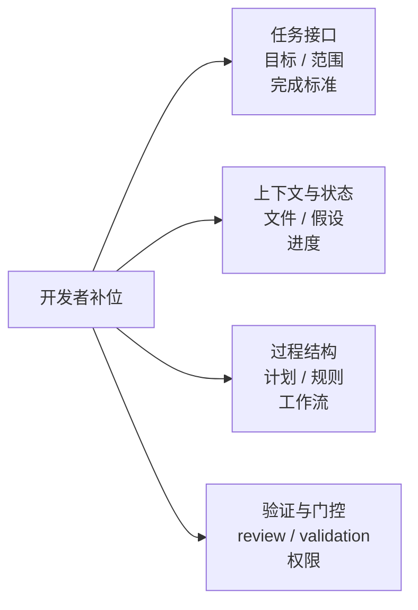
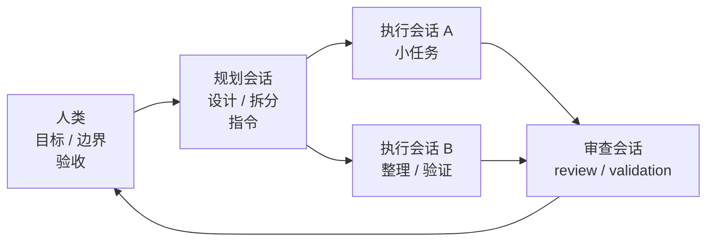

# 给 AI 编程加一层外部支架

> 写作说明：本文是面向 GitHub 发布的公开中文文章版本，目标是可独立阅读和传播；写作方式会比仓库内研究笔记更偏技术博客 / 实践分享。请不要按仓库内部 Evidence / Trace 模板强行改写，也不要补入内部路径、施工说明或仓库治理语境。
>
> 这是一篇面向开发者的实践笔记。它讨论的不是“怎么写一句更神奇的提示词”，而是当 AI 参与真实开发任务时，开发者如何通过任务边界、上下文、过程记录、审核和验收，把一次容易跑偏的协作变成更可控的工作流。

## 一、模型不是唯一变量

很多 AI 编程失败，表面上看像是模型能力不够：改错文件、扩大范围、误解需求、跳过验证，或者很自信地说“已经完成”。但在真实开发里，问题往往不只是模型不聪明，而是这次协作缺少足够的外部支撑。

软件开发不是一次问答，而是一段带状态的执行过程。模型需要知道：这轮任务到底做什么、不做什么、应该读哪些上下文、当前做到哪一步、什么动作需要停下来确认、怎样证明任务真的完成。

如果这些支撑没有被显式提供，人类就会在过程中反复补上：收窄目标、指定文件、要求先写计划、检查 diff、补充验收标准、限制高风险动作。本文把这些开发者提供的外部结构，称为 **human harness**，也可以更口语地理解为：给 AI 编程加一层“人类支架”。

## 二、本文想解决什么问题

本文不是要证明一个完整理论，也不是要给出某个固定流程。它更像一套实践语言，用来解释：为什么很多看似琐碎的协作动作，会决定 AI 编程到底是稳定推进，还是越做越偏。

读这篇文章时，可以把内容分成两层：

- 前半部分回答：AI 编程里常缺哪些外部支撑。
- 后半部分回答：开发者可以用哪些具体动作把这些支撑补上。

本文真正关心的是三个问题：

```text
一次 AI 编程协作中：
- 模型卡住的是目标、上下文、过程、验证，还是权限？
- 人类现在补的动作，是临时救火，还是反复出现的稳定需求？
- 这个动作应该继续靠人提醒，还是值得沉淀成模板、规则、流程或工具能力？
```

## 三、一个典型的任务漂移场景

假设你给 AI 一个看似简单的任务：

```text
帮我把这个小功能整理一下，顺便补一下文档。
```

一种常见的跑偏路径是：

1. AI 把“小功能整理”理解成一次较大重构，开始改动多个文件。
2. AI 没有先确认文档定位，直接把说明写成泛泛而谈的教程。
3. AI 在过程中顺手调整了无关目录、示例或配置。
4. AI 最后说“已经完成”，但没有说明需求是否满足、测试是否通过、哪些内容只是推断。

这个场景里，问题不一定是模型不会写代码，而是协作缺了几层支撑：

| 跑偏表现 | 缺少的支撑 |
|---|---|
| 把小任务扩大成大改动 | 任务边界 |
| 不知道文档该写给谁看 | 任务接口 |
| 改到无关文件 | 权限边界 |
| 过程不可见 | 状态记录 |
| 完成声明没有证据 | 验收机制 |

人类真正需要补的，不是“盯紧一点”这么简单，而是把这些隐含要求外部化，让模型在更清楚的任务面上工作。

## 四、四类外部支撑

把常见经验抽象一下，AI 编程里最常需要补的外部支撑大致有四类。



### 4.1 任务接口

模型并不天然知道“这轮任务真正负责什么”。任务接口要解决的是：目标是什么、范围到哪里、哪些事情不做、什么算完成。

好的任务接口不是把需求写得更长，而是把开放目标改写成一个可以执行、可以检查、可以验收的对象。

### 4.2 上下文与状态

上下文不是越多越好。更重要的是：当前步骤需要的信息能不能被模型看到，当前任务状态能不能被人和模型共同追踪。

这层支撑通常包括：该读哪些文件、哪些材料暂时不能用、已经做过哪些判断、还有哪些开放问题、下一步是什么。

### 4.3 过程、规则和工作流

有些支撑只在当前任务中有用，比如 checklist；有些支撑会反复出现，比如项目规则；有些支撑已经适合变成稳定流程，比如固定的设计审核、代码 review、验收模板。

区分它们很重要。临时提醒不一定都值得沉淀，但反复出现的边界也不应该永远停留在聊天里。

### 4.4 验证、归因与权限

AI 说“完成了”不等于任务真的完成。完成需要证据：测试、构建、diff、验收清单、人工确认，或者其他可检查对象。

同时，失败也需要归因。问题到底来自需求没说清、上下文给错、执行过程漂移、验证不足，还是权限放得太早？先归因，再修复，往往比直接重做更稳定。

## 五、把协作变稳定的具体做法

下面这些做法不是固定流程，而是一些可以复用的支撑动作。它们的共同点是：把原本藏在开发者脑子里的判断，变成模型可见、可执行、可检查的外部对象。

| 做法 | 主要补的支撑 |
|---|---|
| 收窄任务 | 任务接口 |
| 设计审核与反向澄清 | 需求澄清 |
| 渐进式披露上下文 | 上下文管理 |
| plan / checklist | 状态锚点 |
| 执行过程可追踪 | 过程证据 |
| 并行会话与模型分工 | 工作流分派 |
| handoff 与上下文重启 | 可恢复状态 |
| 持久规则 | 长期约束 |
| review 与 validation | 偏差发现与完成证据 |
| 权限门控 | 副作用控制 |

### 5.1 先把任务变小

宽泛任务最容易诱发模型自由发挥。开始执行前，可以先把任务压成一个小接口：

```text
本轮任务
- 做什么：
- 不做什么：
- 允许改哪里：
- 什么算完成：
```

这个模板看起来简单，但它能避免模型在错误目标空间里越走越远。

### 5.2 设计阶段先审核，再执行

设计文档或实现方案出来后，不一定要立刻开发。可以先让模型反过来暴露不确定性：哪些需求不清楚、哪些约束没说透、哪些验收标准会产生歧义。

也可以让多个模型从不同角度审一遍：

| 审核角度 | 看什么 |
|---|---|
| 需求完整性 | 是否漏了目标、边界、用户场景 |
| 技术可行性 | 方案是否能落地，是否过度设计 |
| 风险与遗漏 | 是否有副作用、兼容性、验证缺口 |

这里的重点不是“多找几个 AI 投票”，而是在开发前减少模型按隐含假设继续推进。

### 5.3 渐进式披露上下文

不要一开始就把所有材料塞给模型，也不要在模型找不到信息时只抱怨它搜索能力差。更稳定的方式是渐进式披露：

```text
渐进式披露
1. 先给目标和边界。
2. 再给最小阅读集：文件路径、符号、目录。
3. 如果仍然不够，再补充更多上下文。
```

实际开发中，一个很有用的小动作是直接复制文件路径、函数名、相关目录给 AI。告诉它“去哪里找”，通常比让它在整个仓库里盲搜更可靠。

### 5.4 用 plan 和 checklist 固定状态

长任务里，模型很容易丢失“现在做到哪里”。plan 和 checklist 的价值不是形式主义，而是把任务状态外显出来。

复杂任务还可以拆成局部工作面：

```text
顶层需求 / 设计
├── 子任务 A：目标、上下文、边界、验收
├── 子任务 B：目标、上下文、边界、验收
└── 子任务 C：目标、上下文、边界、验收
```

这样模型进入某个子任务时，不需要同时背负整个项目的所有信息。

### 5.5 让执行过程可追踪

执行过程不应该只留下最终结果。模型最好持续暴露：当前步骤、已经完成的动作、发现的问题、下一步计划、需要人类确认的事项。

```text
执行过程记录
- 当前步骤：
- 已完成动作：
- 发现的问题：
- 下一步：
- 需要确认：
```

这不是增加汇报负担，而是让漂移更早暴露。等最终交付时才发现方向错了，成本通常更高。

### 5.6 并行会话与模型分工

并行会话不是简单多开几个聊天窗口，而是在个人工作流里模拟 agent 分工：谁负责规划，谁负责执行，谁负责审查，哪些结果需要回到人类确认。



从成本和能力看，不同模型也可以承担不同层级的工作：强模型负责设计和拆分，普通模型执行约束清楚的小任务，人类把关目标、边界和验收。

前提是执行任务已经足够小：输入明确、禁止事项写清、验收标准可检查。否则并行只会把错误放大。

### 5.7 用 handoff 承接长任务

长任务中，模型不只是会忘细节，更容易忘“为什么这么做”。handoff 的价值，是把任务恢复所需的信息留下来。

```text
AI handoff
- 背景：为什么做这件事。
- 当前需求：这一轮交付什么，不做什么。
- 执行边界：哪些文件、命令、动作不能碰。
- 关键上下文：重要文件、入口文档、外部材料。
- 已完成内容：改了什么，结论是什么。
- 正在进行：卡在哪一步，正在验证什么。
- 已验证 / 未验证：哪些确认过，哪些只是推断。
- 下一步：推荐继续做什么。
- 验收标准：如何证明完成。
- 风险提醒：容易误删、误改或扩大范围的点。
```

好的 handoff 不是聊天记录摘要，而是“接下来怎么安全继续”的状态包。

如果长会话后半段开始出现规则失效、边界遗忘、反复纠偏，就可以基于 handoff 开新会话重新接手。继续把噪声堆在同一个上下文里，未必更高效。

### 5.8 把重复提醒写成规则

如果同一种约束反复出现，就不应该永远靠聊天提醒。项目边界、禁止事项、验证要求、常见坑、偏好的交付格式，都适合写进固定文件或固定模板。

但规则不是越多越好。规则膨胀后，也会变成新的上下文噪声。

### 5.9 区分 review 和 validation

“审核”至少有三种：

| 阶段 | 更准确的动作 | 关注点 |
|---|---|---|
| 设计阶段 | 需求澄清 | 目标、范围、约束是否清楚 |
| 执行中 | review | 是否偏离设计、扩大范围、引入风险 |
| 执行后 | validation | 是否真的满足完成标准 |

review 关注偏差，validation 关注证据。两者混在一起，就容易出现“看起来改了很多，但没人知道是否真的完成”。

### 5.10 给高风险动作加门控

有些动作不应该只按“模型能不能做”来放权，而应该按副作用半径分级。

```text
需要确认的高风险动作
- 扩大任务范围
- 批量修改文件
- 删除内容
- 安装依赖
- 跑高成本命令
- 修改规则、README 或目录结构
```

权限门控不是保守，而是在支撑不完整时限制副作用扩散。

### 5.11 运行环境也是支架

AI 编程表现不只取决于 prompt。项目能否启动、测试能否运行、依赖是否可用、环境变量是否清楚，都会影响模型能不能稳定完成任务。

```text
运行环境准备
- 启动方式
- 测试命令
- 依赖安装方式
- 环境变量
- 网络 / 权限限制
- 禁止执行的命令
```

如果每次都要临时解释怎么启动项目、怎么跑测试，说明环境本身还没有形成稳定支架。

## 六、什么时候该沉淀成规则或流程

不是所有有用动作都应该立刻沉淀。更稳妥的判断方式是：

- 只是本轮任务需要记一下：先放 checklist。
- 只是为了让任务能继续：先写 handoff。
- 同一种边界反复出现：再考虑写成规则。
- 同一类任务反复出现，而且步骤相对稳定：再考虑沉淀成模板或流程。
- 必须依赖固定交互、权限控制、验证门槛或系统支持：再考虑做成工具能力。

沉淀的目标不是让流程更重，而是降低后续协作成本。只有当一个动作重复出现、边界相对稳定、外部化后明显减少误解和返工时，它才值得长期维护。

## 七、开始下一次协作前的检查清单

下一次和 coding agent 协作前，可以先快速检查：

- 任务目标是否已经收窄？
- 不做事项是否说清楚？
- 必读上下文是否明确？
- 当前状态是否有 plan、checklist 或过程记录？
- 是否留下可交接状态？
- 验收证据是什么？
- 哪些动作需要人工确认？
- 哪些人工提醒已经重复到值得沉淀？

这份清单的目的不是增加流程，而是帮助你更快判断：这次协作里缺的是哪一层外部支架。

## 八、仍然值得继续想的问题

有些问题还没有足够稳定的答案，但值得保留为后续探索方向。

**任务尺度与动态引导**

- 模型能否根据任务尺度，主动请求更强的上下文、计划、handoff、review 或 validation？
- 人类如何判断当前任务只需要一句指令，还是需要局部工作面和完整交接？
- 当任务从小改动变成长任务时，应该由谁触发支架升级？

**handoff 与上下文重启**

- handoff 应该多长，才能同时满足可恢复性和低噪声？
- 什么时候应该继续当前会话，什么时候应该开新会话？
- 重要信息应该如何放在开头或结尾，以降低长上下文的位置偏差？

**多模型分工**

- 强模型写指令、普通模型执行的边界应该怎么划？
- 多模型互审时，如何避免互相放大错误假设？
- 人类应该优先审规划指令，还是审执行结果？

**沉淀与膨胀**

- 一个动作重复多少次才值得写成规则？
- 规则变多后，如何避免它们反过来污染上下文？
- 哪些经验只适合个人工作法，不适合团队化或产品化？

## 九、适用范围：这不是万能方法

这套方法更适合下面几类场景：

- 任务不是一次性问答，而是需要连续执行、检查和修正。
- 项目有明确文件结构、测试方式或文档约束。
- 开发者愿意维护少量外部状态，例如 plan、checklist 或 handoff。
- AI 的任务边界需要被显式限制，否则容易扩大范围。

它不太适合下面几类场景：

- 一次性解释、翻译、简单问答。
- 没有清晰验收标准的探索性闲聊。
- 开发者不打算维护任何外部状态，却期待模型长期稳定执行。
- 把所有协作成本都转嫁给规则、模板或流程。

更稳妥的说法是：**human harness 是一种复盘语言。它帮助我们在 AI 编程跑偏时，不只问“模型行不行”，还问“这次缺了哪一层外部支架”。**

## 延伸阅读与参考资料

本文主要来自个人使用 coding agent 的经验整理，也参考了以下方向：

- `01-foundations/agent-system-modeling/2605.13357_AI_Harness_Engineering.md`：提供 agent harness、runtime substrate、missing-harness intervention 等概念背景。
- `01-foundations/cognitive-architectures/Externalization_2604.08224.md`：提供认知外部化和认知人工制品视角。
- `llm/01-foundations/transformer-architecture/attention-mechanisms/position-bias/survey.md`：解释长上下文中的位置偏差，尤其是重要信息容易在中间位置被忽略。
- `agentic/04-human-agent-interaction/human-in-the-loop/human-in-the-loop-patterns.md`：提供 human-in-the-loop 协作模式的相关背景。
- `agentic/06-frameworks-and-tools/02-coding-agents-and-tools/claude-code/vibe-coding-harness-evidence.md`：记录 Claude Code 相关公开观察。
- `agentic/06-frameworks-and-tools/03-project-studies/openhands/vibe-coding-harness-evidence.md`：记录 OpenHands 相关公开观察。

这些资料提供的是概念和观察背景。本文仍然是一篇实践经验文章，文中的做法不应被理解为已经充分验证的行业最佳实践。
