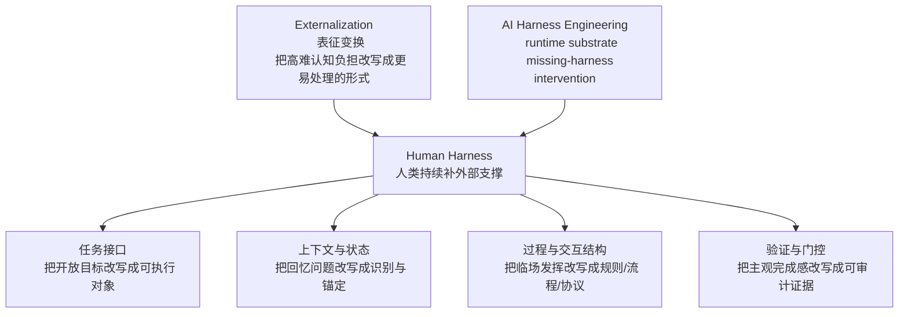
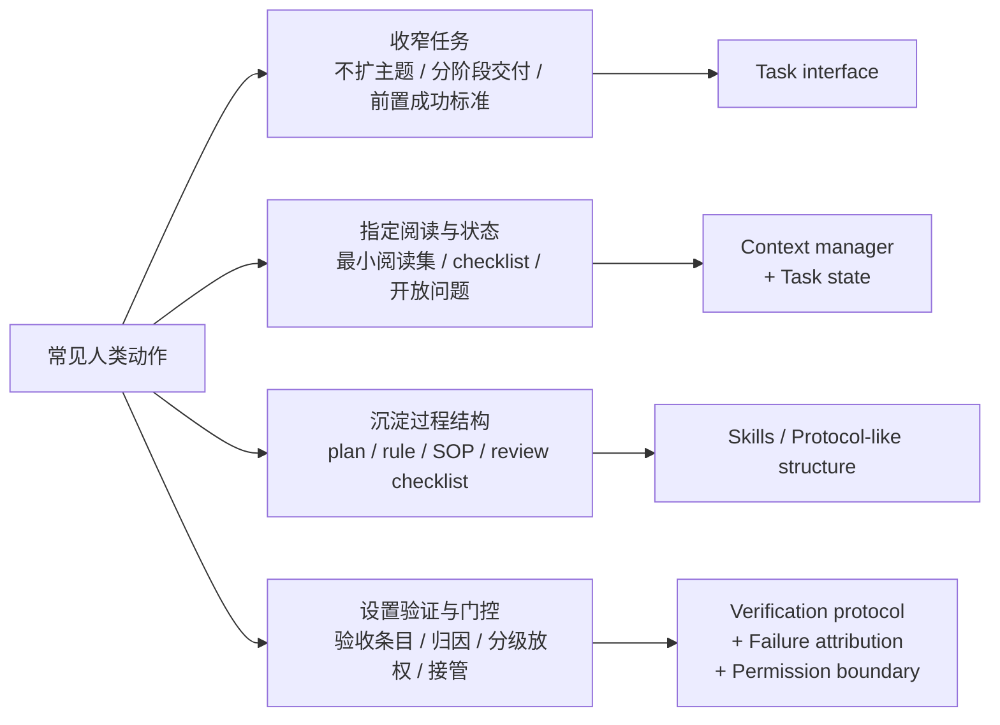

# Vibe Coding 与 Human Harness

> 本文把 human harness 当作一个分析框架，用来解释：在 vibe coding 里，人类到底在补什么、这些补位为什么有效、哪些已经值得沉淀成稳定工作法。

## 一、为什么要从 human harness 讲起

这篇文档关心的不是“人类是不是一种特殊 agent”这类理论问题，而是一个更实际的问题：**为什么同样一个模型，在有人持续协作的 vibe coding 场景里往往表现更好；这种提升到底来自模型本身，还是来自人类不断补进去的外部支撑。**

`AI Harness Engineering` 给出的核心判断是：自治软件工程能力不是模型单体属性，而是 `model-harness-environment system` 的系统能力。换句话说，很多人类介入不只是“协作习惯”或“高手经验”，而是在替系统补那些本应由 runtime substrate 提供的支撑。论文把这种现象叫做 **missing-harness human intervention**。

`Externalization in LLM Agents` 又把这个问题解释得更清楚。它提醒我们，Agent 基础设施的价值，不只是“多给模型一点帮助”，而是做 **representational transformation**：把模型不擅长处理的问题，改写成它更容易处理的形式。最常见的几种改写方式包括：

- 把困难的“回忆”问题改成“识别与检索”问题。
- 把每次临时发明流程，改成可复用的过程或技能。
- 把靠自然语言猜测的交互，改成结构化、可检查的交换。

把这两篇论文放在一起，human harness 的意义就比较清楚了：

- `Externalization` 解释了**这些补位为什么有效**。
- `AI Harness Engineering` 解释了**这些补位为什么会反复由人类手工承担**。

因此，本文不把 human harness 当成一个要被证明的大理论，而把它当成一个更实用的判断框架：**哪些 vibe coding 动作，本质上是在做认知负担外部化；这些外部化又分别落在了哪类 harness 支撑上。**

上图对应本文的核心判断：`Externalization` 解释这些补位为什么有效，`AI Harness Engineering` 解释这些补位为什么会反复由人类手工承担，而 human harness 则是把两者接到 vibe coding 现场的中间层。

---

## 二、vibe coding 真正补的是什么

表面上看，vibe coding 里的常见动作像是一组零散技巧：先写 plan、限制范围、要求复审、写规则、及时接管。但把 `Externalization` 和 `AI Harness Engineering` 放在一起看，会发现这些动作其实在做同一件事：**把原本要模型临时承担的认知负担，搬到外部结构里。**

从这个角度看，vibe coding 里最常见的人类补位，大致落在四类外部化支撑上。

这张图不是为了把所有动作硬分到几个格子里，而是为了说明一件更重要的事：很多看似琐碎的人类动作，背后都有更底层的外部化支撑对象。

### 2.1 把“要做什么”外部化成任务接口

模型并不天然知道“这轮任务真正的对象是什么”。很多失败并不是不会写，而是从一开始就在错误目标上持续工作。`AI Harness Engineering` 把这一层叫做 `task interface`：目标、要求、约束和成功标准要被显式写出来；缺失时，系统就会在错误目标上忙碌。

`Externalization` 提醒我们，好的任务接口不是把要求写得更长，而是把问题改写得更容易处理：把开放目标改写成可识别、可判断、可验收的任务对象。

这也是为什么高质量 vibe coding 往往一开始不是“直接干”，而是先做下面这些动作：

- 先声明这轮**不做什么**。
- 先把完整目标切成阶段性交付。
- 先把“什么算通过”写出来。

这些动作看起来像 prompt 技巧，实质上是在补 `task interface`。它们的价值，不在于让表达更漂亮，而在于把“发散的开放任务”改写成“模型当前能稳定执行的窄任务”。

### 2.2 把“该看什么、该记什么”外部化成上下文与状态

`Externalization` 对记忆的分析很适合直接放到这里。它反复强调：记忆系统的成功标准不在于“存了多少”，而在于**当前步骤的上下文是否清晰可读**。也就是说，好的外部化不是把更多材料塞给模型，而是让正确的历史、正确的文件、正确的限制，在正确的时候变得显眼。

这和 `AI Harness Engineering` 里的两个组件高度对齐：

- `context manager`：决定应该暴露哪些任务相关内容。
- `task state`：维护当前假设、已检查文件、开放问题和下一步。

放到 vibe coding 里，人类最常补的其实就是这两层：

- 指定先读哪篇基础文档，哪些外部材料只能留在 `temp/`。
- 排除无关目录、无关专题和低证据输入，避免材料污染。
- 要求先出 plan、写 checklist、显式记录开放问题，而不是让状态停留在模型隐式推理里。
- 用阶段推进替代一次性长执行，减少中途漂移和重复劳动。

这些动作的本质，都不是“帮助模型回忆更多”，而是把困难的内部回忆，改写成外部可识别的上下文选择和状态锚定。所以，这一层在实际 vibe coding 里往往比“长篇 prompt 优化”更有效。

### 2.3 把“怎么做”外部化成过程、规则和协议

`Externalization` 对 skills 和 protocols 的区分，可以明显提升这里的表达精度。

- `skills` 外化的是**程序性专业知识**：有一类任务应该如何完成。
- `protocols` 外化的是**交互结构**：行动如何以结构化、可预测的方式进入世界。

这样一来，plan、rule、review 就不再只是并排摆放的“控制组件”，而是位于不同的外部化位置：

- `plan`、`checklist`、`SOP` 更接近轻量的过程外化：它们把一次性临场发挥，转成可复用、可检查的局部流程。
- `rule` 文档更接近约束与启发式的外化：它把原本需要人类反复提醒的判断，沉淀成可被复述和触发的显式制品。
- 代码审查模板、设计评审清单、Evidence / Trace 要求，则更像把交付协议结构化：什么对象需要什么证据、以什么格式交付、哪些状态不能跳过。

这也是为什么“让模型先写规则，再要求它按规则执行”有时有效：它在短期内把一部分程序性知识和约束，从模型内部临场合成，转成了外部可引用的制品。

但这里也要保持克制。并不是所有反复提醒都值得升级成 rule 或 skill artifact。只有当某种过程知识**会重复出现、可以被明确描述、而且确实能降低下次协作成本**时，它才值得被外部化；否则只是在把临时上下文过早固化成长期开销。

### 2.4 把“怎么证明做对了”外部化成验证、归因与门控

这是 `AI Harness Engineering` 最强、也最能把本文拉出“经验贴”气质的一层。论文反复强调：任务完成不能只靠自然语言声明，而要绑定到 **requirement-level verification evidence**。同时，它又要求 `attribution before recovery`——失败后先解释缺了什么支撑，再决定如何修复。

这意味着高质量 vibe coding 的关键，不只是“过程更有条理”，而是更早地把验证和归因也外部化了：

- 先验收 plan，再决定是否执行。
- 把设计 review 和代码 review 分开，因为两者的验证对象不同。
- 把 review 结论写成 action items，而不是停留在印象判断。
- 不接受“我觉得已经好了”这类口头完成，必须要求具体证据。
- 出现问题时，先判断是 task interface、context、verification 还是 permission 出了错，而不是立刻重做。

从 `Externalization` 的角度看，这一层做的是把“模糊的主观完成感”改写成“可检查的外部证据”；从 `AI Harness Engineering` 的角度看，这一层补的是 `verification protocol`、`failure attribution`、`permission boundary` 和 `intervention logger`。这也解释了为什么很多真正高质量的 vibe coding，节奏上看起来反而更“慢”——因为它在花力气生产可审计的外部证据，而不是只追求一次性生成速度。

---

## 三、从外部化视角重新看常见 vibe coding 动作

如果接受前一节的框架，那么很多常见动作就不该再被理解为孤立技巧，而应该被看成一组更稳定的补位模式。

### 3.1 收窄任务，不是为了保守，而是为了把开放目标转成可执行对象

“先只改这一段”“先别扩目录”“先不要写成总论”，这些话表面上是在收窄范围，实质上是在做任务接口外部化。它们把高不确定任务转成当前回合可处理的对象，减少了模型在错误目标空间里漂移的概率。

### 3.2 指定最小阅读集，不是为了省事，而是为了把回忆问题改成识别问题

“先读这两篇，不要看别的”“外部结果先留 `temp/`”“这里只能引用对象内 evidence”，这些动作不是单纯的资料管理，而是在补 `context manager`。它们的效果来自表征变换：不再要求模型从一堆可能相关的材料里自己回忆和筛选，而是先把候选空间裁剪成可识别集。

### 3.3 先出 plan / checklist，不是为了显得规范，而是为了给执行建立外部状态锚点

如果模型每一轮都要重新猜当前阶段、开放问题和下一步，长任务几乎必然漂移。plan 和 checklist 的价值，不在于“更专业”，而在于把任务状态显式放到外部，让人和模型都能围绕同一个状态对象推进。

### 3.4 review 的价值，不只是挑错，而是把失败从结果层拉回支撑层

很多低质量 review 只会说“这段不太对”“再改好一点”。高质量 review 则会继续追问：是范围界定错了，还是材料选错了，还是验证没立住，还是放权过早。这种 review 已经不是普通评论，而是在执行 `failure attribution`。

### 3.5 分级放权和及时接管，不是交互风格，而是 runtime gate 设计

“先只分析、不执行”“先只改一个文件”“先验证再放大”这类做法，不应被写成保守偏好，而应被理解为 `permission boundary` 的外部实现。它们的核心不是让流程更慢，而是通过门控把高风险动作延后，避免系统在支撑尚未完整时就扩大副作用半径。

### 3.6 记录人类补位，本身就是在为系统改进积累诊断样本

这是最容易被忽略、但对分享型文档最有价值的一点。如果每一轮都要人工补同类动作——总要指定阅读集、总要补验收标准、总要解释同一种失败——那就说明这里不是偶发经验，而是高频 missing-harness intervention。把这些补位记录下来，真正的意义不是复盘谁做了什么，而是识别**哪些人类支架已经稳定到值得沉淀为模板、规则、skill artifact 或产品能力。**

---

## 四、当前样本线索：不同产品在外化什么

当前仅基于 `Claude Code` 与 `OpenHands` 两个公开样本，可以先保守保留几条观察。这里不再只是说“它们支持 plan/constraint”，而是尝试按外部化支撑来读。

- **Claude Code** 更强的证据落在 `plan mode`、permission mode、最佳实践工作流提示。这说明它更像把一部分任务状态、放权强度和阶段性 gate 外化到运行中的模式切换里。它不一定显式管理所有支撑，但在“先 plan、再决定是否执行”“按阶段调节确认强度”上证据更强。
- **OpenHands** 更强的证据落在 `confirmation policy`、`hooks`、CLI `Esc` 暂停、人工审查建议。这说明它更像把约束、门控和恢复路径外化到 system-level control plane 里：某些动作是否能发生、何时暂停、何时人工进入，是由更明确的治理层承接的。
- 两个样本都更稳定支持 `verification / permission / intervention` 相关支撑，而对 `goal harness` 的显式一等交互面支持仍偏弱。换句话说，它们都比“完全自由对话”更像 harness，但还不足以说明任务接口已经被彻底产品化。
- 如果用 `Externalization` 的语言描述，两者差异不只是“交互风格不同”，而是**外部化落点不同**：前者更多把控制强度外化进交互节奏，后者更多把控制结构外化进系统治理层。

这些线索当前更适合作为整理技巧时的观察起点，而不是本文要证明的中心结论。

---

## 五、这篇文档想交付什么

如果把本文写成“列出几个技巧”，它很容易滑回经验贴；如果把它写成“证明 human 就是 harness”，它又会变成一个过大的理论题。更稳的定位，是把它写成一个**技术判断框架**：

- 它解释为什么某些 vibe coding 动作有效——因为它们在做认知负担外部化，而不是单纯“沟通更仔细”。
- 它帮助区分哪些动作只是临时经验，哪些已经对应稳定的 harness 缺口。
- 它给后续研究和产品比较提供一套统一语言：任务接口、上下文筛选、状态锚定、验证证据、失败归因、权限门控、人类补位记录。

从分享视角看，这个框架的价值不在于告诉读者“以后都要先写 plan”，而在于给他们一个更清楚的问题模板：

- 这个任务里，模型真正卡住的是目标、上下文、过程、验证，还是权限？
- 我现在补的这一步，是一次性经验，还是高频 missing-harness intervention？
- 这一步值得继续人工做，还是已经值得沉淀成外部化制品？

只有回答了这些问题，vibe coding 才会从“高手带着模型干活”真正走向“可复制的人机协作工程”。

---

## 六、边界

- 不把 `Externalization` 直接写成“人类参与越多越好”的论据。它解释的是为什么某些支撑有效，不自动为任何具体流程背书。
- 不把 `AI Harness Engineering` 的 11 个组件机械投影到本文。本文只抽取最贴近 vibe coding 的部分，不把专题写成论文摘抄。
- 不把 human harness 写成闭合理论。当前更适合把它当作技术判断框架，而不是待证明命题。
- 不把所有高频动作都升级成 rule、skill 或 protocol。只有重复出现、可显式描述、且确实降低后续成本的补位，才值得外部化。
- 不把当前产品样本直接写成行业定论。`Claude Code` 与 `OpenHands` 只是两个公开观察点，不足以覆盖全部 coding-agent 设计空间。
- 不把个体高手经验直接写成稳定最佳实践。很多技巧仍停留在有限样本和高熟练度前提下。

更稳妥的写法是：**把 human harness 当作分析 vibe coding 的中层框架，用来识别哪些人类补位正在把模型能力转化成可持续的系统能力。**

## Evidence

- Status: `Inferred / Unverified`
- Sources:
  - `01-foundations/agent-system-modeling/2605.13357_AI_Harness_Engineering.md`
  - `01-foundations/cognitive-architectures/Externalization_2604.08224.md`
  - `04-human-agent-interaction/overview.md`
  - `04-human-agent-interaction/backlog.md`
  - `04-human-agent-interaction/human-in-the-loop/human-in-the-loop-patterns.md`
  - `06-frameworks-and-tools/02-coding-agents-and-tools/claude-code/vibe-coding-harness-evidence.md`
  - `06-frameworks-and-tools/03-project-studies/openhands/vibe-coding-harness-evidence.md`
- Trace: 本文从 `04-human-agent-interaction/backlog.md` 中 `Human-as-Agent Harness in Vibe Coding` 条目进入；当前用 `AI Harness Engineering` 提供 runtime substrate 与 missing-harness intervention 语言，用 `Externalization` 提供 representational transformation 与认知人工制品语言，再回头重组 vibe coding 中的人类补位动作。本文目标不是复述两篇论文，而是为“哪些技巧值得沉淀、哪些缺口值得产品化”提供统一判断框架。
- Needs:
  - 补更具体的 vibe coding 技巧样本与操作案例。
  - 区分哪些补位已经适合沉淀为模板、规则、skill artifact 或产品能力，哪些仍主要停留在个体工作法。
