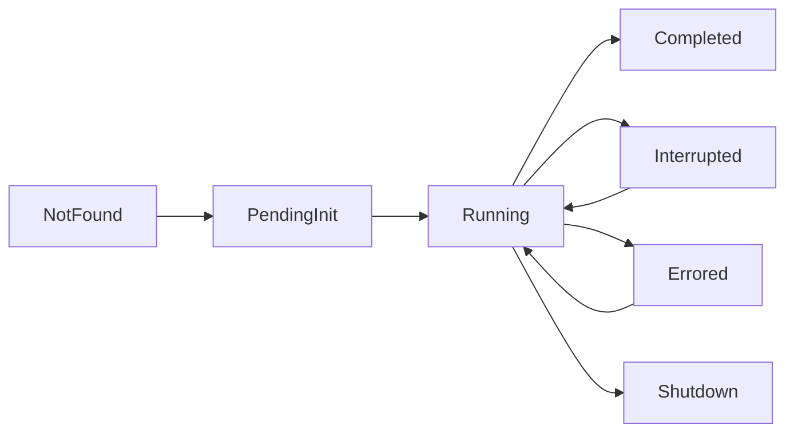

# Codex 故障排查手册

> **专题文档**。本文汇总 Codex 的 Agent 状态异常、会话超时和上下文溢出排查步骤。适合使用中遇到问题时查阅。部分内容来自社区报告，官方文档中信息较有限。

> 基于 OpenAI 官方文档 + CSDN 架构分析 + 社区报告整理（2026.5）。注意：部分会话超时和恢复细节源自社区报告而非官方文档，官方对此有较多未明确说明之处。
> Codex 官方文档对错误处理和故障排查的描述较为有限，以下内容标注了可靠度。

---

## 一、Agent 状态与异常

Codex Agent 有 7 种状态，其中 `Interrupted`、`Errored`、`NotFound` 属于异常状态。

### 状态说明

| 状态 | 含义 | 是否异常 |
|------|------|---------|
| **PendingInit** | 任务创建，初始化中 | 否 |
| **Running** | 任务正在执行 | 否 |
| **Completed** | 任务正常完成 | 否 |
| **Interrupted** | **外部触发中断**（超时、用户取消、被高优先级任务抢占） | 是 |
| **Errored** | **内部运行时错误**（代码执行失败、依赖缺失、沙箱违规） | 是 |
| **Shutdown** | 任务被关闭（正常关闭流程） | 否 |
| **NotFound** | 会话 ID 无效、任务已被清理、Cloud 容器已销毁 | 是 |

> **Interrupted vs Errored 的本质区别**：Interrupted 是外部原因（超时/取消），Errored 是内部原因（执行失败/环境问题）。

### TurnAbortReason（中止原因）

| 原因 | 触发场景 |
|------|----------|
| **Interrupted** | 任务执行中被外部事件打断（超时、取消令牌触发） |
| **Replaced** | Manager 调度时用新任务替换了旧任务（优先级调度行为） |
| **ReviewEnded** | Code Review 流程中审核轮次结束 |
| **BudgetLimited** | Token 额度或 API 调用次数用尽 |

---

## 二、会话超时

| 问题 | 已知信息 | 来源 |
|------|---------|------|
| **单任务超时** | Codex 使用 `with_timeout` 机制，超时时返回 `TaskError::Timeout`。网络请求的建议超时为 30 秒 | B（社区） |
| **会话级空闲超时** | 官方未公布交互模式的空闲断开时间规则 | 未找到明确信息 |
| **`resume` 恢复窗口** | 官方未公布 context 保留的时间上限 | 未找到明确信息 |
| **Cloud 任务超时** | Cloud 模式下任务可连续执行 7 小时以上 | B（社区） |

### 排查建议

- **任务超时**：检查是否是网络请求耗时过长。如果是，拆分为更小的子任务
- **Cloud 任务意外结束**：检查 `approval_policy` 是否为 `never`（全自动模式不会因审批等待超时）

---

## 三、会话恢复

| 问题 | 已知信息 | 来源 |
|------|---------|------|
| **`resume` 恢复内容** | 恢复对话上下文（context），但不保证恢复文件状态、环境状态、Agent 内部状态 | A（官方） |
| **`codex fork`** | **不存在此命令** | 未找到 |
| **恢复失败原因** | 可能原因：会话过期（Cloud 容器清理）、会话 ID 无效、沙箱环境已销毁 | C（推断） |
| **官方排查指南** | 无专门的会话恢复排查指南，仅有沙箱网络配置相关的安全排查建议 | 未找到 |

### ✅ 已确认的可用命令

- `codex resume` — 恢复之前的会话（恢复上下文）
- `/status` — 注意：这是**快速搜索快捷键**，不是会话状态查看命令

---

## 四、上下文管理

| 问题 | 已知信息 | 来源 |
|------|---------|------|
| **Codex 模型上下文窗口大小** | 官方未公布 Codex 专用模型的上下文窗口值 | 未找到明确信息 |
| **溢出时的行为** | 官方未明确说明（截断/警告/静默丢弃） | 未找到明确信息 |
| **上下文溢出的错误码** | 官方未发布相关错误码 | 未找到明确信息 |

### 排查建议

- 如果长任务（50+ 轮交互）出现推理退化或"失忆"现象，建议主动开新会话，不要在一个会话中无限累积
- 观察任务分解是否合理 —— Codex 通过将复杂任务拆分为独立子任务来缓解上下文压力

---

## 五、已知问题与官方资源

| 资源 | 状态 | 说明 |
|------|------|------|
| **Known Issues 页面** | 未在调研资料中找到 | — |
| **Changelog** | ✅ 存在 | 官方有 changelog，但调研时未获取到内容 |
| **会话管理专项指南** | 不存在 | 官方文档中无此分类 |
| **沙箱安全排查建议** | ✅ 存在 | Agent 默认运行在沙箱环境，网络默认关闭 |

---

## 参考来源

- https://developers.openai.com/codex（CLI Reference）
- https://openai.com/index/introducing-upgrades-to-codex/
- https://blog.csdn.net/gitblog_01166/article/details/157419484（源码分析）

*最后更新: 2026-05-26*