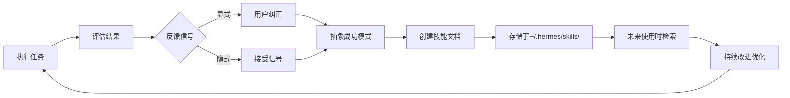
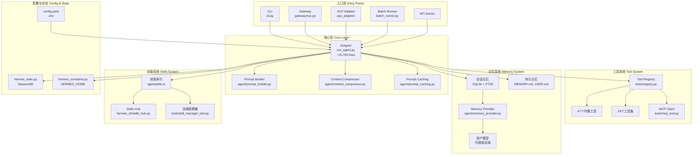
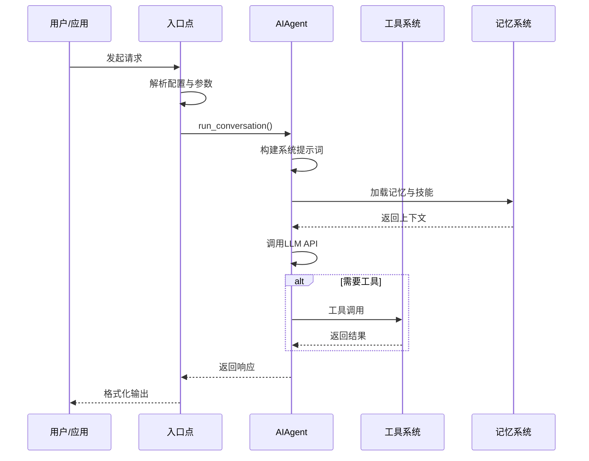
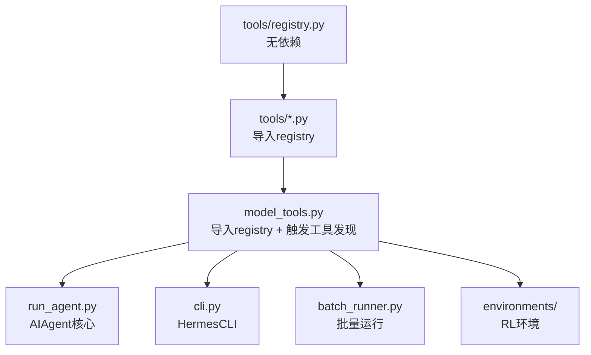
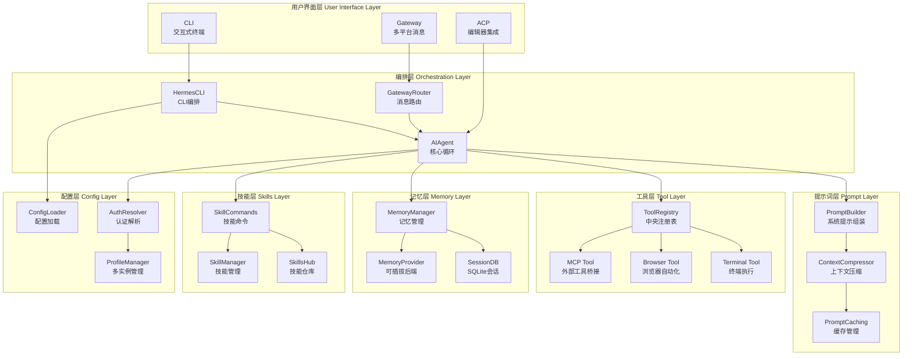

# Hermes Agent 架构设计概述

## 项目简介

Hermes Agent 是由 **Nous Research** 构建的开源自改进AI代理，是目前唯一具有内置学习循环的AI代理框架。它能够从经验中创建技能、在使用过程中改进技能、主动持久化知识、搜索自己的历史对话，并跨会话构建对用户的深入理解模型。

### 核心定位

- **自进化能力**：内置学习循环，通过使用获得智能
- **本地优先**：运行在用户的机器或服务器上，数据完全可控
- **模型无关**：支持200+模型，可无缝切换，无厂商锁定
- **多平台统一**：CLI、Telegram、Discord、Slack等18个平台统一体验

### 与主流框架对比

| 维度 | Hermes Agent | OpenClaw | Claude Code |
|-------|-------------|-----------|-------------|
| 核心定位 | 自进化个人助理 | 团队运营平台 | IDE集成编程助手 |
| 架构 | 单一代理持久循环 | Gateway控制平面 | IDE集成 |
| 记忆模型 | 多层记忆（会话+持久+用户模型） | 平面Markdown文件 | 自动笔记到磁盘 |
| 技能系统 | 动态创建+自改进 | 静态插件（5700+） | 静态人工编写 |
| 开源协议 | MIT | MIT | 专有 |
| GitHub Stars | ~85K | ~345K | N/A |
| 部署方式 | 本地+Docker+SSH+Serverless | 本地 | IDE内 |

## 核心设计理念：自进化学习循环

Hermes Agent 的核心创新在于其**四阶段学习机制**：



### 学习循环详细流程

1. **执行阶段**：使用40+内置工具完成任务
2. **评估阶段**：
   - 显式反馈：用户纠正（如"使用snake_case命名函数"）
   - 隐式接受：用户未纠正即视为接受
3. **抽象阶段**：成功模式被抽象为可复用的技能文档
4. **持久化**：技能以Markdown格式存储，遵循agentskills.io开放标准
5. **改进**：技能在后续使用中持续优化

这种**记忆复合（Memory Compounding）**效应使得Hermes Agent随着使用时间增长而越来越智能，这是与OpenClaw等静态框架的根本区别。

## 工具系统 vs 技能系统：关系与区别

> 详细说明见「3. 工具系统.md」和「5. 技能系统与网关.md」

### 核心对比

| 维度 | 工具系统 | 技能系统 |
|-----|---------|---------|
| 本质 | 可执行代码（"手"） | 知识文档（"脑"） |
| 存储位置 | `tools/*.py` | `~/.hermes/skills/*.md` |
| 创建方式 | 开发者编写Python | Agent自动创建或用户编写Markdown |
| 执行方式 | 函数调用 → 返回值 | 读取文档 → 注入提示词 |
| 生命周期 | 开发者控制 | Agent自改进 |

### 关键区别

- **工具** = 做事的能力（短期、确定、类型安全）
- **技能** = 知道如何做的能力（长期、可改进、渐进式披露）

### 在学习循环中的协同

```
执行任务 → 使用工具 → 获得经验 → 判断创建技能 → 提取最佳实践 → 存储技能 → 推荐相关工具
```

- 工具系统提供「执行」能力
- 技能系统从执行中「抽象」经验，形成可复用知识
- 两者在自进化学习循环中协同工作

## 整体架构：单一代理持久循环

### 架构选择：单一代理 vs Swarm

Hermes Agent 采用**单一代理持久循环（Single Agent Persistent Loop）**架构，而非多代理编排（Swarm）设计。社区深度分析（TrilogyAI Substack）指出：

- **Swarm优势**：适合一次性复杂任务，可并行处理
- **Swarm劣势**：引入上下文爆炸、协调开销、状态同步复杂
- **单一循环优势**：简洁、可预测、专注"记忆复合"和"技能自迭代"

AIAgent作为"耐用组件（durable component）"，执行后端完全可插拔——这正是模块化的灵魂。这种设计直接支撑了自进化：代理不依赖外部编排器，而是通过内置循环，从经验中提炼技能、主动管理记忆、跨会话深化用户模型。

### 技术架构总览



### 平台无关核心设计原则

Hermes Agent 遵循以下核心设计原则：

| 原则 | 实践意义 |
|-------|---------|
| **提示词稳定性** | 系统提示词在对话中不改变，仅用户显式操作（`/model`）可破坏缓存 |
| **可观测执行** | 每个工具调用通过回调对用户可见，CLI有spinner，Gateway有消息更新 |
| **可中断** | API调用和工具执行可通过用户输入或信号中途取消 |
| **平台无关核心** | 一个AIAgent类服务CLI、Gateway、ACP、Batch、API Server |
| **松耦合** | 可选子系统（MCP、插件、Memory Provider、RL环境）使用注册表模式和check_fn门控 |

## 入口点设计

Hermes Agent 提供5个主要入口点，所有入口最终都汇聚到核心 `AIAgent` 类。

### 1. CLI（命令行界面）

**文件位置**：`cli.py`

**特点**：
- Rich库用于banner/面板渲染
- prompt_toolkit提供自动补全和多行编辑
- KawaiiSpinner动画显示API调用进度
- Skin引擎支持主题自定义

**启动方式**：
```bash
hermes              # 启动交互式CLI
hermes model        # 切换模型
hermes tools        # 配置工具
hermes config       # 修改配置
```

### 2. Messaging Gateway（消息网关）

**文件位置**：`gateway/run.py`

**特点**：
- 长运行进程，支持18个平台适配器
- 统一会话路由和用户授权
- 斜杠命令分发系统
- 钩子系统与cron调度

**支持平台**：
- Telegram、Discord、Slack
- WhatsApp、Signal
- Home Assistant、QQ Bot
- Email、Matrix等

### 3. ACP Adapter（编辑器集成）

**文件位置**：`acp_adapter/`

**特点**：
- 实现Anthropic Code Protocol（ACP）
- 支持VS Code、Zed、JetBrains
- 编辑器内直接与Agent交互
- 完整的工具和会话支持

### 4. Batch Runner（批量运行器）

**文件位置**：`batch_runner.py`

**特点**：
- 并行批量处理
- 轨迹生成与保存
- 用于RL训练数据收集
- 支持检查点恢复

### 5. API Server

**特点**：
- RESTful API接口
- 编程式调用Hermes能力
- 支持Python库直接导入

### 入口点统一调用流程



## 项目目录结构详解

```
hermes-agent/
├── run_agent.py          # AIAgent类 — 核心对话循环（~10,700行）
├── model_tools.py        # 工具编排，discover_builtin_tools(), handle_function_call()
├── toolsets.py           # 工具集定义，_HERMES_CORE_TOOLS列表
├── cli.py                # HermesCLI类 — 交互式CLI编排器（~10,000行）
├── hermes_state.py       # SessionDB — SQLite会话存储（FTS5搜索）
├── hermes_constants.py   # HERMES_HOME、profile感知路径
├── batch_runner.py       # 并行批量轨迹生成
│
├── agent/                # Agent内部组件
│   ├── prompt_builder.py     # 系统提示词组装
│   ├── context_compressor.py # 默认引擎 — 有损摘要压缩
│   ├── prompt_caching.py     # Anthropic提示词缓存
│   ├── context_engine.py      # ContextEngine ABC（可插拔）
│   ├── auxiliary_client.py   # 辅助LLM（vision、summarization）
│   ├── model_metadata.py     # 模型上下文长度、token估算
│   ├── models_dev.py         # models.dev注册表集成
│   ├── anthropic_adapter.py  # Anthropic API格式转换
│   ├── display.py            # KawaiiSpinner、工具预览格式化
│   ├── skill_commands.py     # 技能斜杠命令（CLI/gateway共享）
│   ├── memory_manager.py     # 记忆管理器编排
│   ├── memory_provider.py     # Memory Provider ABC
│   └── trajectory.py         # 轨迹保存助手
│
├── hermes_cli/           # CLI子命令和设置
│   ├── main.py           # 入口点 — 所有hermes子命令（~6,000行）
│   ├── config.py         # DEFAULT_CONFIG、OPTIONAL_ENV_VARS、迁移
│   ├── commands.py       # 斜杠命令定义 + SlashCommandCompleter
│   ├── callbacks.py      # 终端回调（clarify、sudo、approval）
│   ├── setup.py          # 交互式设置向导
│   ├── skin_engine.py    # Skin/主题引擎 — CLI视觉自定义
│   ├── skills_config.py  # hermes skills — 平台级技能启用/禁用
│   ├── tools_config.py   # hermes tools — 平台级工具启用/禁用
│   ├── skills_hub.py     # /skills斜杠命令（搜索、浏览、安装）
│   ├── models.py         # 模型目录、提供商模型列表
│   ├── model_switch.py   # 共享/model切换流水线（CLI + gateway）
│   ├── auth.py           # 提供商标识解析
│   ├── providers.py      # 提供商配置管理
│   ├── runtime_provider.py # 运行时和提供商抽象
│   └── profiles.py      # Profile管理（多实例隔离）
│
├── tools/                # 工具实现（每个工具一个文件）
│   ├── registry.py       # 中央工具注册表（schemas、handlers、dispatch）
│   ├── approval.py       # 危险命令检测
│   ├── terminal_tool.py  # 终端编排
│   ├── process_registry.py # 后台进程管理
│   ├── file_tools.py     # read_file、write_file、patch、search_files
│   ├── web_tools.py      # web_search、web_extract
│   ├── browser_tool.py   # 10个浏览器自动化工具
│   ├── code_execution_tool.py # execute_code沙箱
│   ├── delegate_tool.py  # 子代理委托
│   ├── mcp_tool.py       # MCP客户端（~2,200行）
│   ├── credential_files.py # 基于文件的凭证传递
│   ├── env_passthrough.py # 沙箱环境变量传递
│   ├── environments/     # 终端后端（local、docker、ssh、modal、daytona、singularity）
│   └── [40+ 其他工具文件]
│
├── gateway/              # 消息平台网关
│   ├── run.py            # 主循环、斜杠命令、消息分发
│   ├── session.py        # SessionStore — 会话持久化
│   ├── config.py         # Gateway配置
│   ├── hooks.py          # 钩子系统
│   ├── platforms/        # 适配器：telegram、discord、slack、whatsapp、signal等
│   └── [其他网关组件]
│
├── acp_adapter/          # ACP服务器（VS Code / Zed / JetBrains集成）
│   ├── server.py        # ACP服务器实现
│   ├── auth.py          # ACP认证
│   ├── session.py       # ACP会话管理
│   └── tools.py         # ACP工具适配
│
├── cron/                 # 调度器
│   ├── scheduler.py     # 调度器主逻辑
│   └── jobs.py          # 作业定义与管理
│
├── environments/         # RL训练环境（Atropos）
│   ├── agent_loop.py    # Agent循环环境
│   ├── hermes_base_env.py  # Hermes基类环境
│   ├── web_research_env.py  # Web研究环境
│   └── [其他RL环境]
│
├── plugins/              # 插件系统
│   ├── context_engine/ # 可插拔上下文引擎
│   ├── memory/         # 可插拔记忆提供者
│   └── example-dashboard/  # 示例插件
│
├── skills/               # 内置技能
│   ├── index-cache/    # 技能索引缓存
│   ├── software-development/
│   ├── research/
│   ├── creative/
│   └── [其他技能分类]
│
├── tests/                # Pytest测试套件（~3000测试）
│   ├── agent/
│   ├── cli/
│   ├── gateway/
│   ├── tools/
│   └── [其他测试目录]
│
├── optional-skills/       # 可选技能包
│   ├── autonomous-ai-agents/
│   ├── blockchain/
│   └── [其他可选技能]
│
├── docs/                 # 文档
├── scripts/              # 脚本
├── web/                  # Web界面
├── website/              # 网站文档
└── [配置文件]
```

**用户配置**：
- `~/.hermes/config.yaml` — 配置设置
- `~/.hermes/.env` — API密钥和敏感信息
- `~/.hermes/skills/` — 技能目录（agentskills.io标准）
- `~/.hermes/sessions/` — 会话存储
- `~/.hermes/memories/` — 持久记忆

## 文件依赖链



### 依赖关系详解

1. **tools/registry.py**：
   - 无外部依赖
   - 被50+工具文件导入
   - 定义ToolEntry和ToolRegistry类

2. **tools/*.py**：
   - 每个工具文件在模块级别调用`registry.register()`
   - 自动发现机制：AST解析检测`registry.register()`调用
   - 无需维护手动导入列表

3. **model_tools.py**：
   - 导入`tools.registry`
   - 调用`discover_builtin_tools()`触发工具导入
   - 提供工具发现、模式收集、调度功能

4. **run_agent.py**：
   - 导入`model_tools`
   - 实现AIAgent类
   - 核心对话循环

5. **cli.py**、**batch_runner.py**、**environments/**：
   - 导入`model_tools`或直接使用AIAgent
   - 实现各自的入口点逻辑

## 核心组件关系



## 技术特色总结

### 1. 单一数据源

所有入口点共享：
- 同一个`AIAgent`类
- 同一个工具注册表
- 同一个配置系统
- 同一个记忆存储

### 2. 高度模块化

- 可插拔上下文引擎
- 可插拔记忆提供者
- 可插拔终端后端
- 可插拔插件系统

### 3. 声明式配置

- 工具通过`registry.register()`声明
- 斜杠命令通过`COMMAND_REGISTRY`声明
- 技能通过agentskills.io标准声明

### 4. 类型安全与验证

- Schema驱动的工具调用
- 环境检查函数
- 配置版本管理

### 5. 观测与调试

- 完整的回调系统
- 丰富的日志输出
- 轨迹保存功能

## 参考资料

- [Hermes Agent官方文档](https://hermes-agent.nousresearch.com/docs/)
- [GitHub仓库](https://github.com/NousResearch/hermes-agent)
- [agentskills.io标准](https://agentskills.io)
- [Nous Research](https://nousresearch.com)
