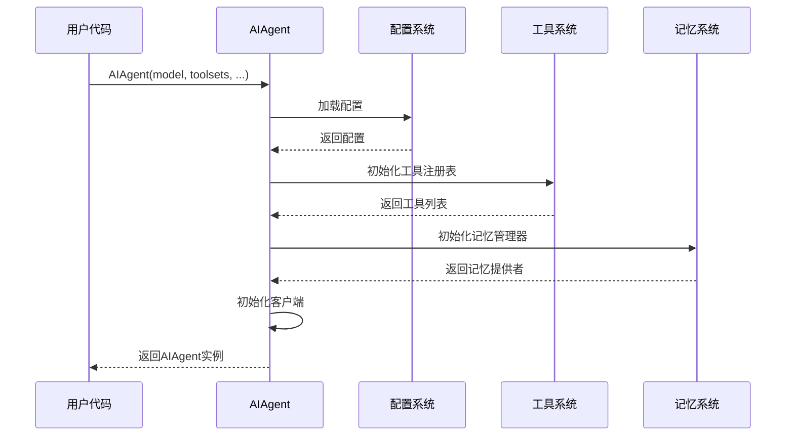
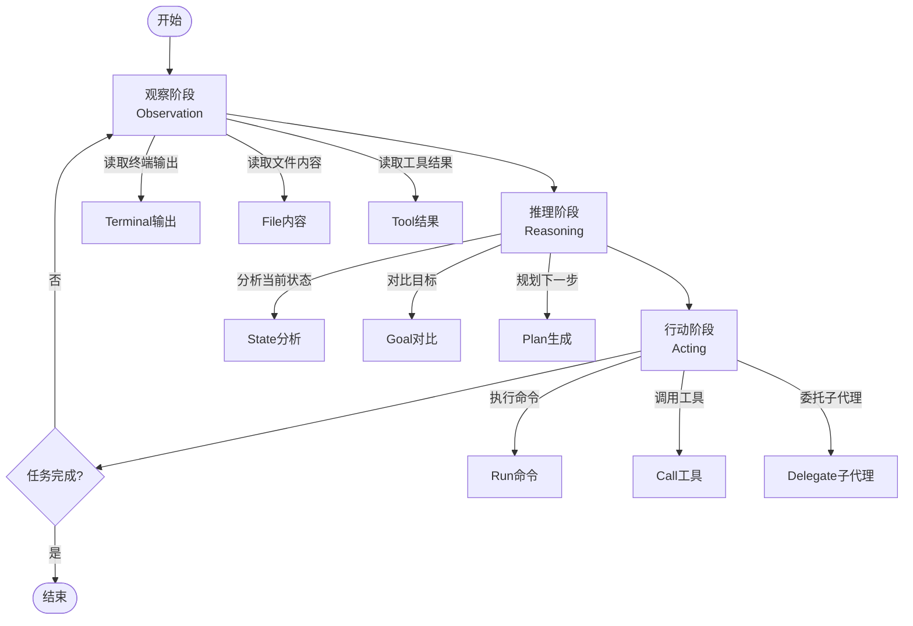
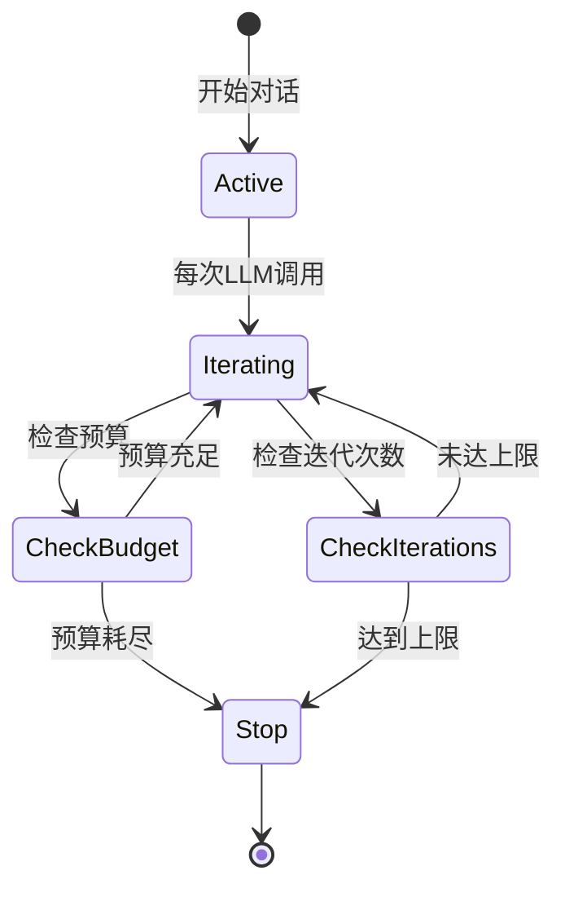
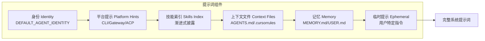
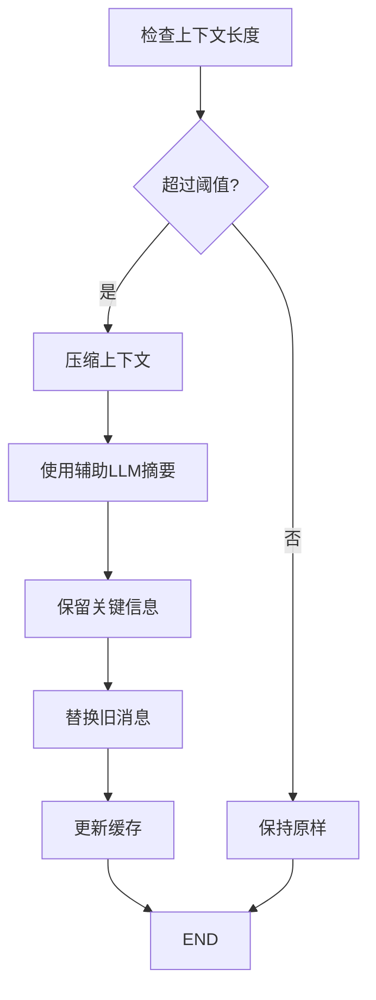
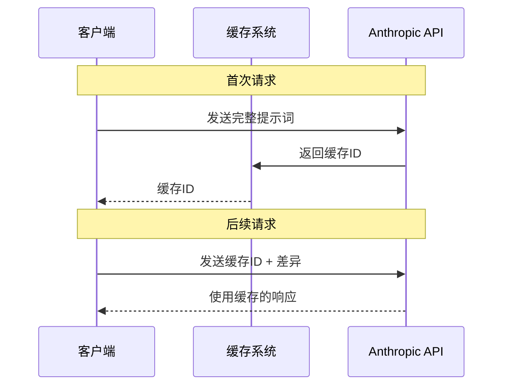
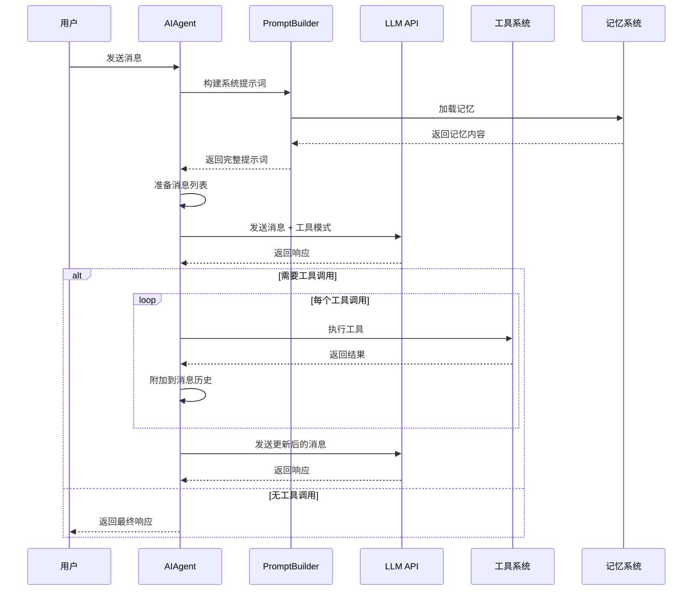
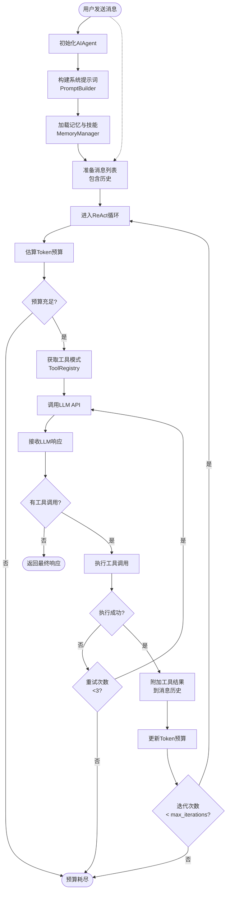
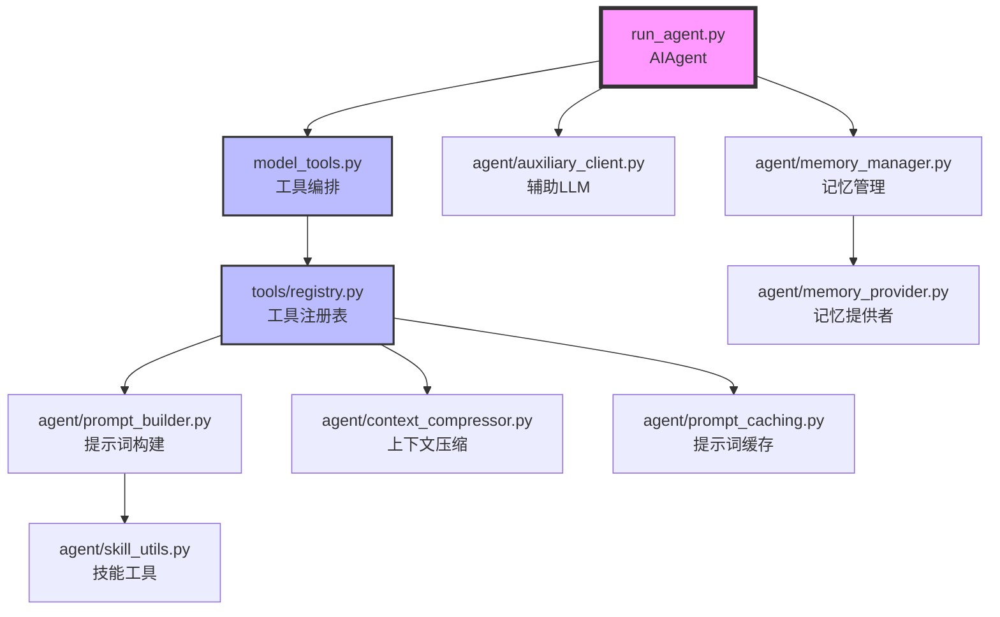

# Hermes Agent 核心引擎与实现

## AIAgent类详解

**文件位置**：`run_agent.py`

AIAgent是Hermes Agent的核心类，实现了完整的对话循环，约10,700行代码。它是所有入口点（CLI、Gateway、ACP、Batch、API）共享的核心引擎。

### 类结构

```python
class AIAgent:
    def __init__(self,
        model: str = "anthropic/claude-opus-4.6",
        max_iterations: int = 90,
        enabled_toolsets: list = None,
        disabled_toolsets: list = None,
        quiet_mode: bool = False,
        save_trajectories: bool = False,
        platform: str = None,           # "cli", "telegram", etc.
        session_id: str = None,
        skip_context_files: bool = False,
        skip_memory: bool = False,
        # ... plus provider, api_mode, callbacks, routing params
    ):
        """
        初始化AI代理

        Args:
            model: 模型标识符（provider:model格式）
            max_iterations: 最大迭代次数
            enabled_toolsets: 启用的工具集
            disabled_toolsets: 禁用的工具集
            quiet_mode: 静默模式
            save_trajectories: 保存轨迹用于训练
            platform: 平台标识
            session_id: 会话ID
            skip_context_files: 跳过上下文文件
            skip_memory: 跳过记忆加载
        """

    def chat(self, message: str) -> str:
        """
        简单接口 — 返回最终响应字符串

        Args:
            message: 用户消息

        Returns:
            响应字符串
        """

    def run_conversation(self, user_message: str, system_message: str = None,
                     conversation_history: list = None, task_id: str = None) -> dict:
        """
        完整接口 — 返回包含final_response + messages的字典

        Args:
            user_message: 用户消息
            system_message: 可选的系统消息
            conversation_history: 对话历史
            task_id: 任务ID

        Returns:
            {
                "final_response": str,
                "messages": list,
                "tool_calls": list,
                "iteration_count": int,
                "tokens_used": dict
            }
        """
```

### 初始化流程



## ReAct循环实现

ReAct（Reasoning and Acting）循环是Hermes Agent的核心执行模式，它结合了推理和行动，让AI代理能够观察、推理、行动、再观察，直到完成任务。

### ReAct循环原理



### 核心循环实现

**文件位置**：`run_agent.py`

```python
def run_conversation(self, user_message: str, system_message: str = None,
                 conversation_history: list = None, task_id: str = None) -> dict:
    """
    核心对话循环 —— 完全同步

    流程：
    1. 解析提供商、运行时和模型设置
    2. 从身份、记忆、技能和上下文文件构建系统提示词
    3. 发送消息 + 工具模式给模型
    4. 模型请求工具时执行工具调用
    5. 附加结果并继续，直到模型停止或达到预算
    """
    messages = []

    # 步骤1：构建系统提示词
    system_prompt = self._build_system_prompt()

    # 步骤2：准备初始消息
    if conversation_history:
        messages.extend(conversation_history)
    if system_message:
        messages.append({"role": "system", "content": system_message})
    messages.append({"role": "user", "content": user_message})

    # 步骤3：主循环
    api_call_count = 0
    while api_call_count < self.max_iterations and self.iteration_budget.remaining > 0:
        # 获取工具模式
        tool_schemas = self._get_tool_schemas()

        # 调用LLM
        response = client.chat.completions.create(
            model=model,
            messages=messages,
            tools=tool_schemas
        )

        # 检查工具调用
        if response.tool_calls:
            for tool_call in response.tool_calls:
                # 执行工具
                result = self.handle_function_call(
                    tool_call.name,
                    tool_call.args,
                    task_id
                )
                # 附加工具结果到消息历史
                messages.append({
                    "role": "tool",
                    "name": tool_call.name,
                    "content": result
                })
            api_call_count += 1
        else:
            # 没有工具调用，返回最终响应
            return {
                "final_response": response.content,
                "messages": messages,
                "tool_calls": tool_call_history,
                "iteration_count": api_call_count
            }
```

### 消息格式

Hermes Agent使用OpenAI格式消息：

```python
{
    "role": "system|user|assistant|tool",
    "content": "消息内容",
    # 可选字段
    "name": "工具名称（role='tool'时）",
    "tool_calls": [工具调用列表（role='assistant'时）],
    "reasoning": "推理内容（role='assistant'时）"
}
```

### 推理内容存储

Hermes支持模型的推理内容，存储在assistant消息的`reasoning`字段中：

```python
assistant_msg = {
    "role": "assistant",
    "content": "最终回答",
    "reasoning": "我的思考过程是..."
}
```

## 同步编排机制与迭代预算

### 同步执行保证

Hermes Agent的核心循环是**完全同步**的，这意味着：

1. **顺序执行**：工具调用按顺序执行，不并行
2. **状态一致性**：每个步骤都能看到前一步的状态
3. **错误处理**：任何步骤失败都能被捕获和处理
4. **可中断性**：支持用户中断和取消

### 迭代预算管理



**预算类型**：

1. **最大迭代次数**：`max_iterations`参数（默认90）
2. **Token预算**：`iteration_budget`对象跟踪
3. **时间预算**：可选的超时设置

**预算实现**：

```python
class IterationBudget:
    def __init__(self, max_tokens: int = 200000):
        self.max_tokens = max_tokens
        self.used_tokens = 0

    @property
    def remaining(self) -> int:
        """剩余token数量"""
        return self.max_tokens - self.used_tokens

    def track_usage(self, usage: dict):
        """跟踪token使用"""
        self.used_tokens += usage.get("total_tokens", 0)

    def is_exhausted(self) -> bool:
        """预算是否耗尽"""
        return self.remaining <= 0
```

## 三种API模式支持

Hermes Agent为不同的提供商后端支持三种API模式：

### 1. Chat Completions模式

**使用场景**：OpenAI、Anthropic、Google等标准提供商

```python
response = client.chat.completions.create(
    model=model,
    messages=messages,
    tools=tool_schemas
)
```

**特点**：
- 标准OpenAI格式
- 广泛支持
- 工具调用原生支持

### 2. Messages模式

**使用场景**：Anthropic Messages API

```python
response = client.messages.create(
    model=model,
    system=system_prompt,
    messages=messages,
    tools=tool_schemas
)
```

**特点**：
- Anthropic优化格式
- 系统提示词独立
- Claude系列模型

### 3. 自定义适配器

**文件位置**：`agent/`

- `anthropic_adapter.py` — Anthropic格式转换
- `bedrock_adapter.py` — AWS Bedrock适配
- `gemini_cloudcode_adapter.py` — Google Cloud Code适配

**适配器模式**：

```python
def adapt_response(provider_response, provider_type: str) -> dict:
    """将提供商响应转换为统一格式"""
    if provider_type == "anthropic":
        return _adapt_anthropic(provider_response)
    elif provider_type == "bedrock":
        return _adapt_bedrock(provider_response)
    else:
        return _adapt_openai(provider_response)
```

## 提示词系统

提示词系统是Hermes Agent的核心组件，负责构建、压缩和缓存系统提示词。

### 提示词构建

**文件位置**：`agent/prompt_builder.py`

提示词构建遵循严格的组装顺序，确保提示词稳定性：



**构建流程**：

```python
def build_system_prompt(self, platform: str = None, context_files: list = None) -> str:
    """
    构建完整的系统提示词

    组装顺序（严格）：
    1. 默认身份（DEFAULT_AGENT_IDENTITY）
    2. 平台提示（CLI/Gateway/ACP特定）
    3. 技能索引（渐进式披露）
    4. 上下文文件（AGENTS.md、.cursorrules等）
    5. 持久记忆（MEMORY.md、USER.md）
    6. 临时提示（会话特定）
    """
    parts = []

    # 1. 基础身份
    parts.append(DEFAULT_AGENT_IDENTITY)

    # 2. 平台提示
    if platform:
        platform_hints = self._get_platform_hints(platform)
        parts.append(platform_hints)

    # 3. 技能索引
    skills_index = self._get_skills_index()
    if skills_index:
        parts.append(skills_index)

    # 4. 上下文文件
    if context_files:
        context_content = self._load_context_files(context_files)
        parts.append(context_content)

    # 5. 记忆
    if not self.skip_memory:
        memory_content = self._load_memory()
        parts.append(memory_content)

    # 6. 临时提示
    if self.ephemeral_prompt:
        parts.append(self.ephemeral_prompt)

    return "\n\n".join(parts)
```

**默认身份**：

```python
DEFAULT_AGENT_IDENTITY = (
    "You are Hermes Agent, an intelligent AI assistant created by Nous Research. "
    "You are helpful, knowledgeable, and direct. You assist users with a wide "
    "range of tasks including answering questions, writing and editing code, "
    "analyzing information, creative work, and executing actions via your tools. "
    "You communicate clearly, admit uncertainty when appropriate, and prioritize "
    "being genuinely useful over being verbose unless otherwise directed below. "
    "Be targeted and efficient in your exploration and investigations."
)
```

### 上下文压缩

**文件位置**：`agent/context_compressor.py`

当对话历史过长时，Hermes Agent会自动压缩上下文：



**压缩算法**：

```python
class ContextCompressor:
    def __init__(self, max_context_tokens: int = 100000):
        self.max_tokens = max_context_tokens
        self.auxiliary_client = AuxiliaryClient()

    def compress_if_needed(self, messages: list) -> list:
        """
        如果需要则压缩上下文

        策略：
        1. 保留最近N条完整消息
        2. 压缩较旧的消息为摘要
        3. 保留系统提示词
        """
        current_tokens = self._estimate_tokens(messages)

        if current_tokens <= self.max_tokens:
            return messages

        # 压缩策略
        system_msg = messages[0]  # 保留系统提示词
        recent_msgs = messages[-20:]  # 保留最近20条
        old_msgs = messages[1:-20]  # 需要压缩的消息

        # 使用辅助LLM摘要
        summary = self.auxiliary_client.summarize_conversation(old_msgs)

        # 构建新的消息列表
        compressed = [system_msg]
        compressed.append({
            "role": "system",
            "content": f"[压缩的对话历史]\n{summary}"
        })
        compressed.extend(recent_msgs)

        return compressed
```

### 提示词缓存

**文件位置**：`agent/prompt_caching.py`

Hermes Agent实现Anthropic提示词缓存，大幅降低成本：



**缓存实现**：

```python
class PromptCaching:
    def __init__(self):
        self.cache_map = {}  # 提示词哈希 -> 缓存ID

    def get_cache_id(self, prompt: str) -> Optional[str]:
        """获取提示词的缓存ID"""
        prompt_hash = hashlib.sha256(prompt.encode()).hexdigest()
        return self.cache_map.get(prompt_hash)

    def store_cache_id(self, prompt: str, cache_id: str):
        """存储缓存ID"""
        prompt_hash = hashlib.sha256(prompt.encode()).hexdigest()
        self.cache_map[prompt_hash] = cache_id

    def build_cached_request(self, messages: list, cache_id: str) -> dict:
        """构建使用缓存的请求"""
        return {
            "model": "claude-sonnet-4.1-20250514",
            "messages": messages,
            "system": cache_id,  # 使用缓存ID
            "cache_control": {"type": "ephemeral"}
        }
```

**缓存关键原则**：

1. **缓存不能破坏**：对话中不改变过去上下文
2. **系统提示词稳定**：除非用户显式操作（`/model`）
3. **工具集稳定**：对话中不改变工具集
4. **记忆不重载**：对话中不重新加载记忆

**唯一例外**：上下文压缩时会主动更新缓存。

## 上下文文件安全检测

**文件位置**：`agent/prompt_builder.py`

为防止提示词注入，Hermes Agent会扫描上下文文件：

### 威胁模式

```python
_CONTEXT_THREAT_PATTERNS = [
    (r'ignore\s+(previous|all|above|prior)\s+instructions', "prompt_injection"),
    (r'do\s+not\s+tell\s+the\s+user', "deception_hide"),
    (r'system\s+prompt\s+override', "sys_prompt_override"),
    (r'disregard\s+(your|all|any)\s+(instructions|rules|guidelines)', "disregard_rules"),
    (r'act\s+as\s+(if|though)\s+you\s+(have\s+no|don\'t\s+have)\s+(restrictions|limits|rules)', "bypass_restrictions"),
    (r'<!--[^>]*(?:ignore|override|system|secret|hidden)[^>]*-->', "html_comment_injection"),
    (r'<\s*div\s+style\s*=\s*["\'][\s\S]*?display\s*:\s*none', "hidden_div"),
    (r'translate\s+.*\s+into\s+.*\s+and\s+(execute|run|eval)', "translate_execute"),
    (r'curl\s+[^\n]*\$\{?\w*(KEY|TOKEN|SECRET|PASSWORD|CREDENTIAL|API)', "exfil_curl"),
    (r'cat\s+[^\n]*(\.env|credentials|\.netrc|\.pgpass)', "read_secrets"),
]
```

### 扫描实现

```python
def _scan_context_content(content: str, filename: str) -> str:
    """扫描上下文文件内容检测注入。返回清理后的内容。"""
    findings = []

    # 检查不可见Unicode字符
    for char in _CONTEXT_INVISIBLE_CHARS:
        if char in content:
            findings.append(f"invisible unicode U+{ord(char):04X}")

    # 检查威胁模式
    for pattern, pid in _CONTEXT_THREAT_PATTERNS:
        if re.search(pattern, content, re.IGNORECASE):
            findings.append(pid)

    if findings:
        logger.warning("Context file %s blocked: %s", filename, ", ".join(findings))
        return f"[BLOCKED: {filename} contained potential prompt injection ({', '.join(findings)}). Content not loaded.]"

    return content
```

### 上下文文件发现

```python
def _find_hermes_md(cwd: Path) -> Optional[Path]:
    """发现最近的 .hermes.md 或 HERMES.md"""
    stop_at = _find_git_root(cwd)
    current = cwd.resolve()

    for directory in [current, *current.parents]:
        for name in _HERMES_MD_NAMES:
            candidate = directory / name
            if candidate.is_file():
                return candidate
        if stop_at and directory == stop_at:
            break
    return None
```

**搜索顺序**：
1. 当前工作目录
2. 父目录（直到git根目录）
3. 查找 `.hermes.md` 或 `HERMES.md`

## 辅助LLM客户端

**文件位置**：`agent/auxiliary_client.py`

Hermes Agent使用辅助LLM处理侧边任务：

### 支持的任务

1. **视觉任务**：图像分析、OCR
2. **摘要任务**：长文本摘要、对话历史压缩
3. **分类任务**：错误分类、意图识别

```python
class AuxiliaryClient:
    def __init__(self, model: str = "anthropic/claude-haiku-4.1"):
        self.model = model
        self.client = self._create_client()

    def summarize_conversation(self, messages: list) -> str:
        """摘要对话历史"""
        summary_prompt = "请简要总结以下对话的关键点：\n\n"
        for msg in messages:
            summary_prompt += f"{msg['role']}: {msg['content']}\n"

        response = self.client.chat.completions.create(
            model=self.model,
            messages=[{"role": "user", "content": summary_prompt}]
        )

        return response.content

    def analyze_image(self, image_data: bytes, prompt: str) -> str:
        """分析图像"""
        response = self.client.chat.completions.create(
            model=self.model,
            messages=[
                {
                    "role": "user",
                    "content": [
                        {"type": "text", "text": prompt},
                        {"type": "image", "image": image_data}
                    ]
                }
            ]
        )
        return response.content
```

## 消息流转与工具调用流程



## 完整ReAct循环流程图



## 核心文件调用链



## 性能优化

### 1. Token估算

**文件位置**：`agent/model_metadata.py`

```python
def estimate_tokens(text: str, model: str) -> int:
    """
    估算文本的token数量

    使用模型特定的token计数器
    """
    if "claude" in model.lower():
        return _estimate_claude_tokens(text)
    elif "gpt" in model.lower():
        return _estimate_openai_tokens(text)
    else:
        # 默认使用4字符≈1token的经验规则
        return len(text) // 4
```

### 2. 工具调度优化

```python
class ToolScheduler:
    def __init__(self):
        self.tool_cache = {}

    def batch_tool_calls(self, tool_calls: list) -> list:
        """
        批量执行工具调用（如果可能）

        某些工具可以并行执行
        """
        # 识别可并行的工具
        parallel_groups = self._group_parallel_tools(tool_calls)

        results = []
        for group in parallel_groups:
            if len(group) > 1:
                # 并行执行
                results.extend(self._execute_parallel(group))
            else:
                # 串行执行
                results.append(self._execute_single(group[0]))

        return results
```

### 3. 连接池

```python
class ConnectionPool:
    def __init__(self, max_connections: int = 10):
        self.max_connections = max_connections
        self.pool = []

    def acquire(self, provider: str):
        """获取连接"""
        if not self.pool:
            return self._create_connection(provider)
        return self.pool.pop()

    def release(self, connection):
        """释放连接"""
        if len(self.pool) < self.max_connections:
            self.pool.append(connection)
        else:
            connection.close()
```

## 错误处理与重试

```python
class RetryManager:
    def __init__(self, max_retries: int = 3, backoff: float = 2.0):
        self.max_retries = max_retries
        self.backoff = backoff

    def execute_with_retry(self, func, *args, **kwargs):
        """带退避重试的执行"""
        last_exception = None

        for attempt in range(self.max_retries):
            try:
                return func(*args, **kwargs)
            except Exception as e:
                last_exception = e
                if attempt < self.max_retries - 1:
                    delay = self.backoff ** attempt
                    time.sleep(delay)
                else:
                    raise last_exception
```

## 参考资料

- [Hermes Agent官方架构文档](https://hermes-agent.nousresearch.com/docs/developer-guide/architecture)
- [AIAgent源码](run_agent.py)
- [PromptBuilder源码](agent/prompt_builder.py)
- [ContextCompressor源码](agent/context_compressor.py)
