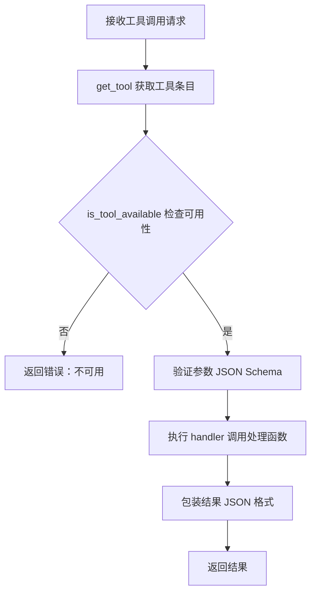

# Hermes Agent 工具系统

工具是扩展 Agent 能力的函数。它们被组织成逻辑工具集（Toolsets），可以按平台启用或禁用。

## 概述

Hermes Agent 内置了广泛的工具注册表，覆盖 Web 搜索、浏览器自动化、终端执行、文件编辑、记忆管理、子代理委托、RL 训练、消息发送、Home Assistant 等功能。

| 统计项 | 数量 |
|-------|------|
| 内置工具 | 47+ |
| 工具集 | 19 |
| 终端后端 | 6 |

## 工具集分类

| 工具集 | 工具示例 | 描述 |
|--------|---------|------|
| `web` | `web_search`, `web_extract` | Web 搜索和页面内容提取 |
| `terminal` | `terminal`, `process` | 终端命令执行和进程管理 |
| `file` | `read_file`, `patch` | 文件读取、写入、修补 |
| `browser` | `browser_navigate`, `browser_snapshot`, `browser_vision` | 交互式浏览器自动化（文本和视觉支持） |
| `vision` | `vision_analyze` | 多模态图像分析 |
| `image_gen` | `image_generate` | 图像生成 |
| `code_execution` | `execute_code` | Python 代码沙箱执行 |
| `delegation` | `delegate_task` | 子代理委托 |
| `todo` | `todo` | 任务规划和追踪 |
| `clarify` | `clarify` | 用户澄清请求 |
| `memory` | `memory` | 持久化记忆存储 |
| `session_search` | `session_search` | 会话历史搜索 |
| `skills` | 技能管理工具 | 技能创建、加载、搜索 |
| `tts` | `text_to_speech` | 文本转语音 |
| `cronjob` | `cronjob` | 定时任务调度 |
| `moa` | 混合代理工具 | 多代理协作 |
| `homeassistant` | `ha_*` | Home Assistant 集成 |
| `rl` | `rl_*` | RL 训练环境工具 |

### 平台预设

Hermes 提供平台级工具预设：

| 预设名称 | 描述 |
|---------|------|
| `hermes-cli` | CLI 默认工具集 |
| `hermes-telegram` | Telegram 平台工具集 |
| `hermes-discord` | Discord 平台工具集 |
| `mcp-<server>` | 动态 MCP 工具集 |

## 工具注册与发现机制

### 架构

```
tools/
├── registry.py           # 中央工具注册表（schemas、handlers、dispatch）
├── approval.py           # 危险命令检测
├── terminal_tool.py      # 终端工具
├── process_registry.py   # 后台进程管理
├── file_tools.py         # 文件操作工具
├── web_tools.py          # Web 工具
├── browser_tool.py       # 浏览器自动化工具
├── code_execution_tool.py # 代码执行沙箱
├── delegate_tool.py      # 子代理委托
├── mcp_tool.py           # MCP 客户端
├── skill_manager_tool.py # 技能管理器
├── credential_files.py   # 凭证文件传递
├── env_passthrough.py    # 环境变量传递
└── environments/         # 终端后端实现
    ├── local/
    ├── docker/
    ├── ssh/
    ├── modal/
    ├── daytona/
    └── singularity/
```

### 注册机制

工具系统采用**声明式注册**机制，通过 AST 解析自动发现：

```python
# tools/registry.py
class ToolRegistry:
    def register(self, name, schema, handler, check_fn=None):
        """注册工具"""
        pass

# 在工具文件中声明
registry.register(
    name="read_file",
    schema={...},           # JSON Schema
    handler=read_file_impl, # 处理函数
    check_fn=None           # 可选：环境检查函数
)
```

### 发现流程

```
启动 Hermes → discover_builtin_tools() → AST 解析检测 registry.register()
→ 导入工具模块 → 工具自动注册 → 构建工具映射表
```

**关键特点**：
- **无外部依赖**：`tools/registry.py` 是核心，被 50+ 工具文件导入
- **自动发现**：AST 解析检测 `registry.register()` 调用
- **无需维护手动导入列表**

### 调用流程



## 终端后端

终端工具支持多种执行环境：

| 后端 | 描述 | 使用场景 |
|------|------|---------|
| `local` | 本地执行（默认） | 开发、可信任务 |
| `docker` | Docker 容器隔离 | 安全、可复现环境 |
| `ssh` | SSH 远程服务器 | 沙箱、将 Agent 与自身代码隔离 |
| `singularity` | Singularity 容器 | HPC 集群计算、无 root |
| `modal` | Modal 云函数 | Serverless、弹性扩展 |
| `daytona` | Daytona 云沙箱 | 持久远程开发环境 |

### 配置

```yaml
# ~/.hermes/config.yaml
terminal:
  backend: local      # 或: docker, ssh, singularity, modal, daytona
  cwd: "."            # 工作目录
  timeout: 180        # 命令超时（秒）
```

### Docker 后端

```yaml
terminal:
  backend: docker
  docker_image: python:3.11-slim
```

### SSH 后端

```yaml
terminal:
  backend: ssh
  ssh:
    host: ${SSH_HOST}
    port: 22
    user: ${SSH_USER}
    key_path: ~/.ssh/id_rsa
```

### Modal 后端

```yaml
terminal:
  backend: modal
  modal:
    app_name: hermes-agent
```

### Daytona 后端

```yaml
terminal:
  backend: daytona
  daytona:
    api_key: ${DAYTONA_API_KEY}
    workspace_id: ${DAYTONA_WORKSPACE_ID}
```

## 交互式终端模式（PTY Mode）

Hermes Agent 支持**交互式 PTY（伪终端）模式**，启用像 Codex 和 Claude Code 这样的交互式 CLI 工具：

```yaml
# config.yaml
terminal:
  pty: true  # 启用 PTY 模式
```

**特点**：
- 完全交互式：可以响应提示和确认
- 更好的兼容性：支持需要 TTY 的命令
- 实时输出：流式返回工具输出

**使用场景**：
- 需要用户输入的命令（如 `vim`、`nano` 编辑器）
- 需要密码的命令（如 `sudo`、`ssh`）
- 需要交互式确认的命令

## Sudo 支持

如果命令需要 sudo 权限：

### 方法1：自动提示

```bash
hermes> terminal
Command: apt update
[sudo] password for xxx: ****  # 自动提示输入密码
```

### 方法2：环境变量

```bash
# 在 ~/.hermes/.env 中设置
SUDO_PASSWORD="your_password_here"
```

### 方法3：密码缓存

```bash
hermes> terminal
Command: apt install htop
[sudo] password: ****  # 首次输入

hermes> terminal
Command: apt install strace
# 无需密码（已缓存）
```

**消息平台注意事项**：
- 在 Telegram、Discord 等平台，如果 sudo 失败，输出会包含提示
- 提示信息：`Add SUDO_PASSWORD to ~/.hermes/.env`
- 这是安全措施，防止在平台日志中暴露密码

## 安全机制：命令审批

工具系统内置**危险命令检测**机制：

```python
# tools/approval.py
class CommandApproval:
    def is_dangerous(self, command: str) -> bool:
        """判断命令是否危险"""
        dangerous_patterns = [
            r"rm\s+-[rf]+",                    # rm -rf
            r"systemctl\s+(stop|disable|restart)",  # systemctl
            r"apt\s+(remove|purge)",           # apt remove
            r"curl.*\|.*sh",                   # curl | sh
            r"chmod\s+777",                    # chmod 777
            r"dd\s+if=",                       # dd
            r">\s*/dev/",                      # 重定向到设备
            # ...
        ]
```

**处理流程**：
1. 检测到危险命令 → 拦截执行
2. 向用户显示命令内容和风险提示
3. 等待用户确认（Approve/Deny/Modify）
4. 用户确认后才执行

## MCP 工具桥接

Hermes Agent 支持 **MCP (Model Context Protocol)** 协议，可以桥接外部工具：

```yaml
# config.yaml
mcp_servers:
  - name: filesystem
    command: mcp-filesystem
    args: ["--root", "/home/user/projects"]
```

**MCP 工具命名规则**：
- 工具名称格式：`mcp_<server>_<tool>`
- 例如：`mcp_filesystem_read_file`

详见 `mcp_tool.py` 实现（~2,200 行）。

## 工具使用命令

### CLI 命令

```bash
# 查看所有可用工具
hermes tools

# 使用特定工具集启动
hermes chat --toolsets "web,terminal"

# 配置平台级工具（交互式）
hermes tools
```

### 会话内命令

```bash
# 查看当前启用的工具
/tools

# 启用/禁用工具
/tools enable web_search
/tools disable browser
```

## 配置文件

### 主配置文件

```yaml
# ~/.hermes/config.yaml

# 终端配置
terminal:
  backend: local
  cwd: "."
  timeout: 180
  pty: false

# 工具集配置
toolsets:
  enabled: ["web", "terminal", "file", "memory"]
  disabled: ["browser", "image_gen"]
```

### 环境变量

```bash
# ~/.hermes/.env
SUDO_PASSWORD=your_password_here
```

## 工具 vs 技能：关系说明

| 维度 | 工具系统 | 技能系统 |
|-----|---------|---------|
| 本质 | 可执行代码（"手"） | 知识文档（"脑"） |
| 存储位置 | `tools/*.py` | `~/.hermes/skills/*.md` |
| 创建方式 | 开发者编写 Python | Agent 自动创建或用户编写 Markdown |
| 执行方式 | 函数调用 → 返回值 | 读取文档 → 注入提示词 |
| 生命周期 | 开发者控制 | Agent 自改进 |

**协同关系**：
- 工具提供「执行」能力
- 技能从执行中「抽象」经验，形成可复用知识
- 技能可以推荐使用特定工具
- 工具执行结果可以触发技能创建

## 参考资料

- [Hermes Agent 官方文档 - Tools](https://hermes-agent.nousresearch.com/docs/user-guide/features/tools)
- [Built-in Tools Reference](https://hermes-agent.nousresearch.com/docs/reference/tools)
- [Toolsets Reference](https://hermes-agent.nousresearch.com/docs/reference/toolsets)