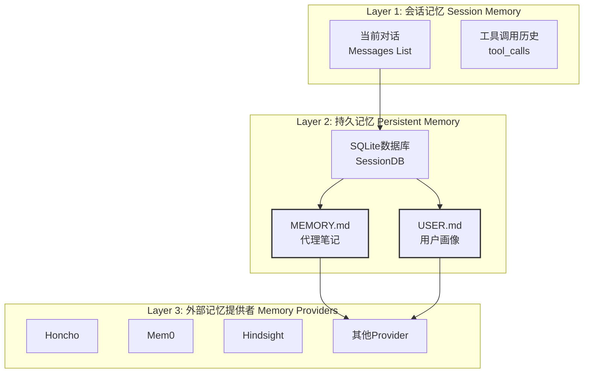
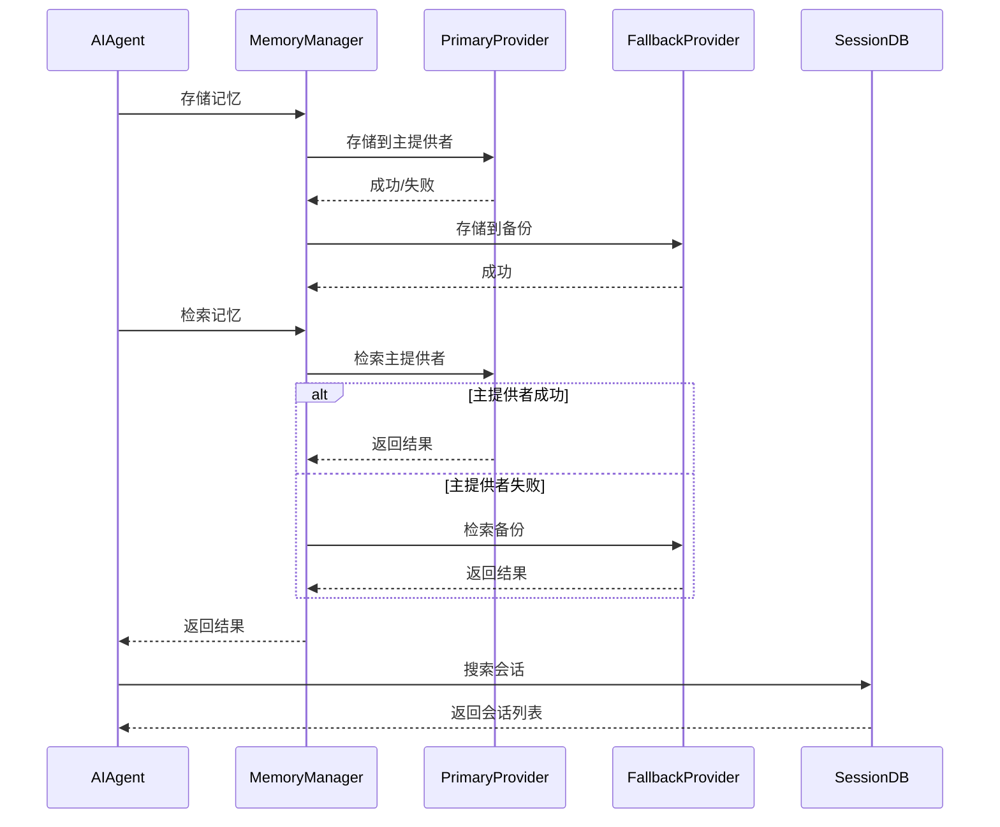

# Hermes Agent 记忆系统

Hermes Agent 拥有跨会话持久化的记忆能力，能够记住你的偏好、项目、环境和学习到的内容。

## 概述

### 记忆文件

两个文件构成 Agent 的记忆：

| 文件 | 用途 | 字符限制 |
|------|------|---------|
| `MEMORY.md` | Agent 的个人笔记 — 环境事实、约定、学习内容 | 2,200 字符（~800 tokens） |
| `USER.md` | 用户画像 — 偏好、沟通风格、期望 | 1,375 字符（~500 tokens） |

两个文件都存储在 `~/.hermes/memories/` 目录，在会话开始时作为冻结快照注入到系统提示词中。

### 记忆系统架构



## 持久记忆（MEMORY.md / USER.md）

### MEMORY.md — 代理笔记

存储 Agent 学习到的内容：

- 环境事实（OS、工具、项目结构）
- 项目约定和配置
- 工具使用技巧和变通方案
- 已完成任务日记
- 有效的技能和技术

**示例**：

```markdown
# Hermes Memory

## Project Information
- Project root: /home/user/projects/myapp
- Language: Python, Framework: Flask

## Conventions
- Use snake_case for function names
- Write docstrings for all functions

## Learned Patterns
- When debugging, start with logs
- For database queries, use SQLAlchemy
```

### USER.md — 用户画像

存储用户的身份、偏好和沟通风格：

- 姓名、角色、时区
- 沟通偏好（简洁 vs 详细、格式偏好）
- 避免的事项
- 工作流习惯
- 技术技能水平

**示例**：

```markdown
# User Profile

## Identity
- Name: Developer
- Role: Full-stack developer
- Timezone: UTC+8

## Preferences
- Languages: Python, JavaScript
- Prefers code over explanations
- Likes examples and templates

## Communication Style
- Direct and concise
- Show code examples first
```

### 记忆在系统提示词中的呈现

会话开始时，记忆条目作为冻结块注入系统提示词：

```
### MEMORY (~45% full, 990/2200 chars)
§ Project uses Python 3.11 with Flask framework
§ User prefers snake_case naming convention
§ Database: PostgreSQL with SQLAlchemy ORM
§ Debugging: always check logs first

### USER PROFILE (~30% full, 412/1375 chars)
§ Role: Full-stack developer, 5+ years experience
§ Prefers concise responses with code examples
§ Avoid: verbose explanations
```

**特点**：
- 使用 `§` 分隔符分隔条目
- 显示使用百分比和字符计数
- 支持多行条目
- **Frozen snapshot**：会话开始时捕获一次，会话期间不变（保护 LLM 前缀缓存）

### 字符限制

记忆有字符限制以保持专注。当记忆满时，Agent 会合并或替换条目为新信息腾出空间。

```yaml
# ~/.hermes/config.yaml
memory:
  memory_enabled: true
  user_profile_enabled: true
  memory_char_limit: 2200    # ~800 tokens
  user_char_limit: 1375      # ~500 tokens
```

## Memory 工具操作

Agent 通过 `memory` 工具管理记忆：

| 操作 | 描述 |
|------|------|
| `add` | 添加新记忆条目 |
| `replace` | 替换现有条目 |
| `remove` | 删除条目 |
| `list` | 列出所有条目 |
| `search` | 搜索记忆 |

### 什么该保存

**主动保存（无需请求）**：

- 项目约定和配置
- 环境细节（OS、Python 版本）
- 用户偏好（命名风格、格式偏好）
- 工具使用模式
- 任务完成记录

**按请求保存**：

- 用户说「记住这个」「别忘了...」
- 显式的记忆指令

### 什么该跳过

- 临时信息（当前日期、天气）
- 敏感数据（密码、API 密钥）
- 会话特定上下文
- 通用知识

## 会话记忆（SessionDB）

### SQLite 数据库

**位置**：`~/.hermes/sessions/sessions.db`

**表结构**：

```sql
-- 会话表
CREATE TABLE sessions (
    id TEXT PRIMARY KEY,
    platform TEXT NOT NULL,
    user_id TEXT,
    title TEXT,
    created_at TIMESTAMP DEFAULT CURRENT_TIMESTAMP,
    updated_at TIMESTAMP DEFAULT CURRENT_TIMESTAMP,
    metadata JSON
);

-- FTS5 全文搜索索引
CREATE VIRTUAL TABLE messages_fts USING fts5(
    content,
    session_id,
    tokenize='porter unicode61'
);
```

### 会话搜索

```python
class SessionDB:
    def search_sessions(self, query: str, limit: int = 10) -> list:
        """使用 FTS5 搜索会话"""
        cursor = self.conn.execute("""
            SELECT DISTINCT s.id, s.title, s.platform, s.created_at
            FROM sessions s
            JOIN messages m ON s.id = m.session_id
            JOIN messages_fts fts ON m.rowid = fts.rowid
            WHERE messages_fts MATCH ?
            ORDER BY s.updated_at DESC
            LIMIT ?
        """, (query, limit))
        return cursor.fetchall()
```

## 外部记忆提供者（Memory Providers）

Hermes Agent 提供 8 个外部记忆提供者插件，提供超出内置 MEMORY.md 和 USER.md 的持久化、跨会话知识。同一时间只能激活一个外部提供者。

### CLI 命令

```bash
hermes memory setup    # 交互式选择和配置
hermes memory status   # 查看当前激活的提供者
hermes memory off      # 禁用外部提供者
```

或通过配置文件设置：

```yaml
# ~/.hermes/config.yaml
memory:
  provider: openviking  # 可选：honcho, mem0, hindsight, holographic, retaindb, byterover, supermemory
```

### 提供者对比

| 提供者 | 最佳用途 | 数据存储 | 特点 |
|--------|---------|---------|------|
| **OpenViking** | 自托管语义记忆 | 本地服务器 | 无外部依赖，完全本地 |
| **Mem0** | 自动记忆管理 | Mem0 Cloud | LLM 自动提取事实 |
| **Hindsight** | 知识图谱 + 用户画像 | 本地 | 会话级图构建，`hindsight_reflect` 工具 |
| **Holographic** | 事实推理 + 信任评分 | 本地 SQLite | `probe`、`reason`、`contradict` 操作 |
| **Supermemory** | 语义相似度搜索 | Supermemory Cloud | 快速检索，简单 API |
| **RetainDB** | 时间序列记忆 | 本地 | 时间维度查询 |
| **ByteRover** | 知识图谱 | 云端 | 企业级图谱 |
| **Honcho** | 跨工具用户建模 | Honcho Cloud | AI 生成的用户理解 |

### OpenViking

自托管的语义记忆，无需外部依赖。

```bash
# 启动服务器
pip install openviking
openviking-server

# 配置 Hermes
hermes memory setup  # 选择 openviking
# 或手动配置
hermes config set memory.provider openviking
echo "OPENVIKING_ENDPOINT=http://localhost:8000" >> ~/.hermes/.env
```

### Mem0

服务端 LLM 事实提取，支持语义搜索、重排序和自动去重。

```bash
pip install mem0ai

hermes memory setup  # 选择 mem0
# 或手动配置
hermes config set memory.provider mem0
echo "MEM0_API_KEY=your-key" >> ~/.hermes/.env
```

**工具**：
- `mem0_profile`：查看所有存储的记忆
- `mem0_search`：语义搜索 + 重排序
- `mem0_conclude`：存储确切事实

**配置文件**：`$HERMES_HOME/mem0.json`

```json
{
  "user_id": "hermes-user",
  "agent_id": "hermes"
}
```

### Hindsight

长期记忆 + 知识图谱 + 实体解析 + 多策略检索。独有的 `hindsight_reflect` 工具提供跨记忆综合。

**特点**：
- 自动保留完整对话轮次（包括工具调用）
- 会话级文档跟踪
- 用户画像构建

### Holographic

本地事实存储，支持推理和信任评分。

**工具**：
- `fact_store`：9 个操作（add, search, probe, related, reason, contradict, update, remove, list）
- `fact_feedback`：有用/无用评分，训练信任分数

**配置**：

```yaml
# config.yaml
plugins:
  hermes-memory-store:
    db_path: $HERMES_HOME/memory_store.db
    auto_extract: false
    default_trust: 0.5
```

**独特能力**：
- `probe`：探测相关事实
- `reason`：基于事实推理
- `contradict`：检测矛盾事实

### Supermemory

语义相似度搜索，云端存储。

```bash
pip install supermemory

hermes memory setup  # 选择 supermemory
echo 'SUPERMEMORY_API_KEY=your-key' >> ~/.hermes/.env
```

**工具**：
- `supermemory_store`：保存显式记忆
- `supermemory_search`：语义相似度搜索
- `supermemory_forget`：按 ID 或最佳匹配查询遗忘
- `supermemory_profile`：持久画像 + 最近上下文

### Honcho 集成

Honcho 是由 Plastic Labs 提供的跨会话用户建模服务，作为额外的上下文层运行在现有记忆之上。

**启用后**：
- USER.md 保持不变
- Honcho 添加额外的用户理解层
- 跨工具、跨会话的用户建模

```bash
hermes memory setup  # 选择 honcho
echo 'HONCHO_API_KEY=your-key' >> ~/.hermes/.env
```

## 记忆管理器

### 架构

```python
class MemoryProvider(ABC):
    """记忆提供者抽象基类"""

    @abstractmethod
    def store(self, key: str, value: dict, metadata: dict = None):
        """存储记忆"""
        pass

    @abstractmethod
    def retrieve(self, query: str, limit: int = 5) -> list:
        """检索记忆"""
        pass

    @abstractmethod
    def delete(self, key: str):
        """删除记忆"""
        pass


class MemoryManager:
    """记忆管理器"""

    def __init__(self, provider: MemoryProvider = None):
        self.primary_provider = provider
        self.fallback_provider = VectorMemoryProvider()

    def store_memory(self, key: str, value: dict, metadata: dict = None):
        """存储记忆（主提供者 + 备份）"""
        if self.primary_provider:
            try:
                self.primary_provider.store(key, value, metadata)
            except Exception as e:
                logger.warning(f"Primary provider failed: {e}")

        # 总是备份到向量数据库
        self.fallback_provider.store(key, value, metadata)

    def retrieve_memory(self, query: str, limit: int = 5) -> list:
        """检索记忆（主提供者优先）"""
        if self.primary_provider:
            try:
                return self.primary_provider.retrieve(query, limit)
            except Exception as e:
                logger.warning(f"Primary provider failed: {e}")

        return self.fallback_provider.retrieve(query, limit)
```

### 记忆压缩

**文件位置**：`agent/context_compressor.py`

```python
class MemoryCompressor:
    def __init__(self, max_tokens: int = 10000):
        self.max_tokens = max_tokens
        self.auxiliary_client = AuxiliaryClient()

    def compress_memory(self, memory_content: str) -> str:
        """压缩记忆内容"""
        if self._estimate_tokens(memory_content) <= self.max_tokens:
            return memory_content

        # 使用辅助 LLM 摘要
        summary = self.auxiliary_client.summarize_text(
            text=memory_content,
            max_length=self.max_tokens
        )

        return summary
```

## 完整流程



## 参考资料

- [Persistent Memory 官方文档](https://hermes-agent.nousresearch.com/docs/user-guide/features/memory)
- [Memory Providers 官方文档](https://hermes-agent.nousresearch.com/docs/user-guide/features/memory-providers)
- [SessionDB 源码](hermes_state.py)
- [Memory Provider 源码](agent/memory_provider.py)