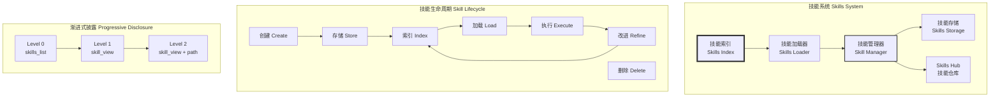
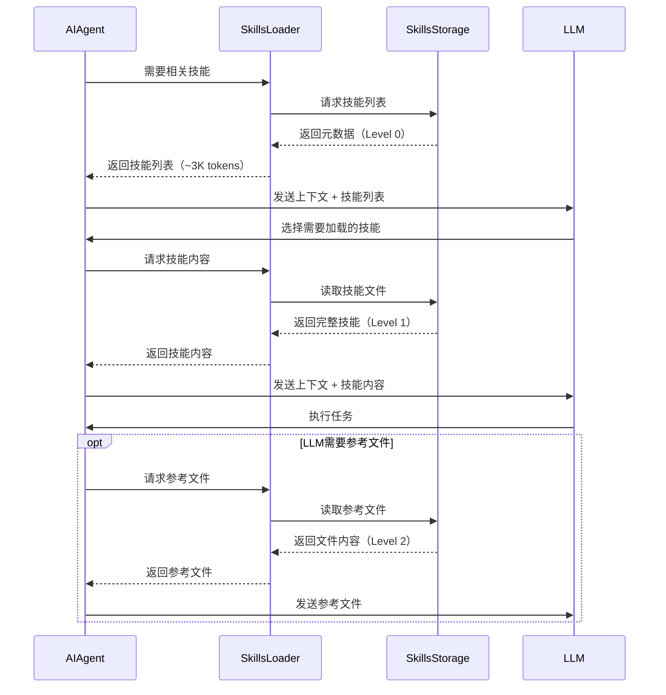
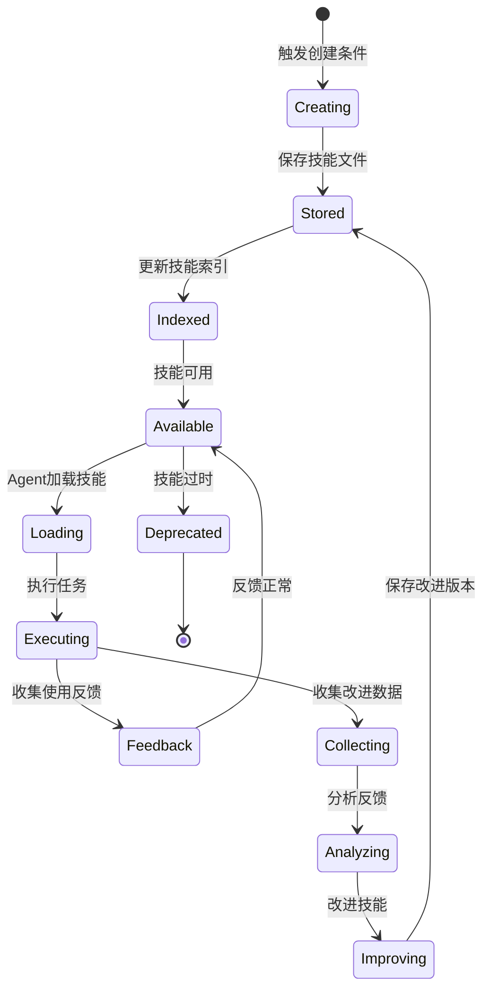

# Hermes Agent 技能系统

技能是 Agent 按需加载的知识文档，遵循 **agentskills.io** 开放标准。所有技能存储在 `~/.hermes/skills/` 目录，作为唯一的真实来源。

## 核心特性

- **渐进式披露**：按需加载，最小化 token 使用
- **自动创建**：Agent 可从成功任务中自动创建技能
- **跨平台兼容**：遵循开放标准，可移植到其他 Agent
- **持续改进**：技能可基于使用反馈自动优化

## 技能系统架构



## 技能目录结构

所有技能存储在 `~/.hermes/skills/` 目录，这是唯一的真实来源。新安装时，内置技能会从仓库复制；Hub 安装和 Agent 创建的技能也会存放在此。

### 单文件技能

简单的技能使用单个 Markdown 文件：

```
~/.hermes/skills/
├── software-development/
│   ├── debugging-flask-apps.md
│   └── python-best-practices.md
├── research/
│   └── literature-search.md
```

### 目录技能（带资源文件）

复杂的技能使用目录结构：

```
~/.hermes/skills/
├── mlops/
│   ├── axolotl/
│   │   ├── SKILL.md           # 主指令文件（必需）
│   │   ├── references/        # 参考文档
│   │   │   ├── api.md
│   │   │   └── examples.md
│   │   ├── templates/         # 输出模板
│   │   │   └── config.yaml
│   │   └── assets/            # 补充文件
│   │       └── diagram.png
│   └── vllm/
│       └── SKILL.md
```

| 目录 | 用途 |
|------|------|
| `SKILL.md` | 主指令文件，必需 |
| `references/` | 额外参考文档（Level 2 加载） |
| `templates/` | 输出格式模板 |
| `assets/` | 图片等补充资源 |

## SKILL.md 格式

### YAML Frontmatter

```yaml
---
name: Debugging Flask Applications
description: Systematic approach to debugging Flask web applications
category: software-development
tags: [flask, debugging, web]
author: Hermes Agent
version: 1.0.0
platforms: [macos, linux]    # 可选：限制操作系统
---
```

### 元数据字段

| 字段 | 类型 | 必需 | 说明 |
|------|------|------|------|
| `name` | string | 是 | 技能名称 |
| `description` | string | 是 | 一句话描述 |
| `category` | string | 是 | 技能分类 |
| `tags` | list | 否 | 标签列表 |
| `author` | string | 否 | 作者 |
| `version` | string | 否 | 版本号 |
| `platforms` | list | 否 | 限制操作系统：`macos` / `linux` / `windows` |

### 平台特定技能

技能可以限制在特定操作系统上使用：

```yaml
platforms: [macos]            # 仅 macOS（如 iMessage、Apple Reminders）
platforms: [macos, linux]     # macOS 和 Linux
# 省略则在所有平台加载
```

设置后，技能会在不兼容平台的系统提示词、`skills_list()` 和斜杠命令中自动隐藏。

### 完整示例

```markdown
---
name: Debugging Flask Applications
description: Systematic approach to debugging Flask web applications
category: software-development
tags: [flask, debugging, web]
author: Hermes Agent
version: 1.0.0
---

# Debugging Flask Applications

This skill provides a systematic approach to debugging Flask web applications.

## Common Issues

### 1. 500 Internal Server Error

**Symptoms:**
- Server returns 500 status code
- No error message shown to user

**Solution:**
1. Check Flask logs: `tail -f logs/flask.log`
2. Enable debug mode: `app.run(debug=True)`
3. Review stack trace in logs

### 2. Template Not Found

**Solution:**
- Verify template directory structure
- Check `app.template_folder` setting

## Best Practices

- Always check logs first
- Use debug mode in development
- Test routes with `curl` or Postman
```

## 使用技能

每个安装的技能自动作为斜杠命令可用：

```bash
# 查看拥有的技能
hermes chat --toolsets skills -q "What skills do you have?"

# 查看特定技能
hermes chat --toolsets skills -q "Show me the axolotl skill"
```

## 渐进式披露模式（Progressive Disclosure）

技能使用 **渐进式披露** 加载模式，最小化 token 消耗：

```
Level 0: skills_list()           → [{name, description, category}, ...]   (~3k tokens)
Level 1: skill_view(name)        → 完整内容 + 元数据                       (变化)
Level 2: skill_view(name, path)  → 特定参考文件                           (变化)
```

Agent 只在真正需要时才加载完整技能内容。

### Level 0: skills_list()

返回技能列表（仅元数据），约 3000 tokens：

```python
def skills_list() -> list:
    """
    返回技能列表（仅元数据）

    Returns:
        [
            {
                "name": "Debugging Flask Apps",
                "description": "Systematic debugging approach",
                "category": "software-development",
                "tags": ["flask", "debugging"]
            },
            ...
        ]
    """
```

### Level 1: skill_view(name)

返回技能的完整内容和元数据：

```python
def skill_view(name: str) -> dict:
    """
    返回技能的完整内容和元数据

    Args:
        name: 技能名称

    Returns:
        {
            "name": "Debugging Flask Apps",
            "description": "...",
            "category": "software-development",
            "metadata": {...},
            "content": "# Debugging Flask Applications\n..."
        }
    """
```

### Level 2: skill_view(name, path)

返回技能的特定参考文件：

```python
def skill_view(name: str, path: str) -> str:
    """
    返回技能的特定参考文件

    Args:
        name: 技能名称
        path: 技能内文件路径（如：examples/basic.py）

    Returns:
        文件内容字符串
    """
```

### 渐进式披露流程



## Agent 管理的技能（skill_manage 工具）

Agent 可以通过 `skill_manage` 工具管理技能。

### 何时创建技能

Agent 会在以下情况下自动创建技能：

1. **复杂任务完成**：多步骤任务成功完成，且包含可复用的模式
2. **用户明确请求**：用户说「保存为技能」或类似表达
3. **模式识别**：识别到重复的成功模式（如相似任务执行多次）

### 可用操作

| 操作 | 描述 |
|------|------|
| `create` | 创建新技能 |
| `update` | 更新现有技能 |
| `delete` | 删除技能 |
| `search` | 搜索技能 |

## 技能创建流程

### 触发条件

Hermes Agent 在以下情况下自动创建技能：

1. **复杂任务完成**：多步骤任务成功完成
2. **用户认可**：用户表示「这很有用」或类似反馈
3. **模式识别**：识别到重复的成功模式
4. **明确请求**：用户明确要求「保存为技能」

### 实现代码

```python
class SkillCreator:
    def __init__(self, skills_dir: str, auxiliary_client: AuxiliaryClient):
        self.skills_dir = Path(skills_dir)
        self.auxiliary_client = auxiliary_client

    def should_create_skill(self, trajectory: dict, user_feedback: str) -> bool:
        """
        判断是否应该创建技能

        条件：
        1. 任务成功（无错误）
        2. 用户正面反馈
        3. 轨迹足够复杂（>= 5个工具调用）
        """
        if trajectory.get("error"):
            return False

        if not self._has_positive_feedback(user_feedback):
            return False

        if len(trajectory.get("tool_calls", [])) < 5:
            return False

        return True

    def create_skill(self, trajectory: dict, task_description: str) -> str:
        """从轨迹创建技能"""
        # 1. 提取关键步骤
        key_steps = self._extract_key_steps(trajectory)

        # 2. 生成技能内容
        skill_content = self._generate_skill_content(
            task_description,
            key_steps
        )

        # 3. 生成元数据
        metadata = self._generate_metadata(task_description, trajectory)

        # 4. 保存技能文件
        skill_name = self._generate_skill_name(task_description)
        skill_path = self.skills_dir / f"{skill_name}.md"

        full_content = self._assemble_skill_file(metadata, skill_content)
        skill_path.write_text(full_content, encoding="utf-8")

        # 5. 更新索引
        self._update_skill_index(skill_path)

        return str(skill_path)
```

## 技能自改进机制

```python
class SkillImprover:
    def __init__(self, skills_dir: str, auxiliary_client: AuxiliaryClient):
        self.skills_dir = Path(skills_dir)
        self.auxiliary_client = auxiliary_client

    def improve_skill(self, skill_name: str, usage_feedback: list) -> bool:
        """
        基于使用反馈改进技能

        Args:
            skill_name: 技能名称
            usage_feedback: 使用反馈列表
                [
                    {
                        "success": True,
                        "user_rating": 5,
                        "issues": ["步骤2不够清晰"],
                        "suggestions": ["添加截图示例"]
                    },
                    ...
                ]
        """
        # 1. 加载当前技能
        skill_path = self.skills_dir / f"{skill_name}.md"
        if not skill_path.exists():
            return False

        # 2. 分析反馈
        improvements = self._analyze_feedback(usage_feedback)

        if not improvements:
            return False  # 无需改进

        # 3. 生成改进建议
        improvement_suggestions = self._generate_improvements(body, improvements)

        # 4. 应用改进
        improved_body = self._apply_improvements(body, improvement_suggestions)

        # 5. 更新版本
        metadata["version"] = self._increment_version(metadata.get("version", "1.0.0"))

        # 6. 保存改进的技能
        skill_path.write_text(improved_content, encoding="utf-8")

        return True
```

## 技能生命周期



## 技能存储与索引

```
~/.hermes/skills/
├── index-cache/              # 技能索引缓存
│   ├── skills_index.json
│   ├── category_index.json
│   └── tag_index.json
├── software-development/    # 按分类组织
│   ├── debugging-flask-apps.md
│   ├── python-best-practices.md
│   └── testing-strategies.md
├── research/
│   ├── literature-search.md
│   └── data-analysis.md
└── [其他分类目录]
```

#### 技能索引

```python
class SkillIndex:
    def __init__(self, skills_dir: str):
        self.skills_dir = Path(skills_dir)
        self.index_file = self.skills_dir / "index-cache" / "skills_index.json"

    def build_index(self) -> dict:
        """构建技能索引"""
        skills = {}

        for skill_path in self.skills_dir.rglob("*.md"):
            if "index-cache" in str(skill_path):
                continue

            content = skill_path.read_text(encoding="utf-8")
            metadata, body = parse_frontmatter(content)

            skill_info = {
                "name": metadata.get("name", skill_path.stem),
                "path": str(skill_path.relative_to(self.skills_dir)),
                "category": metadata.get("category", "misc"),
                "tags": metadata.get("tags", []),
                "description": metadata.get("description", ""),
            }
            skills[skill_info["name"]] = skill_info

        return skills

    def search(self, query: str, limit: int = 10) -> list:
        """搜索技能"""
        # 1. 精确匹配
        # 2. 模糊匹配
        # 3. 语义搜索（如果有向量数据库）
        pass
```

## Skills Hub

**文件位置**：`hermes_cli/skills_hub.py`

Skills Hub 是社区技能仓库，允许浏览、安装和分享技能。

### 信任级别

| 级别 | 描述 |
|------|------|
| `official` | 官方维护，完全可信 |
| `verified` | 社区验证，可信度高 |
| `community` | 社区贡献，用户自行判断 |

### 斜杠命令（会话内）

| 命令 | 功能 |
|------|------|
| `/skills` | 列出已安装的技能 |
| `/skills search <query>` | 在 Hub 中搜索技能 |
| `/skills install <name>` | 从 Hub 安装技能 |
| `/skills browse` | 浏览 Hub 分类 |

### Skills Hub API

```python
class SkillsHubClient:
    def __init__(self, base_url: str = "https://api.agentskills.io"):
        self.base_url = base_url

    def search_skills(self, query: str, category: str = None,
                     tags: list = None, limit: int = 20) -> list:
        """搜索技能"""
        pass

    def get_skill(self, skill_id: str) -> dict:
        """获取技能详情"""
        pass

    def download_skill(self, skill_id: str, dest_dir: str) -> str:
        """下载技能"""
        pass

    def publish_skill(self, skill_path: str, api_key: str) -> dict:
        """发布技能"""
        pass
```

## 技能 vs 工具：关系说明

| 维度 | 技能系统 | 工具系统 |
|-----|---------|---------|
| 本质 | 知识文档（"脑"） | 可执行代码（"手"） |
| 存储位置 | `~/.hermes/skills/*.md` | `tools/*.py` |
| 创建方式 | Agent 自动创建或用户编写 Markdown | 开发者编写 Python |
| 执行方式 | 读取文档 → 注入提示词 | 函数调用 → 返回值 |
| 生命周期 | Agent 自改进 | 开发者控制 |

**协同关系**：
- 工具提供「执行」能力
- 技能从执行中「抽象」经验，形成可复用知识
- 技能可以推荐使用特定工具
- 工具执行结果可以触发技能创建

## 参考资料

- [技能系统官方文档](https://hermes-agent.nousresearch.com/docs/user-guide/features/skills)
- [agentskills.io 标准](https://agentskills.io)
- [Skills Hub](https://agentskills.io/hub)
- [SkillCommands 源码](agent/skill_commands.py)
