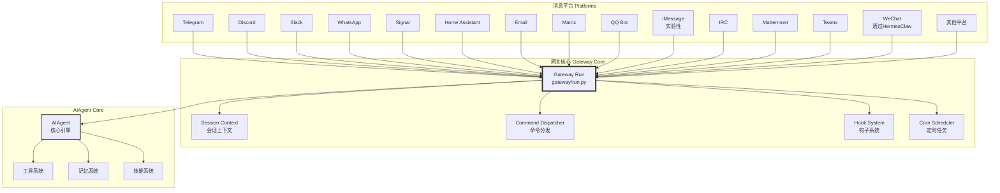
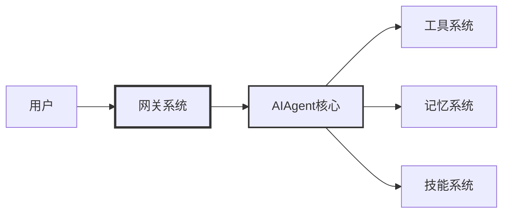

# Hermes Agent 网关系统

消息网关是 Hermes Agent 与 18 个消息平台通信的桥梁，提供统一的会话路由、用户授权和斜杠命令系统。

## 概述

网关系统独立于技能系统，作为 Hermes Agent 的多平台接入层，负责：

- **会话路由**：管理不同平台的用户会话
- **用户授权**：验证用户身份，控制访问权限
- **斜杠命令**：处理 `/model`、`/skills`、`/reset` 等命令
- **钩子系统**：支持消息前后处理钩子
- **定时任务**：Cron 调度器支持

## 支持的平台

| 平台 | 类型 | 说明 |
|------|------|------|
| Telegram | 即时通讯 | 完全支持 |
| Discord | 即时通讯 | 完全支持 |
| Slack | 团队协作 | 完全支持 |
| WhatsApp | 即时通讯 | 完全支持 |
| Signal | 即时通讯 | 完全支持 |
| Matrix | 去中心化通讯 | 完全支持 |
| Email | 邮件 | 完全支持 |
| Home Assistant | 智能家居 | 完全支持 |
| QQ Bot | 即时通讯 | 完全支持 |
| IRC | 聊天协议 | 完全支持 |
| Mattermost | 团队协作 | 完全支持 |
| Teams | 团队协作 | 完全支持 |
| iMessage | 即时通讯 | 实验性 |
| WeChat | 即时通讯 | 通过 HermesClaw |

## 网关架构



## Gateway 主循环

**文件位置**：`gateway/run.py`

```python
class Gateway:
    def __init__(self, config: dict):
        self.config = config
        self.platforms = {}
        self.session_store = SessionStore()
        self.command_dispatcher = CommandDispatcher()
        self.hook_system = HookSystem()
        self.cron_scheduler = CronScheduler()

    async def start(self):
        """启动网关"""
        # 1. 初始化平台适配器
        for platform_name, platform_config in self.config.get("platforms", {}).items():
            if platform_config.get("enabled", False):
                platform = self._create_platform(platform_name, platform_config)
                self.platforms[platform_name] = platform

        # 2. 启动所有平台
        for platform in self.platforms.values():
            await platform.start()

        # 3. 启动Cron调度器
        await self.cron_scheduler.start()

        # 4. 触发启动钩子
        await self.hook_system.trigger_hooks("gateway_start")

        logger.info("Gateway started")

    async def handle_message(self, platform: str, user_id: str,
                          message: str, message_id: str = None):
        """
        处理消息

        Args:
            platform: 平台名称
            user_id: 用户ID
            message: 消息内容
            message_id: 消息ID（可选）
        """
        # 1. 检查用户授权
        if not await self._is_user_authorized(platform, user_id):
            await self._send_unauthorized_response(platform, user_id)
            return

        # 2. 获取或创建会话
        session = self.session_store.get_or_create(
            platform=platform,
            user_id=user_id
        )

        # 3. 检查斜杠命令
        if message.startswith("/"):
            await self._handle_slash_command(
                platform, user_id, session, message, message_id
            )
            return

        # 4. 触发消息前钩子
        await self.hook_system.trigger_hooks(
            "message_before",
            platform=platform,
            user_id=user_id,
            message=message,
            session=session
        )

        # 5. 创建AIAgent并运行
        ai_agent = AIAgent(
            model=session.get("model", self.config.get("model")),
            session_id=session["id"],
            platform=platform
        )

        response = ai_agent.run_conversation(
            user_message=message,
            conversation_history=session.get("messages", [])
        )

        # 6. 更新会话
        session["messages"] = response["messages"]
        session["updated_at"] = datetime.now().isoformat()
        self.session_store.update(session)

        # 7. 发送响应
        await self._send_response(platform, user_id, response["final_response"])

        # 8. 触发消息后钩子
        await self.hook_system.trigger_hooks(
            "message_after",
            platform=platform,
            user_id=user_id,
            message=message,
            response=response,
            session=session
        )

    async def _handle_slash_command(self, platform: str, user_id: str,
                                 session: dict, message: str,
                                 message_id: str = None):
        """处理斜杠命令"""
        # 解析命令
        command, *args = message[1:].split()
        command = command.lower()

        # 分发命令
        handler = self.command_dispatcher.get_handler(command)
        if handler:
            try:
                result = await handler(
                    platform=platform,
                    user_id=user_id,
                    session=session,
                    args=args,
                    message_id=message_id
                )
                await self._send_response(platform, user_id, result)
            except Exception as e:
                logger.error(f"Command {command} failed: {e}", exc_info=True)
                await self._send_response(
                    platform, user_id,
                    f"命令执行失败: {str(e)}"
                )
        else:
            await self._send_response(
                platform, user_id,
                f"未知命令: /{command}"
            )
```

## 斜杠命令系统

### 内置命令

| 命令 | 功能 | 示例 |
|------|------|------|
| `/help` | 显示帮助信息 | `/help` |
| `/model` | 切换模型 | `/model claude-opus-4` |
| `/reset` | 重置会话 | `/reset` |
| `/skills` | 列出技能 | `/skills` |
| `/load <skill>` | 加载技能 | `/load flask-debugging` |
| `/search <query>` | 搜索技能 | `/search flask` |
| `/install <skill>` | 安装技能 | `/install mlops/axolotl` |

### 命令注册机制

```python
# hermes_cli/commands.py
COMMAND_REGISTRY = {
    "help": {
        "handler": show_help,
        "description": "显示帮助信息",
        "usage": "/help"
    },
    "model": {
        "handler": switch_model,
        "description": "切换模型",
        "usage": "/model <model_name>"
    },
    "skills": {
        "handler": skills_command,
        "description": "技能管理",
        "usage": "/skills [search|install|load] [args]"
    },
    # ...
}
```

## 会话持久化

### SessionStore 实现

```python
class SessionStore:
    def __init__(self, db_path: str):
        self.db_path = db_path
        self.conn = sqlite3.connect(db_path)
        self._create_tables()

    def _create_tables(self):
        """创建会话表"""
        self.conn.execute("""
            CREATE TABLE IF NOT EXISTS sessions (
                id TEXT PRIMARY KEY,
                platform TEXT NOT NULL,
                user_id TEXT NOT NULL,
                title TEXT,
                model TEXT,
                messages JSON,
                created_at TIMESTAMP DEFAULT CURRENT_TIMESTAMP,
                updated_at TIMESTAMP DEFAULT CURRENT_TIMESTAMP,
                metadata JSON,
                UNIQUE(platform, user_id)
            )
        """)

        self.conn.execute("""
            CREATE INDEX IF NOT EXISTS idx_platform_user
            ON sessions(platform, user_id)
        """)

    def get_or_create(self, platform: str, user_id: str) -> dict:
        """获取或创建会话"""
        session = self._get_session(platform, user_id)

        if not session:
            session_id = self._generate_session_id()
            session = {
                "id": session_id,
                "platform": platform,
                "user_id": user_id,
                "title": f"{platform} conversation",
                "model": None,
                "messages": [],
                "created_at": datetime.now().isoformat(),
                "updated_at": datetime.now().isoformat(),
                "metadata": {}
            }

            self._insert_session(session)
            logger.info(f"Created session {session_id} for {platform}:{user_id}")

        return session

    def update(self, session: dict):
        """更新会话"""
        self.conn.execute("""
            UPDATE sessions
            SET title = ?, model = ?, messages = ?,
                updated_at = ?, metadata = ?
            WHERE id = ?
        """, (
            session["title"],
            session["model"],
            json.dumps(session["messages"]),
            datetime.now().isoformat(),
            json.dumps(session.get("metadata", {})),
            session["id"]
        ))
        self.conn.commit()
```

### 会话隔离

每个平台+用户组合有独立的会话：

```
Telegram:user123 → Session A
Telegram:user456 → Session B
Discord:user123   → Session C
Slack:user789     → Session D
```

## 钩子系统

### 钩子类型

| 钩子 | 触发时机 | 用途 |
|------|---------|------|
| `gateway_start` | 网关启动时 | 初始化资源 |
| `gateway_stop` | 网关停止时 | 清理资源 |
| `message_before` | 消息处理前 | 日志记录、消息过滤 |
| `message_after` | 消息处理后 | 日志记录、结果后处理 |
| `command_before` | 命令执行前 | 权限检查 |
| `command_after` | 命令执行后 | 审计日志 |

### 钩子注册

```python
class HookSystem:
    def __init__(self):
        self.hooks = defaultdict(list)

    def register(self, hook_name: str, handler: Callable):
        """注册钩子"""
        self.hooks[hook_name].append(handler)

    async def trigger_hooks(self, hook_name: str, **kwargs):
        """触发钩子"""
        for handler in self.hooks[hook_name]:
            try:
                result = handler(**kwargs)
                if asyncio.iscoroutine(result):
                    await result
            except Exception as e:
                logger.error(f"Hook {hook_name} failed: {e}")

# 使用示例
@hook_system.register("message_before")
def log_message(platform: str, user_id: str, message: str, **kwargs):
    logger.info(f"[{platform}] {user_id}: {message[:50]}...")

@hook_system.register("message_after")
def log_response(platform: str, response: dict, **kwargs):
    logger.info(f"[{platform}] Response: {len(response['final_response'])} chars")
```

## Cron 调度器

### 配置定时任务

```yaml
# ~/.hermes/config.yaml
cron:
  enabled: true
  jobs:
    - name: daily_summary
      schedule: "0 9 * * *"  # 每天 9:00
      prompt: "生成今日任务摘要"
      target_platform: telegram
      target_user: "123456789"
    
    - name: weekly_report
      schedule: "0 18 * * 5"  # 每周五 18:00
      prompt: "生成本周工作报告"
```

### CronScheduler 实现

```python
class CronScheduler:
    def __init__(self, config: dict, jobs_file: str = None):
        self.config = config
        self.jobs_file = Path(jobs_file or "~/.hermes/cron_jobs.json")
        self.jobs = self._load_jobs()
        self.running = False

    def add_job(self, schedule: str, prompt: str,
                target_platform: str = None,
                target_user: str = None) -> str:
        """添加定时任务"""
        job_id = str(uuid.uuid4())

        job = {
            "id": job_id,
            "schedule": schedule,  # cron表达式
            "prompt": prompt,
            "target_platform": target_platform,
            "target_user": target_user,
            "next_run": self._calculate_next_run(schedule),
            "enabled": True
        }

        self.jobs.append(job)
        self._save_jobs()

        return job_id

    async def start(self):
        """启动调度器"""
        self.running = True

        while self.running:
            now = datetime.now()

            for job in self.jobs:
                if not job.get("enabled", False):
                    continue

                next_run = datetime.fromisoformat(job["next_run"])

                if now >= next_run:
                    await self._execute_job(job)
                    job["next_run"] = self._calculate_next_run(job["schedule"])

            self._save_jobs()
            await asyncio.sleep(60)  # 每分钟检查一次

    async def _execute_job(self, job: dict):
        """执行定时任务"""
        ai_agent = AIAgent(
            model=self.config.get("model"),
            platform=job.get("target_platform", "cron")
        )

        response = ai_agent.run_conversation(user_message=job["prompt"])

        if job.get("target_platform") and job.get("target_user"):
            await self._send_response(
                job["target_platform"],
                job["target_user"],
                response["final_response"]
            )
```

## 平台适配器

### 适配器接口

```python
class PlatformAdapter(ABC):
    """平台适配器抽象基类"""
    
    @abstractmethod
    async def start(self):
        """启动平台连接"""
        pass
    
    @abstractmethod
    async def stop(self):
        """停止平台连接"""
        pass
    
    @abstractmethod
    async def send_message(self, user_id: str, message: str):
        """发送消息"""
        pass
    
    @abstractmethod
    async def get_user_info(self, user_id: str) -> dict:
        """获取用户信息"""
        pass
```

### Telegram 适配器示例

```python
class TelegramAdapter(PlatformAdapter):
    def __init__(self, config: dict):
        self.token = config["token"]
        self.bot = None
        self.gateway = None

    async def start(self):
        from telegram import Application
        
        self.app = Application.builder().token(self.token).build()
        self.app.add_handler(MessageHandler(filters.TEXT, self._handle_message))
        await self.app.initialize()
        await self.app.start()
        await self.app.updater.start_polling()

    async def _handle_message(self, update, context):
        user_id = str(update.effective_user.id)
        message = update.message.text
        
        await self.gateway.handle_message(
            platform="telegram",
            user_id=user_id,
            message=message,
            message_id=str(update.message.message_id)
        )

    async def send_message(self, user_id: str, message: str):
        await self.app.bot.send_message(chat_id=int(user_id), text=message)
```

## 配置文件

```yaml
# ~/.hermes/config.yaml

# 网关配置
gateway:
  enabled: true
  
# 平台配置
platforms:
  telegram:
    enabled: true
    token: ${TELEGRAM_BOT_TOKEN}
    
  discord:
    enabled: true
    token: ${DISCORD_BOT_TOKEN}
    
  slack:
    enabled: true
    bot_token: ${SLACK_BOT_TOKEN}
    app_token: ${SLACK_APP_TOKEN}

# 授权配置
authorization:
  mode: whitelist  # whitelist / blacklist / open
  whitelist:
    telegram:
      - "123456789"
      - "987654321"
    discord:
      - "111222333444555666"

# 钩子配置
hooks:
  message_before:
    - log_message
    - rate_limit
  message_after:
    - log_response
```

## 用户授权

### 授权模式

| 模式 | 描述 |
|------|------|
| `open` | 所有人可访问 |
| `whitelist` | 仅白名单用户可访问 |
| `blacklist` | 黑名单用户禁止访问 |

### 授权检查

```python
class AuthorizationManager:
    def __init__(self, config: dict):
        self.mode = config.get("mode", "open")
        self.whitelist = config.get("whitelist", {})
        self.blacklist = config.get("blacklist", {})

    async def is_authorized(self, platform: str, user_id: str) -> bool:
        """检查用户是否授权"""
        if self.mode == "open":
            return True
        
        elif self.mode == "whitelist":
            platform_whitelist = self.whitelist.get(platform, [])
            return user_id in platform_whitelist
        
        elif self.mode == "blacklist":
            platform_blacklist = self.blacklist.get(platform, [])
            return user_id not in platform_blacklist
        
        return False
```

## 与其他系统的关系



网关系统是用户与 Agent 之间的桥梁，但不依赖任何特定子系统。用户请求通过网关进入后，由 AIAgent 核心统一调度工具、记忆、技能等系统。

## 参考资料

- [Hermes Agent 官方文档 - Messaging](https://hermes-agent.nousresearch.com/docs/user-guide/messaging)
- [Gateway 源码](gateway/run.py)
- [平台适配器源码](gateway/platforms/)