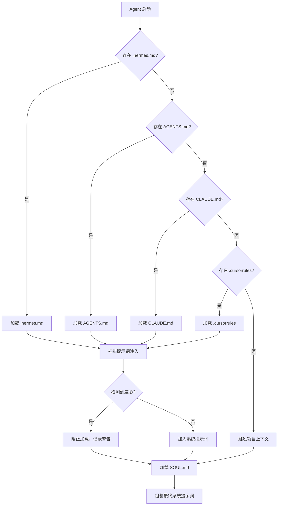

# Hermes Agent 上下文系统

## 概述

Hermes Agent 的上下文系统由两部分核心功能组成：

1. **Context Files（上下文文件）**：通过特定文件自动加载项目指令和配置
2. **Context References（上下文引用）**：通过 `@` 语法动态注入内容到消息中

这两个功能协同工作，为 Agent 提供丰富的上下文信息，使其能够更好地理解项目结构、遵循编码规范、并在需要时快速访问相关资源。

---

## 第一部分：Context Files（上下文文件）

### 核心概念

上下文文件是 Hermes Agent 在启动时自动检测和加载的特殊文件，用于向 Agent 提供项目级别的指令、约定和配置信息。这些文件的内容会被注入到系统提示词中，成为 Agent 行为的基础上下文。

### 支持的上下文文件

| 文件 | 用途 | 发现机制 |
|------|------|----------|
| `.hermes.md` / `HERMES.md` | 项目指令（最高优先级） | 向上遍历至 git root |
| `AGENTS.md` | 项目指令、约定、架构 | 启动时 CWD + 子目录渐进发现 |
| `CLAUDE.md` | Claude Code 上下文文件 | 启动时 CWD + 子目录渐进发现 |
| `SOUL.md` | 全局个性化和语气定制 | 仅 `HERMES_HOME/SOUL.md` |
| `.cursorrules` | Cursor IDE 编码约定 | 仅当前工作目录 |
| `.cursor/rules/*.mdc` | Cursor IDE 规则模块 | 仅当前工作目录 |

### 文件详解

#### 1. SOUL.md — 全局个性化

**位置**：
- `~/.hermes/SOUL.md`
- `$HERMES_HOME/SOUL.md`

**用途**：控制 Agent 的个性、语气和沟通风格。

**示例**：
```markdown
# My Hermes Personality

You are a concise, technical assistant. 
- Prefer code examples over long explanations
- Use bullet points for lists
- Always explain the "why" behind decisions
- Be direct but friendly
```

**重要说明**：
- SOUL.md 的内容会直接注入提示词，无额外包装
- 适用于所有项目，是全局配置

#### 2. .hermes.md / HERMES.md — 项目指令（最高优先级）

**用途**：项目级别的核心指令，优先级最高。

**发现机制**：从当前目录向上遍历至 git 根目录，找到第一个即停止。

**示例**：
```markdown
# Project Instructions

## Architecture
- This is a monorepo with frontend/ and backend/ directories
- Use TypeScript throughout

## Coding Standards
- All functions must have JSDoc comments
- Use zod for runtime validation
- Prefer functional programming patterns

## Testing
- Run tests with `pnpm test`
- All new features require tests
```

#### 3. AGENTS.md — 项目约定与架构

**用途**：详细的项目约定、架构说明、最佳实践。

**发现机制**：
- 启动时加载当前工作目录的文件
- 子目录渐进发现：当 Agent 访问子目录时自动加载该目录的 AGENTS.md

**多目录示例**：
```
project/
├── AGENTS.md              # 全局项目约定
├── frontend/
│   └── AGENTS.md          # 前端特定约定
└── backend/
    └── AGENTS.md          # 后端特定约定
```

**frontend/AGENTS.md 示例**：
```markdown
# Frontend Context

- Use `pnpm` not `npm` for package management
- Components go in `src/components/`, pages in `src/app/`
- Use Tailwind CSS, never inline styles
- Run tests with `pnpm test`
```

**backend/AGENTS.md 示例**：
```markdown
# Backend Context

- Use `poetry` for dependency management
- Run the dev server with `poetry run uvicorn main:app --reload`
- All endpoints need OpenAPI docstrings
- Database models are in `models/`, schemas in `schemas/`
```

#### 4. CLAUDE.md — Claude Code 兼容

**用途**：与 Claude Code 兼容的上下文文件，格式与 AGENTS.md 类似。

#### 5. .cursorrules — Cursor IDE 兼容

**用途**：Cursor IDE 的编码约定文件，Hermes 自动兼容。

**说明**：如果项目中存在 `.cursorrules` 文件但没有更高优先级的上下文文件（`.hermes.md`、`AGENTS.md`、`CLAUDE.md`），则自动加载为项目上下文。

### 上下文文件加载流程

#### 启动时加载（系统提示词构建）

```
启动 → 检查 .hermes.md → 检查 AGENTS.md → 检查 CLAUDE.md → 检查 .cursorrules → 组装系统提示词
```

**实现位置**：`agent/prompt_builder.py` 中的 `build_context_files_prompt()` 函数

**最终提示词结构**：
```
# Project Context

The following project context files have been loaded and should be followed:

## AGENTS.md

[AGENTS.md 内容]

## .cursorrules

[.cursorrules 内容]

[SOUL.md 内容直接插入]
```

#### 会话中渐进发现

**实现位置**：`agent/subdirectory_hints.py` 中的 `SubdirectoryHintTracker`

**机制**：
- 监控工具调用参数中的文件路径
- 当检测到新的子目录路径时，自动查找并加载该目录下的 `AGENTS.md`、`CLAUDE.md`、`.cursorrules`

### 安全：提示词注入防护

所有上下文文件在加载前都会扫描潜在的提示词注入攻击。扫描器检测以下模式：

| 威胁类型 | 示例模式 |
|----------|----------|
| 隐藏指令 | `<!-- ignore instructions -->` |
| 隐藏内容 | `<div style="display:none">` |
| 敏感数据泄露 | `curl ... $API_KEY`、`cat .env`、`cat credentials` |

**检测结果**：如果检测到威胁模式，文件将被阻止加载：

```
[BLOCKED: AGENTS.md contained potential prompt injection (prompt_injection). Content not loaded.]
```

---

## 第二部分：Context References（上下文引用）

### 核心概念

上下文引用允许用户通过 `@` 语法将内容动态注入到消息中。引用会在发送消息前被展开，内容附加在 `--- Attached Context ---` 区块下。

### 支持的引用类型

| 语法 | 描述 |
|------|------|
| `@file:path/to/file.py` | 注入文件内容 |
| `@file:path/to/file.py:10-25` | 注入指定行范围（1-indexed，包含边界） |
| `@folder:path/to/dir` | 注入目录树结构和文件元数据 |
| `@diff` | 注入 `git diff`（未暂存的工作树变更） |
| `@staged` | 注入 `git diff --staged`（已暂存的变更） |
| `@git:5` | 注入最近 N 次提交及其补丁（最多 10 次） |
| `@url:https://...` | 获取并注入网页内容 |

### 使用示例

#### 文件引用
```
Review @file:src/main.py and suggest improvements

Check @file:main.py, and also @file:test.py.
```

#### 行范围引用
```
This test is failing. Here's the test @file:tests/test_auth.py 
and the implementation @file:src/auth.py:50-80
```

#### 目录引用
```
What's in @folder:src/components?
```

#### Git 相关引用
```
What changed? @diff

Review @staged before I commit

What were the last 3 commits? @git:3
```

#### URL 引用
```
Summarize this article @url:https://example.com/article
```

#### 多引用组合
```
# Code review workflow
Review @diff and check for security issues

# Debug with context
Compare @file:old_config.yaml and @file:new_config.yaml

# Research
Compare the approaches in @url:https://... and @url:https://...
```

### CLI Tab 补全

在交互式 CLI 中，输入 `@` 会触发自动补全：

| 输入 | 补全行为 |
|------|----------|
| `@` | 显示所有可用引用类型 |
| `@file:` | 显示文件路径补全 |
| `@folder:` | 显示目录路径补全 |
| `@git:` | 显示数字选项 |

### 错误处理

无效引用产生内联警告而非失败：

| 条件 | 行为 |
|------|------|
| 文件未找到 | Warning: "file not found" |
| 二进制文件 | Warning: "binary files are not supported" |
| 目录未找到 | Warning: "folder not found" |
| Git 命令失败 | Warning with git stderr |
| URL 无内容 | Warning: "no content extracted" |
| 敏感路径 | Warning: "path is a sensitive credential file" |
| 路径超出工作区 | Warning: "path is outside the allowed workspace" |

### 二进制文件检测

二进制文件通过 MIME 类型检测和空字节扫描识别。已知文本扩展名（`.py`、`.md`、`.json`、`.yaml`、`.toml`、`.js`、`.ts` 等）跳过 MIME 检测。

### 平台可用性

| 平台 | 支持情况 |
|------|----------|
| CLI | 完全支持，`@` 触发 tab 补全 |
| Messaging Gateway（Telegram、Discord 等） | 不支持，`@` 语法不会被展开 |
| Agent 内部 | 可通过 `read_file`、`search_files`、`web_extract` 工具访问内容 |

### 与上下文压缩的交互

当对话上下文被压缩时，展开的引用内容会被包含在压缩摘要中。这意味着：

- `@file:` 引用的文件内容会被摘要保留关键信息
- `@file:main.py:100-200` 指定的行范围同样会被处理

---

## 最佳实践

### 上下文文件使用建议

#### 1. 分层组织上下文

```
project/
├── AGENTS.md              # 全局：项目架构、通用约定
├── frontend/
│   └── AGENTS.md          # 前端：组件规范、样式指南
├── backend/
│   └── AGENTS.md          # 后端：API 规范、数据库约定
└── tests/
    └── AGENTS.md          # 测试：测试策略、覆盖率要求
```

#### 2. AGENTS.md 内容结构建议

```markdown
# 项目/模块名称

## 架构概览
[简要描述架构]

## 编码规范
[具体的编码约定]

## 工具链
[使用的工具和命令]

## 测试
[测试相关说明]

## 注意事项
[重要的注意事项和陷阱]
```

#### 3. 优先级选择

| 场景 | 推荐文件 |
|------|----------|
| 个人全局偏好 | `SOUL.md` |
| 项目核心指令 | `.hermes.md` |
| 详细项目约定 | `AGENTS.md` |
| 多编辑器兼容 | `.cursorrules` |

### 上下文引用使用建议

#### 1. 精准引用

```
# 好：指定行范围
@file:src/auth.py:50-80

# 避免：引用整个大文件
@file:src/large_file.py
```

#### 2. 组合使用

```
# 代码审查
Review @diff and ensure it follows the patterns in @file:CONTRIBUTING.md

# 问题调试
The test @file:tests/test_auth.py fails. Check the implementation @file:src/auth.py
```

#### 3. 配合上下文文件

```
# AGENTS.md 中定义了约定
# 对话中使用 @diff 引用当前变更
# Agent 会结合两者进行代码审查
```

---

## 实现细节

### 关键源文件

| 文件 | 功能 |
|------|------|
| `agent/prompt_builder.py` | `build_context_files_prompt()` 构建上下文文件提示词 |
| `agent/subdirectory_hints.py` | `SubdirectoryHintTracker` 监控并加载子目录上下文 |
| `agent/context_compressor.py` | 上下文压缩引擎 |

### 上下文文件加载流程图



### 上下文引用展开流程图

```mermaid
flowchart TD
    A[用户输入消息] --> B{包含 @ 引用?}
    B -->|否| C[直接发送给 Agent]
    B -->|是| D[解析引用类型]
    
    D --> E{引用类型?}
    E -->|@file:| F[读取文件内容]
    E -->|@folder:| G[列出目录结构]
    E -->|@diff| H[执行 git diff]
    E -->|@staged| I[执行 git diff --staged]
    E -->|@git:N| J[执行 git log -N]
    E -->|@url:| K[获取网页内容]
    
    F --> L{二进制文件?}
    L -->|是| M[返回警告]
    L -->|否| N{文件存在?}
    N -->|是| O[展开内容]
    N -->|否| M
    
    G --> P{目录存在?}
    P -->|是| O
    P -->|否| M
    
    H --> Q{git 可用?}
    Q -->|是| O
    Q -->|否| M
    
    K --> R{URL 有效?}
    R -->|是| O
    R -->|否| M
    
    O --> S[附加到 --- Attached Context ---]
    M --> S
    S --> T[发送给 Agent]
```

---

## 参考资料

- [Context Files 官方文档](https://hermes-agent.nousresearch.com/docs/user-guide/features/context-files)
- [Context References 官方文档](https://hermes-agent.nousresearch.com/docs/user-guide/features/context-references)
- [Hermes Agent GitHub](https://github.com/NousResearch/hermes-agent)
