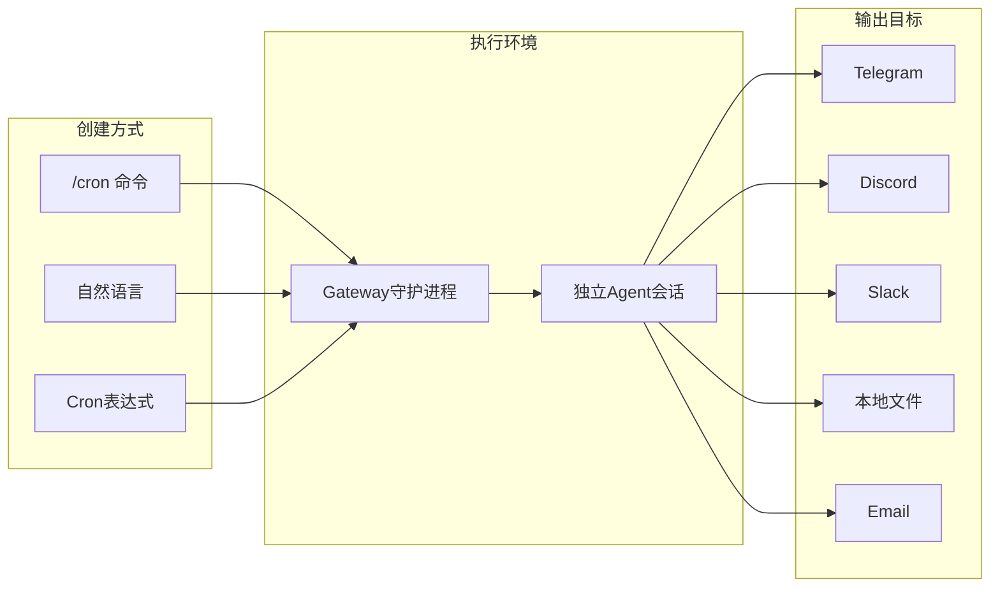
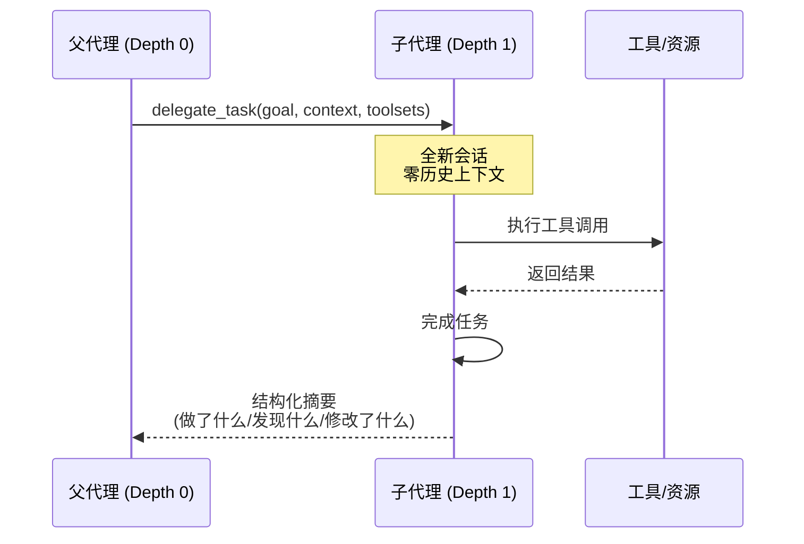
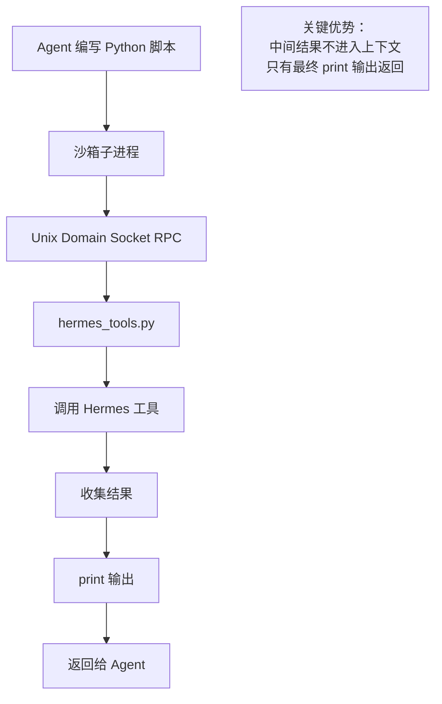
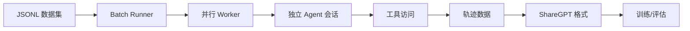

# Hermes Agent 自动化能力

Hermes Agent 提供了丰富的自动化能力，包括定时任务、子代理委托、代码执行、事件钩子和批量处理。这些特性让 Agent 能够自主执行复杂工作流，大幅提升效率。

## 1. 定时任务（Cron）

定时任务系统允许 Agent 按计划自动执行任务，支持自然语言和标准 cron 表达式。

### 核心概念



### 创建定时任务

#### 使用 `/cron` 命令

在对话中使用 `/cron` 命令创建任务：

```
用户: /cron 每天早上9点检查服务器状态并报告
```

Agent 会调用 `cronjob` 工具创建任务：

```python
cronjob(
    action="schedule",
    prompt="SSH into server 192.168.1.100, check nginx status with 'systemctl status nginx', verify HTTP 200",
    schedule="0 9 * * *",  # 每天9:00
    output="telegram"       # 输出到Telegram
)
```

#### `cronjob` 工具操作

| Action | 描述 | 示例 |
|--------|------|------|
| `schedule` | 创建新任务 | `cronjob(action="schedule", ...)` |
| `list` | 列出所有任务 | `cronjob(action="list")` |
| `pause` | 暂停任务 | `cronjob(action="pause", job_id="abc123")` |
| `resume` | 恢复任务 | `cronjob(action="resume", job_id="abc123")` |
| `run` | 立即执行 | `cronjob(action="run", job_id="abc123")` |
| `remove` | 删除任务 | `cronjob(action="remove", job_id="abc123")` |
| `status` | 查看状态 | `cronjob(action="status")` |

### Gateway 守护进程

Cron 执行由 Gateway 守护进程处理，每 60 秒检查一次到期任务：

```bash
# 安装为用户服务
hermes gateway install

# Linux: 安装为系统服务（服务器启动时运行）
sudo hermes gateway install --system

# 或前台运行
hermes gateway
```

### 任务配置参数

```python
cronjob(
    action="schedule",
    prompt="检查服务器并发送报告",
    schedule="0 9 * * *",
    
    # 输出目标
    output="telegram",           # 默认平台：Telegram home channel
    # output="telegram:123456",  # 特定Telegram聊天
    # output="telegram:-100123:17585",  # Telegram话题 (chat_id:thread_id)
    # output="discord:#engineering",    # Discord频道
    # output="slack",            # Slack home channel
    # output="local",            # 本地文件 (~/.hermes/cron/output/)
    # output="email",            # 邮件
    
    # 可选参数
    script="/path/to/pre-script.sh",  # 执行前脚本
    skill="server-monitor",           # 附加技能
    image="python:3.11-slim"          # Docker镜像
)
```

### 输出目标配置

| 输出值 | 描述 | 使用场景 |
|--------|------|---------|
| `"origin"` | 返回创建位置 | 消息平台默认 |
| `"local"` | 本地文件 | CLI默认 |
| `"telegram"` | Telegram home channel | 需要 `TELEGRAM_HOME_CHANNEL` |
| `"telegram:123456"` | 特定聊天 | 直接投递 |
| `"discord:#engineering"` | 特定频道 | 按频道名 |
| `"slack"` / `"whatsapp"` / `"signal"` | 其他平台 | 对应平台 |
| `"email"` | 邮件 | 邮件通知 |

### 提示词最佳实践

Cron 任务运行在**全新的独立会话**中，提示词必须包含所有必要信息：

```python
# ❌ 错误：缺少上下文
prompt = "Check on that server issue"

# ✅ 正确：自包含提示词
prompt = """
SSH into server 192.168.1.100 as user 'deploy', 
check if nginx is running with 'systemctl status nginx', 
and verify http://example.com returns HTTP 200.
"""
```

### 安全限制

- **禁止递归调度**：Cron 会话内禁用 cron 管理工具，防止无限调度循环
- **脚本超时**：默认 120 秒，可通过配置延长

```yaml
# ~/.hermes/config.yaml
cron:
  script_timeout_seconds: 300  # 5分钟
```

或设置环境变量：
```bash
export HERMES_CRON_SCRIPT_TIMEOUT=300
```

### 提供商恢复

Cron 任务继承配置的回退提供商和凭证池轮换。当主 API 被限速或返回错误时，自动切换到备用提供商。

---

## 2. 子代理委托（Delegation）

子代理委托允许主 Agent 将任务分配给独立的子代理执行，实现并行处理和专业分工。

### 核心概念



### 委托 API

```python
delegate_task(
    goal="研究 Hermes Agent 的架构设计",
    context="查找官方文档和 GitHub 仓库，总结核心组件",
    toolsets=["web"],           # 可用工具集
    max_iterations=50,          # 最大迭代次数
    model="google/gemini-flash-2.0"  # 可选：指定模型
)
```

### 工具集选择

| Toolset | 用途 |
|---------|------|
| `["terminal", "file"]` | 代码工作、调试、文件编辑、构建 |
| `["web"]` | 研究、事实核查、文档查找 |
| `["terminal", "file", "web"]` | 全栈任务（默认） |
| `["file"]` | 只读分析、代码审查 |
| `["terminal"]` | 系统管理、进程管理 |

### 禁用工具

无论指定什么工具集，以下工具**始终对子代理禁用**：
- `delegation` - 防止递归委托
- `clarify` - 无需用户澄清
- `memory` - 隔离记忆
- `code_execution` - 安全限制
- `send_message` - 禁止直接发消息

### 上下文隔离

子代理从**全新的会话**开始，完全没有父代理的对话历史。所有必要信息必须通过 `goal` 和 `context` 参数传递：

```python
# ❌ 错误：子代理不知道"那个项目"
delegate_task(goal="检查那个项目的测试覆盖率")

# ✅ 正确：提供完整上下文
delegate_task(
    goal="检查测试覆盖率并报告",
    context="""
    项目位于 /home/user/myproject
    使用 pytest 运行测试
    需要生成覆盖率报告到 coverage/
    """
)
```

### 深度限制

委托有**深度限制为 2**：
- 父代理 (Depth 0) → 可以委托子代理 (Depth 1)
- 子代理 (Depth 1) → **不能**再委托

这防止了失控的递归委托链。

### 迭代限制

每个子代理有迭代限制（默认 50），控制工具调用轮次：

```python
# 简单任务：减少迭代
delegate_task(
    goal="快速检查文件",
    context="检查 /etc/nginx/nginx.conf 是否存在并打印前10行",
    max_iterations=10
)

# 复杂任务：增加迭代
delegate_task(
    goal="完整代码重构",
    context="重构整个认证模块",
    max_iterations=100
)
```

### 模型配置

可以为子代理配置不同的模型（例如使用更便宜/更快的模型）：

```yaml
# ~/.hermes/config.yaml
delegation:
  model: "google/gemini-flash-2.0"  # 便宜模型用于子代理
  provider: "openrouter"            # 可选：路由到不同提供商
```

### 实践示例

#### 并行研究

```python
# 同时研究多个主题
delegate_task(goal="研究 Python 3.13 新特性", toolsets=["web"])
delegate_task(goal="研究 Rust 异步编程最佳实践", toolsets=["web"])
delegate_task(goal="研究 Go 1.22 新特性", toolsets=["web"])
```

#### 代码审查

```python
delegate_task(
    goal="审查代码质量",
    context="""
    审查 src/auth/ 目录下的所有 Python 文件
    检查：1) 安全漏洞 2) 代码风格 3) 性能问题
    """,
    toolsets=["file"],
    max_iterations=30
)
```

### delegate_task vs execute_code

| 特性 | delegate_task | execute_code |
|------|---------------|--------------|
| 执行主体 | 独立子代理 | Python 沙箱 |
| 上下文 | 全新会话 | 当前上下文 |
| 工具能力 | 完整 Agent 能力 | 程序化工具调用 |
| 输出 | 结构化摘要 | print() 输出 |
| 适用场景 | 复杂推理任务 | 数据处理流水线 |

---

## 3. 代码执行（Code Execution）

`execute_code` 工具允许 Agent 编写 Python 脚本，程序化调用 Hermes 工具，将多步工作流压缩到单个 LLM 轮次。

### 核心机制



### 工作原理

```python
# Agent 可以编写这样的脚本：
from hermes_tools import web_search, web_extract

results = web_search("Python 3.13 features", limit=5)
for r in results["data"]["web"]:
    content = web_extract([r["url"]])
    # ... 过滤和处理 ...
print(summary)  # 只有 print 输出返回
```

**关键优势**：中间工具结果**不进入上下文窗口**，只有最终 `print()` 输出返回，大幅减少 Token 消耗。

### 沙箱可用工具

| 工具 | 描述 |
|------|------|
| `web_search` | 网络搜索 |
| `web_extract` | 提取网页内容 |
| `read_file` | 读取文件 |
| `write_file` | 写入文件 |
| `search_files` | 搜索文件 |
| `patch` | 文件补丁 |
| `terminal` | 终端命令（仅前台） |

### 触发条件

Agent 使用 `execute_code` 的场景：
- 需要**逻辑判断**在工具调用之间
- 需要**循环或条件分支**
- 需要**数据聚合和处理**
- 需要**减少 Token 消耗**

### 资源限制

| 资源 | 限制 | 说明 |
|------|------|------|
| 超时 | 5 分钟 (300s) | SIGTERM 终止，5s 后 SIGKILL |
| Stdout | 50 KB | 超出截断并提示 `[output truncated at 50KB]` |
| Stderr | 10 KB | 非零退出时包含在输出中 |
| 工具调用 | 50 次/执行 | 达到限制返回错误 |

### 配置资源限制

```yaml
# ~/.hermes/config.yaml
code_execution:
  timeout: 300           # 最大秒数
  max_tool_calls: 50     # 每次执行最大工具调用
```

### 实践示例

#### 数据处理流水线

```python
from hermes_tools import search_files, read_file
import json

# 查找所有配置文件并提取数据库设置
matches = search_files("database", path=".", file_glob=".yaml", limit=20)
configs = []
for match in matches.get("matches", []):
    content = read_file(match["path"])
    configs.append({
        "file": match["path"], 
        "preview": content["content"][:200]
    })

print(json.dumps(configs, indent=2))
```

#### 多步网络研究

```python
from hermes_tools import web_search, web_extract

# 搜索并聚合信息
all_findings = []
topics = ["FastAPI best practices", "SQLAlchemy optimization", "Pydantic validation"]

for topic in topics:
    results = web_search(topic, limit=3)
    for r in results["data"]["web"]:
        content = web_extract([r["url"]])
        all_findings.append({
            "topic": topic,
            "url": r["url"],
            "summary": content.get("text", "")[:500]
        })

print(f"收集了 {len(all_findings)} 条信息")
```

### execute_code vs terminal

| 特性 | execute_code | terminal |
|------|--------------|----------|
| 执行环境 | Python 沙箱 | Shell |
| 工具调用 | 程序化调用 Hermes 工具 | 系统命令 |
| 输出 | 只有 print() 结果 | 命令标准输出 |
| Token 效率 | 高（中间结果不进入上下文） | 低（所有输出进入上下文） |
| 适用场景 | 数据处理、逻辑编排 | 构建、系统命令、进程管理 |

### 平台支持

代码执行需要 Unix Domain Socket，仅支持 **Linux 和 macOS**。Windows 上自动禁用，Agent 回退到常规顺序工具调用。

---

## 4. 事件钩子（Hooks）

Hermes 有两套钩子系统，在关键生命周期点运行自定义代码：

| 系统 | 注册方式 | 运行环境 | 用途 |
|------|----------|----------|------|
| Gateway Hooks | `HOOK.yaml` + `handler.py` | Gateway | 日志、告警、Webhook |
| Plugin Hooks | `ctx.register_hook()` | CLI + Gateway | 工具拦截、指标、护栏 |

两套系统都是**非阻塞**的——任何钩子错误都会被捕获并记录，不会导致 Agent 崩溃。

### Gateway 事件钩子

#### 创建钩子

```bash
# 创建钩子目录
mkdir -p ~/.hermes/hooks/my-hook
```

**HOOK.yaml**:
```yaml
name: "my-hook"
events:
  - agent:end
  - session:start
```

**handler.py**:
```python
import httpx

def handle(event_type: str, payload: dict):
    """处理钩子事件"""
    if event_type == "agent:end":
        # Agent 完成时的处理
        message = payload.get("message", {})
        response = payload.get("response", "")
        
        # 发送到外部系统
        httpx.post("https://api.example.com/log", json={
            "event": event_type,
            "user": payload.get("user_id"),
            "message_length": len(message),
            "response_length": len(response)
        })
```

#### 可用事件

| 事件 | 触发时机 | Payload 字段 |
|------|----------|--------------|
| `gateway:startup` | Gateway 启动 | `platforms` |
| `session:start` | 会话开始 | `platform`, `user_id`, `session_id`, `session_key` |
| `session:end` | 会话结束 | `platform`, `user_id`, `session_key` |
| `session:reset` | 会话重置 (`/new`, `/reset`) | `platform`, `user_id`, `session_key` |
| `agent:start` | Agent 开始处理 | `platform`, `user_id`, `session_id`, `message` |
| `agent:step` | Agent 每步迭代 | `platform`, `user_id`, `session_id`, `iteration`, `tool_names` |
| `agent:end` | Agent 完成响应 | `platform`, `user_id`, `session_id`, `message`, `response` |
| `command:` | 任意斜杠命令 | `platform`, `user_id`, `command`, `args` |

#### 通配符匹配

注册 `command:` 会匹配所有 `command:` 事件（`command:model`、`command:reset` 等），可以用单个订阅监控所有斜杠命令。

### Plugin 钩子

Plugin 钩子在插件内通过 `ctx.register_hook()` 注册，运行在 CLI 和 Gateway 环境。

#### pre_llm_call 钩子

在每次 LLM 调用前触发，可以注入上下文：

```python
import httpx

MEMORY_API = "https://memory.example.com"

def recall(session_id, user_message, is_first_turn, kwargs):
    """记忆召回钩子"""
    try:
        resp = httpx.post(f"{MEMORY_API}/recall", json={
            "session_id": session_id,
            "query": user_message,
        }, timeout=3)
        memories = resp.json().get("results", [])
        if not memories:
            return None
        text = "Recalled context:\n" + "\n".join(f"- {m['text']}" for m in memories)
        return {"context": text}
    except Exception:
        return None

def register(ctx):
    ctx.register_hook("pre_llm_call", recall)
```

多个插件返回上下文时，按插件发现顺序（按目录名字母序）用双换行连接。

**使用场景**：
- 记忆召回
- RAG 上下文注入
- 护栏检查
- 每轮分析

### 实践示例

#### 启动检查清单（BOOT.md）— 内置功能

在项目根目录创建 `BOOT.md`，Agent 启动时自动执行：

```markdown
# 启动检查清单

请执行以下检查：
1. 确认 git 状态干净
2. 检查虚拟环境是否激活
3. 验证依赖版本
```

没有 `BOOT.md` 时静默跳过，零开销。

#### Telegram 长任务告警

当 Agent 执行超过 10 步时发送通知：

```python
# ~/.hermes/hooks/telegram-alert/handler.py
import httpx

step_counts = {}

def handle(event_type: str, payload: dict):
    session_id = payload.get("session_id")
    
    if event_type == "agent:step":
        iteration = payload.get("iteration", 0)
        step_counts[session_id] = iteration
        
        if iteration > 10:
            # 发送 Telegram 告警
            httpx.post(
                f"https://api.telegram.org/bot{TOKEN}/sendMessage",
                json={
                    "chat_id": CHAT_ID,
                    "text": f"⚠️ Agent 已执行 {iteration} 步，可能需要关注"
                }
            )
    
    elif event_type == "agent:end":
        # 清理计数
        step_counts.pop(session_id, None)
```

---

## 5. 批量处理（Batch Processing）

批量处理允许跨数百或数千个提示词并行运行 Hermes Agent，生成结构化轨迹数据，主要用于训练数据生成。

### 概述



**Batch Runner** (`batch_runner.py`) 处理 JSONL 数据集，每个提示词运行完整的 Agent 会话并记录：
- 完整对话历史
- 工具调用统计
- 推理覆盖率指标

### 快速开始

#### 准备数据集

**dataset.jsonl**:
```json
{"prompt": "编写一个 Python 函数找出最长回文子串"}
{"prompt": "使用 Flask 创建用户认证 REST API 端点"}
{"prompt": "调试这个错误：TypeError: cannot unpack non-iterable NoneType object"}
```

可选字段：
- `image` / `docker_image` - Docker 镜像
- `cwd` - 工作目录

#### 运行批量处理

```bash
python batch_runner.py \
    --dataset_file dataset.jsonl \
    --batch_size 10 \
    --run_name my-experiment \
    --num_workers 4
```

### 配置参数

| 参数 | 默认值 | 描述 |
|------|--------|------|
| `--dataset_file` | （必需） | JSONL 数据集路径 |
| `--batch_size` | （必需） | 每批提示词数 |
| `--run_name` | （必需） | 运行名称（用于输出目录和检查点） |
| `--distribution` | `"default"` | 工具集分布采样 |
| `--model` | `claude-sonnet-4.6` | 使用的模型 |
| `--base_url` | - | API 基础 URL |
| `--api_key` | （环境变量） | API 密钥 |
| `--max_turns` | `10` | 每个提示词最大工具调用迭代 |
| `--num_workers` | `4` | 并行工作进程数 |
| `--resume` | `false` | 从检查点恢复 |
| `--verbose` | `false` | 详细日志 |
| `--max_samples` | 全部 | 只处理前 N 个样本 |
| `--max_tokens` | - | 最大 Token 数 |

### Docker 镜像支持

每个提示词可以指定 Docker 镜像：

```json
{"prompt": "安装 numpy 并计算 3x3 矩阵的特征值", "image": "python:3.11-slim"}
{"prompt": "编译并运行这个 Rust 程序", "image": "rust:1.75"}
{"prompt": "搭建 Node.js Express 服务器", "image": "node:20-alpine", "cwd": "/app"}
```

Batch Runner 会在运行每个提示词前验证 Docker 镜像是否可访问。

### 提供商路由（OpenRouter）

| 参数 | 描述 |
|------|------|
| `--providers_allowed` | 允许的提供商列表（如 `"anthropic,openai"`） |
| `--providers_ignored` | 忽略的提供商列表（如 `"together,deepinfra"`） |
| `--providers_order` | 首选提供商顺序 |
| `--provider_sort` | 按 `"price"`、`"throughput"` 或 `"latency"` 排序 |

### 输出格式

输出为 ShareGPT 格式的轨迹数据，包含：

```json
{
  "conversation_id": "uuid",
  "model": "claude-sonnet-4.6",
  "conversation": [
    {
      "role": "user",
      "content": "编写一个 Python 函数..."
    },
    {
      "role": "assistant",
      "content": "好的，这是一个实现...",
      "tool_calls": [...],
      "reasoning": "我的思路是..."
    }
  ],
  "tool_statistics": {
    "total_calls": 5,
    "by_tool": {"terminal": 3, "file": 2}
  },
  "metrics": {
    "reasoning_coverage": 0.85,
    "total_tokens": 3500
  }
}
```

### 检查点与恢复

Batch Runner 支持检查点，中断后可恢复：

```bash
# 初始运行（中断后）
python batch_runner.py --dataset_file data.jsonl --batch_size 10 --run_name my-run

# 恢复运行
python batch_runner.py --dataset_file data.jsonl --batch_size 10 --run_name my-run --resume
```

---

## 自动化能力对比

| 特性 | 用途 | 执行环境 | 交互性 |
|------|------|----------|--------|
| **Cron** | 定时执行 | Gateway 守护进程 | 低（自动触发） |
| **Delegation** | 任务分解 | 独立子代理 | 中（委托后自主） |
| **Code Execution** | 数据处理 | Python 沙箱 | 低（脚本执行） |
| **Hooks** | 生命周期监控 | Gateway/Plugin | 被动（事件触发） |
| **Batch Processing** | 批量推理 | 并行 Worker | 低（数据驱动） |

## 组合使用场景

### 场景 1：定时监控 + 告警

```
Cron → 定时检查服务器状态 → Hooks → 发现异常发送 Telegram 告警
```

### 场景 2：批量研究 + 报告

```
Batch Processing → 并行研究多个主题 → Delegation → 子代理汇总报告
```

### 场景 3：数据处理流水线

```
Cron → 定时触发 → Code Execution → 处理数据 → Hooks → 完成通知
```

## 参考资料

- [Cron 文档](https://hermes-agent.nousresearch.com/docs/user-guide/features/cron)
- [Delegation 文档](https://hermes-agent.nousresearch.com/docs/user-guide/features/delegation)
- [Code Execution 文档](https://hermes-agent.nousresearch.com/docs/user-guide/features/code-execution)
- [Hooks 文档](https://hermes-agent.nousresearch.com/docs/user-guide/features/hooks)
- [Batch Processing 文档](https://hermes-agent.nousresearch.com/docs/user-guide/features/batch-processing)
