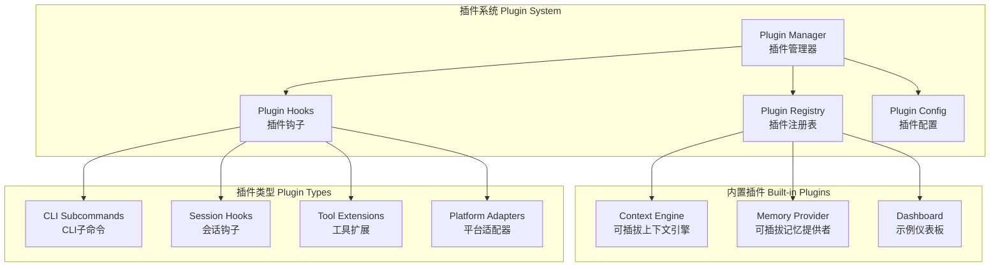
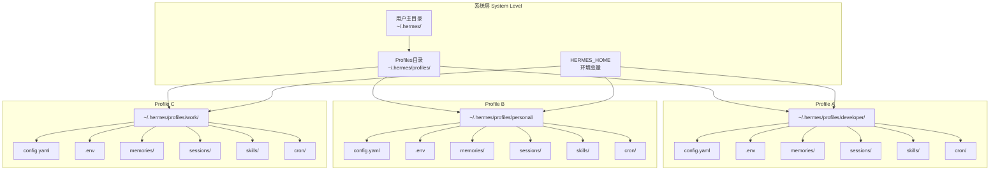
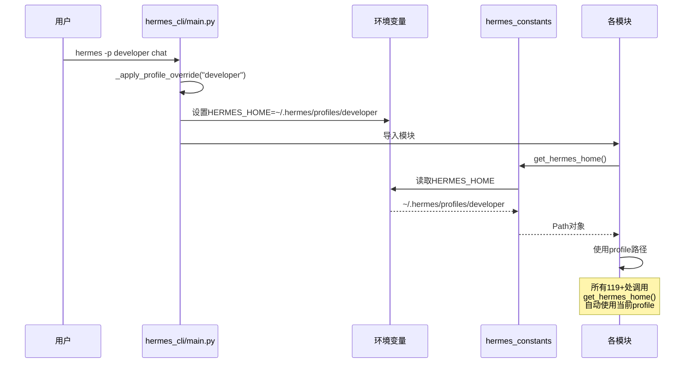
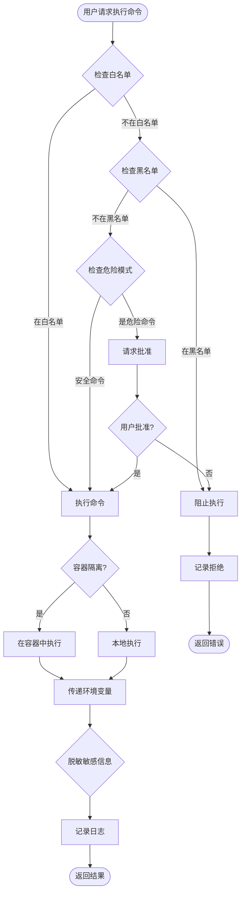
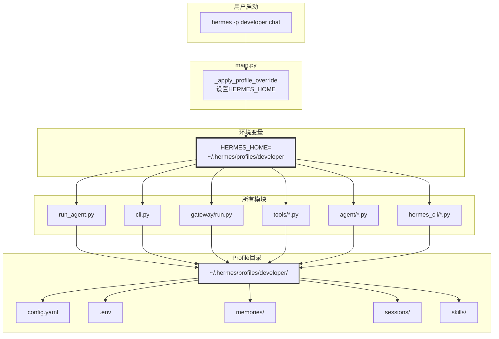

# Hermes Agent 高级特性与部署

## 插件系统

Hermes Agent的插件系统提供热插拔式扩展能力，允许开发者在不修改核心代码的情况下扩展功能。

### 插件架构



### 插件管理器

**文件位置**：`hermes_cli/plugins.py`

```python
class PluginManager:
    def __init__(self, plugins_dir: str):
        self.plugins_dir = Path(plugins_dir)
        self.plugins = {}
        self.hooks = {}

    def discover_plugins(self):
        """发现插件"""
        for plugin_path in self.plugins_dir.glob("*/"):
            manifest_path = plugin_path / "plugin.yaml"

            if not manifest_path.exists():
                continue

            try:
                plugin = self._load_plugin(plugin_path, manifest_path)
                if plugin:
                    self.plugins[plugin["name"]] = plugin
                    logger.info(f"Loaded plugin: {plugin['name']}")
            except Exception as e:
                logger.error(f"Failed to load plugin {plugin_path}: {e}")

    def _load_plugin(self, plugin_path: Path, manifest_path: Path) -> Optional[dict]:
        """加载插件"""
        # 1. 读取清单文件
        manifest = self._load_manifest(manifest_path)

        # 2. 验证清单
        self._validate_manifest(manifest)

        # 3. 加载插件模块
        module_path = plugin_path / manifest.get("entry", "plugin.py")
        if not module_path.exists():
            raise ValueError(f"Plugin entry not found: {module_path}")

        spec = importlib.util.spec_from_file_location(
            manifest["name"],
            module_path
        )
        module = importlib.util.module_from_spec(spec)
        spec.loader.exec_module(module)

        # 4. 调用插件初始化
        if hasattr(module, "init"):
            module.init(self)

        # 5. 注册钩子
        if hasattr(module, "hooks"):
            for event, handler in module.hooks.items():
                self.register_hook(event, handler, manifest["name"])

        # 6. 注册CLI命令
        if hasattr(module, "commands"):
            for cmd_name, cmd_handler in module.commands.items():
                self.register_command(
                    cmd_name,
                    cmd_handler,
                    manifest["name"]
                )

        return {
            **manifest,
            "path": str(plugin_path),
            "module": module,
            "enabled": True
        }

    def _load_manifest(self, manifest_path: Path) -> dict:
        """加载插件清单"""
        with open(manifest_path, 'r') as f:
            return yaml.safe_load(f)

    def _validate_manifest(self, manifest: dict):
        """验证插件清单"""
        required_fields = ["name", "version", "description", "entry"]
        for field in required_fields:
            if field not in manifest:
                raise ValueError(f"Missing required field: {field}")

    def register_hook(self, event: str, handler: Callable, plugin_name: str):
        """注册钩子"""
        if event not in self.hooks:
            self.hooks[event] = []

        self.hooks[event].append({
            "handler": handler,
            "plugin": plugin_name
        })

    async def trigger_hooks(self, event: str, **kwargs):
        """触发钩子"""
        if event not in self.hooks:
            return

        for hook in self.hooks[event]:
            try:
                if asyncio.iscoroutinefunction(hook["handler"]):
                    await hook["handler"](**kwargs)
                else:
                    hook["handler"](**kwargs)
            except Exception as e:
                logger.error(
                    f"Hook {event} in plugin {hook['plugin']} failed: {e}",
                    exc_info=True
                )

    def register_command(self, name: str, handler: Callable, plugin_name: str):
        """注册CLI命令"""
        # 这里需要集成到hermes_cli/commands.py的COMMAND_REGISTRY
        pass
```

### 插件清单示例

```yaml
# plugin.yaml
name: example-dashboard
version: 1.0.0
description: Example dashboard plugin
author: Hermes Agent
entry: plugin.py

requirements:
  - flask>=2.0.0
  - plotly>=5.0.0

hooks:
  - event: message_after
    handler: on_message_after

commands:
  - name: dashboard
    handler: show_dashboard
    help_text: Show the example dashboard

config:
  - key: dashboard_port
    type: integer
    default: 5000
    description: Port for the dashboard server
```

### 插件实现示例

```python
# plugin.py
from flask import Flask, render_template
import plotly.graph_objects as go

app = Flask(__name__)

# 钩子函数
async def on_message_after(platform: str, user_id: str, message: str,
                         response: dict, session: dict):
    """消息后钩子：记录统计信息"""
    # 记录消息统计
    pass

# CLI命令
def show_dashboard(args: list):
    """显示仪表板"""
    print("Starting dashboard...")
    app.run(host="0.0.0.0", port=5000)

# 插件初始化
def init(plugin_manager: PluginManager):
    """插件初始化"""
    print("Example dashboard plugin initialized")
```

## Profile多实例支持

Hermes Agent支持Profiles（多实例），每个Profile有完全独立的配置、API密钥、记忆、会话、技能、网关等。

### Profile隔离机制



### Profile核心机制

**文件位置**：`hermes_cli/main.py`

```python
def _apply_profile_override(profile_name: str):
    """
    应用Profile覆盖

    这是Profile机制的核心：在任何模块导入之前设置HERMES_HOME
    """
    if not profile_name:
        return

    # 计算Profile的HERMES_HOME
    profiles_root = Path.home() / ".hermes" / "profiles"
    profile_home = profiles_root / profile_name

    # 设置环境变量
    os.environ["HERMES_HOME"] = str(profile_home)

    # 创建目录结构
    profile_home.mkdir(parents=True, exist_ok=True)
    (profile_home / "memories").mkdir(exist_ok=True)
    (profile_home / "sessions").mkdir(exist_ok=True)
    (profile_home / "skills").mkdir(exist_ok=True)
    (profile_home / "cron").mkdir(exist_ok=True)
```

### Profile安全编码规则

**文件位置**：`hermes_constants.py`

```python
from pathlib import Path
import os

def get_hermes_home() -> Path:
    """
    获取HERMES_HOME路径

    读取HERMES_HOME环境变量，如果未设置则返回默认路径
    """
    return Path(os.environ.get("HERMES_HOME", Path.home() / ".hermes"))

def display_hermes_home() -> str:
    """
    获取用户显示的HERMES_HOME路径

    返回~/.hermes用于默认，或~/.hermes/profiles/<name>用于profiles
    """
    hermes_home = get_hermes_home()
    profiles_root = Path.home() / ".hermes" / "profiles"

    if profiles_root in hermes_home.parents:
        # 这是profile
        profile_name = hermes_home.name
        return f"~/.hermes/profiles/{profile_name}"
    else:
        # 这是默认
        return "~/.hermes"

def _get_profiles_root() -> Path:
    """
    获取Profiles根目录

    注意：这个函数总是返回~/.hermes/profiles，不受当前profile影响
    这样允许`hermes -p coder profile list`看到所有profile
    """
    return Path.home() / ".hermes" / "profiles"

def _get_default_hermes_home() -> Path:
    """
    获取默认HERMES_HOME

    总是返回~/.hermes，不受当前profile影响
    """
    return Path.home() / ".hermes"
```

### Profile管理命令

```python
def profile_list():
    """列出所有Profiles"""
    profiles_root = _get_profiles_root()

    if not profiles_root.exists():
        print("No profiles found")
        return

    profiles = list(profiles_root.iterdir())

    print(f"Found {len(profiles)} profiles:\n")

    for profile_path in profiles:
        profile_name = profile_path.name
        profile_home = profile_path

        # 获取统计信息
        sessions_count = len(list((profile_home / "sessions").glob("*.db")))
        skills_count = len(list((profile_home / "skills").glob("**/*.md")))

        print(f"Profile: {profile_name}")
        print(f"  Path: {profile_home}")
        print(f"  Sessions: {sessions_count}")
        print(f"  Skills: {skills_count}")
        print()

def profile_create(name: str, copy_from: str = None):
    """创建新Profile"""
    profiles_root = _get_profiles_root()
    profile_home = profiles_root / name

    if profile_home.exists():
        print(f"Profile already exists: {name}")
        return

    # 创建目录结构
    profile_home.mkdir(parents=True, exist_ok=True)
    (profile_home / "memories").mkdir(exist_ok=True)
    (profile_home / "sessions").mkdir(exist_ok=True)
    (profile_home / "skills").mkdir(exist_ok=True)
    (profile_home / "cron").mkdir(exist_ok=True)

    # 复制配置
    if copy_from:
        source_home = profiles_root / copy_from
        source_config = source_home / "config.yaml"

        if source_config.exists():
            dest_config = profile_home / "config.yaml"
            shutil.copy(source_config, dest_config)
            print(f"Copied config from {copy_from}")
    else:
        # 创建默认配置
        default_config = {
            "model": "anthropic/claude-opus-4.6",
            "profile": name
        }

        with open(profile_home / "config.yaml", 'w') as f:
            yaml.dump(default_config, f)

    print(f"Profile created: {name}")
    print(f"Path: {profile_home}")

def profile_delete(name: str):
    """删除Profile"""
    profiles_root = _get_profiles_root()
    profile_home = profiles_root / name

    if not profile_home.exists():
        print(f"Profile not found: {name}")
        return

    # 确认删除
    confirm = input(f"Delete profile '{name}'? This cannot be undone. (y/n): ")
    if confirm.lower() != 'y':
        print("Cancelled")
        return

    # 删除目录
    shutil.rmtree(profile_home)

    print(f"Profile deleted: {name}")

def profile_switch(name: str):
    """切换Profile（设置默认）"""
    # 实际上通过命令行参数 -p <name> 实现
    # 这里只是设置默认profile
    default_file = Path.home() / ".hermes" / "default_profile"

    with open(default_file, 'w') as f:
        f.write(name)

    print(f"Default profile set to: {name}")
```

### Token锁防止凭证冲突

```python
# gateway/status.py
_token_locks = {}

def acquire_scoped_lock(scope: str) -> bool:
    """
    获取作用域锁

    用于防止多个profile使用相同的凭证（如bot token）

    Args:
        scope: 锁的作用域（如：telegram:bot_token）

    Returns:
        是否成功获取锁
    """
    if scope in _token_locks:
        return False

    _token_locks[scope] = True
    return True

def release_scoped_lock(scope: str):
    """
    释放作用域锁

    Args:
        scope: 锁的作用域
    """
    if scope in _token_locks:
        del _token_locks[scope]

# 在平台适配器中使用
# gateway/platforms/telegram.py
async def connect(self):
    """连接Telegram"""
    # 获取bot token
    token = self.config.get("bot_token")

    # 获取锁
    lock_scope = f"telegram:{token}"
    if not acquire_scoped_lock(lock_scope):
        raise RuntimeError(
            f"Another profile is already using this Telegram bot token. "
            f"Use a different token or stop the other profile."
        )

    # 连接...
    self.client = AsyncTelegramClient(...)

async def disconnect(self):
    """断开连接"""
    # 断开连接
    await self.client.disconnect()

    # 释放锁
    token = self.config.get("bot_token")
    lock_scope = f"telegram:{token}"
    release_scoped_lock(lock_scope)
```

### Profile隔离机制图



## Skin主题引擎

Skin引擎提供数据驱动的CLI视觉自定义，无需修改代码即可创建新主题。

### Skin引擎架构

**文件位置**：`hermes_cli/skin_engine.py`

```python
from dataclasses import dataclass
from typing import Dict, List, Optional
import yaml

@dataclass
class SkinConfig:
    """Skin配置"""
    name: str
    description: str

    # 颜色
    colors: Dict[str, str]

    # Spinner
    spinner: Dict[str, any]

    # Branding
    branding: Dict[str, str]

    # 工具
    tool_prefix: str = "┊"
    tool_emojis: Dict[str, str] = None


# 内置Skins
_BUILTIN_SKINS = {
    "default": {
        "name": "default",
        "description": "Classic Hermes gold/kawaii theme",
        "colors": {
            "banner_border": "gold3",
            "banner_title": "gold1",
            "banner_accent": "yellow",
            "banner_dim": "dark_gray",
            "banner_text": "white",
            "response_border": "gold3",
        },
        "spinner": {
            "waiting_faces": ["(・ω・)", "(・∀・)", "(・ε・)", "(・o・)"],
            "thinking_faces": ["(・ω・)", "( ・∀・)", "( ・_・)", "( ^_^ )"],
            "thinking_verbs": ["thinking", "reasoning", "considering", "pondering"],
            "wings": [
                ["⟨(・ω・)", "(・ω・)⟩"],
                ["⟨(・∀・)", "(・∀・)⟩"],
            ]
        },
        "branding": {
            "agent_name": "Hermes Agent",
            "welcome": "Welcome to Hermes Agent! How can I help you today?",
            "response_label": " Hermes ",
            "prompt_symbol": "❯ "
        },
        "tool_prefix": "┊",
        "tool_emojis": {
            "read_file": "📄",
            "write_file": "✍️",
            "terminal": "💻",
            "web_search": "🔍",
            # ... 更多工具emoji
        }
    },
    "ares": {
        "name": "ares",
        "description": "Crimson/bronze war-god theme",
        "colors": {
            "banner_border": "deep_sky_blue4",
            "banner_title": "red1",
            "banner_accent": "orange_red1",
            "banner_dim": "gray30",
            "banner_text": "white",
            "response_border": "deep_sky_blue4",
        },
        "spinner": {
            "waiting_faces": ["⚔️", "🛡️", "🏹", "⚔️"],
            "thinking_faces": ["⚡", "🔥", "💪", "⚡"],
            "thinking_verbs": ["warring", "conquering", "dominating", "ruling"],
            "wings": [
                ["⟨⚔️", "⚔️⟩"],
                ["⟨🛡️", "🛡️⟩"],
            ]
        },
        "branding": {
            "agent_name": "Ares",
            "welcome": "War is coming. What is your command?",
            "response_label": " ARES ",
            "prompt_symbol": "⚔️ "
        },
        "tool_prefix": "⚔️",
        "tool_emojis": {
            "read_file": "📜",
            "write_file": "✒️",
            "terminal": "🗡️",
            "web_search": "🔎",
        }
    },
    "mono": {
        "name": "mono",
        "description": "Clean grayscale monochrome",
        "colors": {
            "banner_border": "gray",
            "banner_title": "white",
            "banner_accent": "gray",
            "banner_dim": "dim",
            "banner_text": "white",
            "response_border": "gray",
        },
        "spinner": {
            "waiting_faces": ["○", "●", "◎", "◉"],
            "thinking_faces": ["○", "●", "◎", "◉"],
            "thinking_verbs": ["processing", "computing", "calculating", "analyzing"],
            "wings": []
        },
        "branding": {
            "agent_name": "Hermes",
            "welcome": "Hermes Agent - Ready.",
            "response_label": " HERMES ",
            "prompt_symbol": "> "
        },
        "tool_prefix": "│",
        "tool_emojis": {}
    },
    "slate": {
        "name": "slate",
        "description": "Cool blue developer-focused theme",
        "colors": {
            "banner_border": "slate_blue3",
            "banner_title": "cyan1",
            "banner_accent": "sky_blue1",
            "banner_dim": "gray",
            "banner_text": "white",
            "response_border": "slate_blue3",
        },
        "spinner": {
            "waiting_faces": ["⚙️", "🔧", "⚙️", "🔧"],
            "thinking_faces": ["🔬", "🧪", "🔭", "🔬"],
            "thinking_verbs": ["debugging", "testing", "building", "deploying"],
            "wings": []
        },
        "branding": {
            "agent_name": "Hermes Dev",
            "welcome": "Development environment ready. What shall we build?",
            "response_label": " DEV ",
            "prompt_symbol": "$ "
        },
        "tool_prefix": "┃",
        "tool_emojis": {
            "read_file": "📖",
            "write_file": "📝",
            "terminal": "⌨️",
            "web_search": "🌐",
        }
    }
}

# 活跃Skin缓存
_active_skin: Optional[SkinConfig] = None

def init_skin_from_config(config: dict):
    """从配置初始化Skin"""
    global _active_skin

    skin_name = config.get("display", {}).get("skin", "default")
    _active_skin = load_skin(skin_name)

def get_active_skin() -> SkinConfig:
    """获取当前活跃的Skin"""
    global _active_skin

    if _active_skin is None:
        _active_skin = load_skin("default")

    return _active_skin

def set_active_skin(name: str):
    """设置活跃Skin"""
    global _active_skin
    _active_skin = load_skin(name)

def load_skin(name: str) -> SkinConfig:
    """加载Skin"""
    # 1. 尝试用户Skin
    user_skin_path = get_hermes_home() / "skins" / f"{name}.yaml"
    if user_skin_path.exists():
        return _load_skin_from_file(user_skin_path)

    # 2. 尝试内置Skin
    if name in _BUILTIN_SKINS:
        skin_data = _BUILTIN_SKINS[name]
        return SkinConfig(**skin_data)

    # 3. 回退到默认
    return SkinConfig(**_BUILTIN_SKINS["default"])

def _load_skin_from_file(path: Path) -> SkinConfig:
    """从文件加载Skin"""
    with open(path, 'r') as f:
        skin_data = yaml.safe_load(f)

    # 合并默认值（处理缺失字段）
    default_skin = _BUILTIN_SKINS["default"]
    merged = _deep_merge(default_skin, skin_data)

    return SkinConfig(**merged)

def _deep_merge(default: dict, override: dict) -> dict:
    """深度合并字典"""
    result = default.copy()

    for key, value in override.items():
        if key in result and isinstance(result[key], dict) and isinstance(value, dict):
            result[key] = _deep_merge(result[key], value)
        else:
            result[key] = value

    return result
```

### 用户Skin示例

```yaml
# ~/.hermes/skins/cyberpunk.yaml
name: cyberpunk
description: Neon-soaked terminal theme

colors:
  banner_border: "#FF00FF"
  banner_title: "#00FFFF"
  banner_accent: "#FF1493"
  banner_dim: "#666666"
  banner_text: "#FFFFFF"
  response_border: "#FF00FF"

spinner:
  waiting_faces: ["⚡", "🔮", "💫", "✨"]
  thinking_faces: ["🌐", "💻", "🎮", "🤖"]
  thinking_verbs: ["hacking", "decrypting", "uploading", "downloading"]
  wings:
    - ["⟨⚡", "⚡⟩"]
    - ["⟨🔮", "🔮⟩"]

branding:
  agent_name: "Cyber Agent"
  welcome: "System online. Awaiting commands..."
  response_label: " ⚡ CYBER "
  prompt_symbol: "⚡ "

tool_prefix: "▏"

tool_emojis:
  read_file: "📁"
  write_file: "💾"
  terminal: "⌨️"
  web_search: "🌐"
  browser: "🌍"
  code_execution: "🐍"
```

### Skin使用

```python
from hermes_cli.skin_engine import get_active_skin

# 在CLI中使用
skin = get_active_skin()

# 使用spinner faces
spinner_face = skin.spinner["waiting_faces"][0]

# 使用颜色
banner_border = skin.colors["banner_border"]

# 使用branding
agent_name = skin.branding["agent_name"]

# 使用工具emoji
tool_emoji = skin.tool_emojis.get(tool_name, "")
```

## 安全机制

### 命令审批系统

**文件位置**：`tools/approval.py`

```python
class CommandApproval:
    def __init__(self, config: dict):
        self.allowlist = config.get("dangerous_commands", {}).get("allowlist", [])
        self.blocklist = config.get("dangerous_commands", {}).get("blocklist", [])
        self.auto_approve_patterns = config.get("dangerous_commands", {}).get("auto_approve", [])

    def is_dangerous(self, command: str) -> bool:
        """
        判断命令是否危险

        危险命令包括：
        - 删除文件/目录（rm, rmdir）
        - 修改系统配置（systemctl, apt, yum）
        - 网络操作（curl, wget, ssh）
        - 密码/密钥操作（chmod, chown）
        """
        dangerous_patterns = [
            r"rm\s+-[rf]+",  # rm -rf
            r"rmdir",  # rmdir
            r"systemctl\s+(stop|disable|restart)",  # systemctl
            r"apt\s+(remove|purge)",  # apt remove
            r"yum\s+(remove|erase)",  # yum remove
            r"curl.*\|.*sh",  # curl | sh
            r"wget.*\|.*sh",  # wget | sh
            r"ssh\s+.*\s+",  # ssh with command
            r"chmod\s+777",  # chmod 777
            r"chown",  # chown
        ]

        for pattern in dangerous_patterns:
            if re.search(pattern, command):
                return True

        return False

    def should_approve(self, command: str) -> tuple[bool, str]:
        """
        判断命令是否需要审批

        Returns:
            (是否需要审批, 原因)
        """
        # 1. 检查自动批准模式
        for pattern in self.auto_approve_patterns:
            if re.search(pattern, command):
                return False, "Auto-approved by pattern"

        # 2. 检查白名单
        for allowed in self.allowlist:
            if command.startswith(allowed):
                return False, "Allowed by whitelist"

        # 3. 检查黑名单
        for blocked in self.blocklist:
            if command.startswith(blocked):
                return True, "Blocked by blacklist"

        # 4. 检查危险命令
        if self.is_dangerous(command):
            return True, "Dangerous command detected"

        return False, "Safe command"

    async def request_approval(self, command: str, platform: str,
                             user_id: str) -> bool:
        """
        请求用户批准

        Returns:
            是否批准
        """
        reason = "Command requires approval"

        # 发送批准请求
        await send_message(
            platform=platform,
            user_id=user_id,
            message=f"⚠️ 命令需要批准:\n\n```\n{command}\n```\n\n{reason}\n\n回复 /approve 批准，/deny 拒绝"
        )

        # 等待响应（简化实现）
        # 实际实现需要会话状态管理
        return True
```

### 容器隔离

```python
class ContainerIsolation:
    def __init__(self, image: str = "ubuntu:24.04"):
        self.image = image
        self.client = docker.from_env()

    def create_container(self) -> str:
        """创建隔离容器"""
        container = self.client.containers.run(
            self.image,
            detach=True,
            stdin_open=True,
            tty=True,
            # 安全配置
            read_only=True,  # 只读根文件系统
            cap_drop=["ALL"],  # 移除所有能力
            cap_add=["CHOWN", "DAC_OVERRIDE", "FOWNER"],  # 只添加必要能力
            security_opt=["no-new-privileges"],  # 禁止提升权限
            user="nobody",  # 使用非root用户
            network_mode="none",  # 无网络（可选）
            # 挂载点
            volumes={
                "/tmp/workdir": {"bind": "/workspace", "mode": "rw"}
            }
        )

        return container.id

    def execute_in_container(self, container_id: str, command: str) -> dict:
        """在容器中执行命令"""
        container = self.client.containers.get(container_id)

        # 创建临时用户（如果需要）
        create_user_cmd = f"useradd -m -s /bin/bash worker"
        container.exec_run(create_user_cmd, user="root")

        # 以非root用户执行
        result = container.exec_run(
            f"su - worker -c '{command}'",
            workdir="/workspace"
        )

        return {
            "stdout": result.output.decode(),
            "exit_code": result.exit_code
        }
```

### 上下文文件注入检测

**文件位置**：`agent/prompt_builder.py`

已在《Hermes Agent核心引擎与实现》中详细说明，包括：

1. **12种威胁模式检测**
2. **不可见Unicode字符检测**
3. **HTML注释注入检测**
4. **隐藏div检测**
5. **翻译执行攻击检测**
6. **凭据窃取检测**
7. **机密文件读取检测**

### 环境变量传递

```python
class EnvPassthrough:
    def __init__(self, config: dict):
        self.allowed_vars = config.get("env_passthrough", {})
        self.sensitive_patterns = [
            r".*PASSWORD.*",
            r".*SECRET.*",
            r".*TOKEN.*",
            r".*KEY.*",
            r".*CREDENTIAL.*"
        ]

    def get_safe_env(self, source_env: dict = None) -> dict:
        """
        获取安全的环境变量

        只传递白名单中指定的变量
        """
        if source_env is None:
            source_env = os.environ.copy()

        safe_env = {}

        for var_name, var_config in self.allowed_vars.items():
            # 检查变量是否在源环境中
            if var_name not in source_env:
                continue

            # 检查是否应该传递
            if var_config.get("enabled", False):
                safe_env[var_name] = source_env[var_name]

        return safe_env

    def is_sensitive(self, var_name: str) -> bool:
        """检查变量名是否敏感"""
        for pattern in self.sensitive_patterns:
            if re.match(pattern, var_name, re.IGNORECASE):
                return True
        return False

    def redact_sensitive(self, text: str) -> str:
        """脱敏文本中的敏感信息"""
        # 脱敏环境变量引用
        text = re.sub(r'\$\{?[A-Z_]+\}?', "[REDACTED]", text)

        # 脱敏密码
        text = re.sub(r'password["\s]*[:=]["\s]*[^"\s]+', 'password=[REDACTED]', text)

        # 脱敏token
        text = re.sub(r'token["\s]*[:=]["\s]*[^"\s]+', 'token=[REDACTED]', text)

        return text
```

## 部署选项

### 本地部署

```bash
# 使用安装脚本
curl -fsSL https://raw.githubusercontent.com/NousResearch/hermes-agent/main/scripts/install.sh | bash

# 手动安装
git clone https://github.com/NousResearch/hermes-agent.git
cd hermes-agent
pip install -e ".[all]"

# 配置
hermes setup

# 运行
hermes
```

### Docker容器化

**Dockerfile**：

```dockerfile
# 使用官方Python镜像
FROM python:3.11-slim

# 设置工作目录
WORKDIR /app

# 安装系统依赖
RUN apt-get update && apt-get install -y \
    curl \
    git \
    vim \
    && rm -rf /var/lib/apt/lists/*

# 复制项目文件
COPY . /app/hermes-agent

# 安装Python依赖
WORKDIR /app/hermes-agent
RUN pip install --no-cache-dir -e ".[all]"

# 创建非root用户
RUN useradd -m -s /bin/bash hermes

# 创建HERMES_HOME
RUN mkdir -p /home/hermes/.hermes && \
    chown -R hermes:hermes /home/hermes/.hermes

# 切换到非root用户
USER hermes
ENV HERMES_HOME=/home/hermes/.hermes

# 暴露端口（如果需要web界面）
EXPOSE 5000

# 启动命令
CMD ["python", "-m", "hermes_cli.main"]
```

**docker-compose.yml**：

```yaml
version: '3.8'

services:
  hermes:
    build: .
    container_name: hermes-agent
    volumes:
      - hermes-data:/home/hermes/.hermes
      - ./config.yaml:/home/hermes/.hermes/config.yaml
      - ./.env:/home/hermes/.hermes/.env
    environment:
      - HERMES_HOME=/home/hermes/.hermes
    stdin_open: true
    tty: true

volumes:
  hermes-data:
```

**运行**：

```bash
# 构建镜像
docker-compose build

# 启动容器
docker-compose up -d

# 进入容器
docker-compose exec hermes hermes
```

### Serverless部署

#### 1. Daytona

```python
# tools/environments/daytona.py
class DaytonaBackend:
    def __init__(self, api_key: str):
        self.api_key = api_key
        self.client = DaytonaClient(api_key)

    def create_workspace(self, name: str, template: str) -> str:
        """创建Daytona工作空间"""
        workspace = self.client.create_workspace(
            name=name,
            template=template
        )
        return workspace.id

    def execute(self, workspace_id: str, command: str) -> dict:
        """在工作空间执行命令"""
        result = self.client.execute_command(
            workspace_id=workspace_id,
            command=command
        )
        return {
            "stdout": result.stdout,
            "stderr": result.stderr,
            "exit_code": result.exit_code
        }

    def stop_workspace(self, workspace_id: str):
        """停止工作空间（休眠）"""
        self.client.stop_workspace(workspace_id)

    def start_workspace(self, workspace_id: str):
        """启动工作空间（唤醒）"""
        self.client.start_workspace(workspace_id)
```

**配置**：

```yaml
# config.yaml
terminal:
  backend: daytona
  daytona:
    api_key: ${DAYTONA_API_KEY}
    workspace_id: ${DAYTONA_WORKSPACE_ID}
```

#### 2. Modal

```python
# tools/environments/modal.py
import modal

app = modal.App("hermes-agent")

@app.function(
    image=modal.Image.debian_slim().pip_install(["hermes-agent"]),
    timeout=600,
    memory=2048,
)
def execute_remote(command: str) -> dict:
    """在Modal上执行命令"""
    import subprocess

    result = subprocess.run(
        command,
        shell=True,
        capture_output=True,
        text=True,
        timeout=300
    )

    return {
        "stdout": result.stdout,
        "stderr": result.stderr,
        "exit_code": result.returncode
    }

class ModalBackend:
    def execute(self, command: str) -> dict:
        """在Modal上执行命令"""
        return execute_remote.call(command)
```

**配置**：

```yaml
# config.yaml
terminal:
  backend: modal
  modal:
    app_name: hermes-agent
```

## 研究特性

### Atropos RL环境集成

**文件位置**：`environments/`

Atropos是Nous Research的强化学习环境，用于训练工具调用模型。

```python
class HermesBaseEnv(gym.Env):
    """Hermes基类环境"""

    def __init__(self, config: dict):
        self.config = config
        self.agent = AIAgent(**config.get("agent", {}))
        self.trajectory = []

    def reset(self):
        """重置环境"""
        self.trajectory = []
        self.current_step = 0
        return self._get_observation()

    def step(self, action):
        """
        执行一步

        Args:
            action: 工具调用 {name: str, args: dict}

        Returns:
            observation, reward, done, info
        """
        # 执行工具调用
        result = self.agent.handle_function_call(
            action["name"],
            action["args"]
        )

        # 记录轨迹
        self.trajectory.append({
            "action": action,
            "result": result,
            "timestamp": datetime.now().isoformat()
        })

        # 计算奖励（简化）
        reward = self._calculate_reward(action, result)
        done = self._is_done(action, result)

        return self._get_observation(), reward, done, {
            "trajectory": self.trajectory
        }

    def _get_observation(self) -> dict:
        """获取观察"""
        return {
            "messages": self.agent.messages,
            "tools": self.agent.get_available_tools(),
            "step": self.current_step
        }

    def _calculate_reward(self, action, result) -> float:
        """计算奖励"""
        # 简化实现
        result_json = json.loads(result)

        if result_json.get("success"):
            return 1.0
        else:
            return -1.0

    def _is_done(self, action, result) -> bool:
        """判断是否完成"""
        result_json = json.loads(result)

        # 如果工具调用失败，可能需要重试
        if not result_json.get("success"):
            return False

        # 否则完成
        return True
```

### 批量轨迹生成

**文件位置**：`batch_runner.py`

```python
class BatchRunner:
    def __init__(self, config: dict):
        self.config = config
        self.output_dir = Path(config.get("output_dir", "trajectories"))
        self.output_dir.mkdir(parents=True, exist_ok=True)

    async def run_batch(self, tasks: list, max_concurrent: int = 5):
        """
        批量运行任务

        Args:
            tasks: 任务列表 [{prompt: str, task_id: str}, ...]
            max_concurrent: 最大并发数
        """
        semaphore = asyncio.Semaphore(max_concurrent)

        async def run_single_task(task):
            async with semaphore:
                return await self._run_task(task)

        # 并发运行
        results = await asyncio.gather(
            *[run_single_task(task) for task in tasks]
        )

        # 保存结果
        for result in results:
            self._save_trajectory(result)

    async def _run_task(self, task: dict) -> dict:
        """运行单个任务"""
        agent = AIAgent(
            model=self.config.get("model"),
            save_trajectories=True
        )

        try:
            response = agent.run_conversation(
                user_message=task["prompt"],
                task_id=task.get("task_id")
            )

            return {
                "task_id": task.get("task_id"),
                "prompt": task["prompt"],
                "response": response,
                "success": True,
                "timestamp": datetime.now().isoformat()
            }

        except Exception as e:
            return {
                "task_id": task.get("task_id"),
                "prompt": task["prompt"],
                "error": str(e),
                "success": False,
                "timestamp": datetime.now().isoformat()
            }

    def _save_trajectory(self, trajectory: dict):
        """保存轨迹"""
        filename = f"{trajectory['task_id']}.json"
        filepath = self.output_dir / filename

        with open(filepath, 'w') as f:
            json.dump(trajectory, f, indent=2)

        logger.info(f"Saved trajectory: {filepath}")
```

### 轨迹压缩

**文件位置**：`trajectory_compressor.py`

```python
class TrajectoryCompressor:
    def __init__(self, compression_level: str = "medium"):
        self.compression_level = compression_level
        self.auxiliary_client = AuxiliaryClient()

    def compress(self, trajectory: dict) -> dict:
        """
        压缩轨迹

        策略：
        - 合并连续的同类工具调用
        - 摘要长文本输出
        - 移除中间状态的详细信息
        """
        compressed = {
            "task_id": trajectory["task_id"],
            "prompt": trajectory["prompt"],
            "tools": self._compress_tool_calls(trajectory["response"]["tool_calls"]),
            "final_response": self._compress_response(trajectory["response"]["final_response"]),
            "compression_metadata": {
                "original_size": json.dumps(trajectory).__len__(),
                "compression_level": self.compression_level
            }
        }

        return compressed

    def _compress_tool_calls(self, tool_calls: list) -> list:
        """压缩工具调用"""
        compressed_calls = []

        current_group = None

        for call in tool_calls:
            # 如果是同类型的工具调用，尝试合并
            if (current_group and
                call["name"] == current_group["name"] and
                self.compression_level == "aggressive"):

                # 合并结果
                current_group["results"].append(call.get("result", ""))
                current_group["count"] += 1
            else:
                # 保存当前组
                if current_group:
                    compressed_calls.append(current_group)

                # 开始新组
                current_group = {
                    "name": call["name"],
                    "args": call["args"],
                    "results": [call.get("result", "")],
                    "count": 1
                }

        # 保存最后一组
        if current_group:
            compressed_calls.append(current_group)

        return compressed_calls

    def _compress_response(self, response: str) -> str:
        """压缩响应"""
        if len(response) < 1000:
            return response

        # 使用辅助LLM摘要
        summary = self.auxiliary_client.summarize_text(
            text=response,
            max_length=500
        )

        return summary
```

### ACP适配器

**文件位置**：`acp_adapter/`

ACP（Anthropic Code Protocol）是Anthropic的编辑器集成协议。

```python
class ACPServer:
    def __init__(self, config: dict):
        self.config = config
        self.agent = AIAgent(
            model=config.get("model"),
            platform="acp"
        )

    async def handle_request(self, request: dict) -> dict:
        """处理ACP请求"""
        method = request.get("method")

        if method == "initialize":
            return await self._handle_initialize(request)
        elif method == "conversation/create":
            return await self._handle_conversation_create(request)
        elif method == "conversation/send":
            return await self._handle_conversation_send(request)
        elif method == "conversation/get":
            return await self._handle_conversation_get(request)
        else:
            return {
                "error": {
                    "code": -32601,
                    "message": f"Method not found: {method}"
                }
            }

    async def _handle_initialize(self, request: dict) -> dict:
        """处理初始化请求"""
        return {
            "result": {
                "name": "Hermes Agent",
                "version": "0.10.0",
                "capabilities": {
                    "conversations": True,
                    "tools": True,
                    "memory": True
                }
            }
        }

    async def _handle_conversation_create(self, request: dict) -> dict:
        """创建对话"""
        params = request.get("params", {})

        conversation_id = str(uuid.uuid4())

        # 创建会话
        session = self.session_store.get_or_create(
            platform="acp",
            user_id="editor"
        )

        return {
            "result": {
                "conversation_id": conversation_id,
                "session_id": session["id"]
            }
        }

    async def _handle_conversation_send(self, request: dict) -> dict:
        """发送消息"""
        params = request.get("params", {})
        conversation_id = params.get("conversation_id")
        message = params.get("message")

        # 运行对话
        response = self.agent.run_conversation(
            user_message=message
        )

        return {
            "result": {
                "response": response["final_response"],
                "tool_calls": response.get("tool_calls", [])
            }
        }
```

## 安全防护流程图



## Profile隔离机制图



## 参考资料

- [安全官方文档](https://hermes-agent.nousresearch.com/docs/user-guide/security)
- [配置官方文档](https://hermes-agent.nousresearch.com/docs/user-guide/configuration)
- [Profile管理文档](https://hermes-agent.nousresearch.com/docs/user-guide/configuration#profiles)
- [插件开发文档](https://hermes-agent.nousresearch.com/docs/developer-guide/plugins)
- [Atropos RL环境](https://github.com/NousResearch/atropos)
- [ACP协议文档](https://github.com/anthropics/anthropic-code-protocol)
- [Docker部署指南](https://hermes-agent.nousresearch.com/docs/getting-started/docker)
