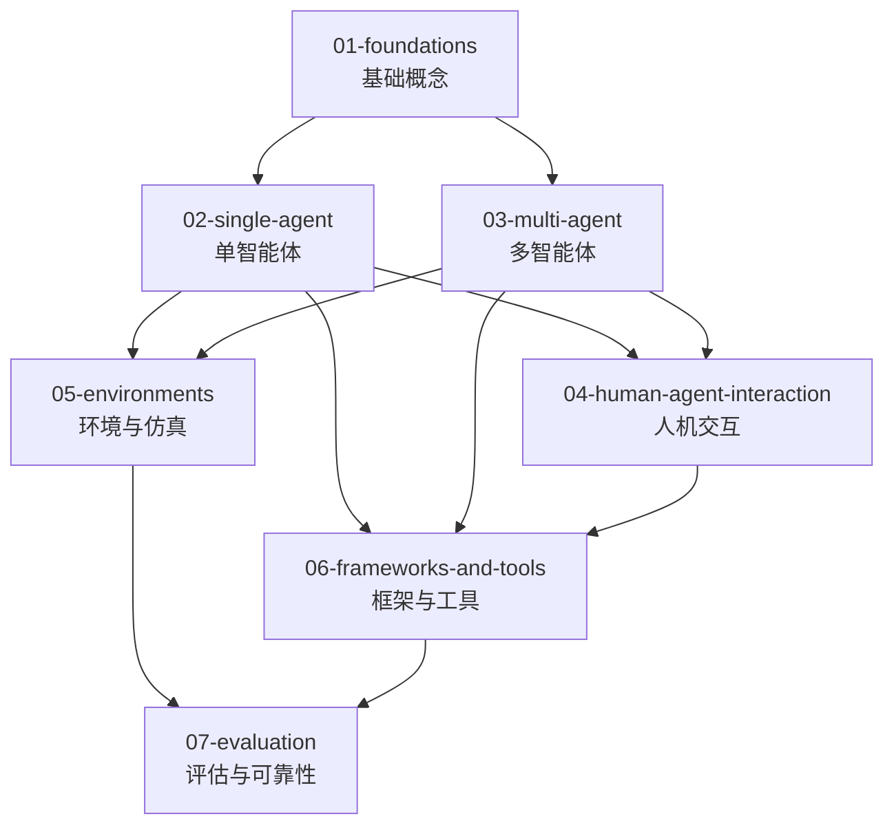

# AI 智能体 (Agentic AI)

LLM 驱动的自主智能系统：从基础概念、单智能体、多智能体，到人机交互、环境、框架工具与评估体系。

## 分类依据

Agentic 目录按抽象层级组织：先建立 Agent 的基础概念与系统模型，再分别沉淀单智能体能力、多智能体关系、人机交互、环境约束、工程生态与评估方法。

- **01（基础）**：工作定义、分类边界、反应式 vs 审慎式、认知架构、系统模型
- **02（单智能体）**：规划、记忆、工具使用、推理行动、自我反思、架构模式
- **03（多智能体）**：协作、竞争与冲突、组织架构、共享状态与上下文、协调、通信协议
- **04（人机交互）**：人在回路、交互表面、委托控制、信任与对齐
- **05（环境）**：仿真环境、浏览器环境、代码执行环境、沙箱安全、基准环境
- **06（框架与工具）**：具体框架、编码工具、项目案例、技能工具系统、对比选型
- **07（评估）**：任务完成度、通用 Agent 基准、SWE 基准、安全鲁棒、人工评估、可观测性

## 边界说明

| 内容 | 归属 | 说明 |
|------|------|------|
| Agent 基础定义、分类边界、系统模型 | `01-foundations/` | 建立跨主题的概念底座，并提供可被下游目录引用的工作定义锚点 |
| 单智能体认知能力（planning/memory/tool-use/reflection） | `02-single-agent/` | 认知能力是架构组成部分，不放入框架工具层重复建设 |
| 多智能体特有问题（协作、协调、通信、共享状态） | `03-multi-agent/` | 关注多 Agent 关系、组织与交互机制 |
| 人与 Agent 的任务委托、控制与交互体验 | `04-human-agent-interaction/` | 关注人机协作边界与交互模式 |
| Agent 运行、交互和评测所依赖的环境 | `05-environments/` | 关注环境建模、沙箱、浏览器与代码执行上下文 |
| 具体框架、工具、产品、开源项目 | `06-frameworks-and-tools/` | 只承载工程生态对象与实现案例，不重建底层能力体系 |
| Agent 评估方法、benchmark、可观测性 | `07-evaluation/` | 关注评估、调试和可靠性判断 |
| Agent 驱动的 RAG | `../rag/03-advanced-patterns/agentic-rag/` | RAG 视角 |
| LLM 推理优化 | `../llm/04-serving/` | Agent 底层引擎 |

## 目录结构

```text
agentic/
├── 01-foundations/                  # 基础概念
│   ├── definition-and-taxonomy/      # 定义与分类
│   ├── behavioral-paradigms/     # 行为范式连续谱
│   ├── cognitive-architectures/      # 认知架构总论
│   └── agent-system-modeling/          # Agent 系统建模
│
├── 02-single-agent/                  # 单智能体
│   ├── planning/                     # 规划
│   │   ├── task-decomposition/       # 任务分解
│   │   ├── plan-and-execute/         # 计划与执行
│   │   └── tree-of-thoughts/         # 思维树
│   ├── memory/                       # 记忆
│   │   ├── short-term-memory/        # 短期记忆
│   │   ├── long-term-memory/         # 长期记忆
│   │   └── retrieval-methods/        # 检索方法
│   ├── tool-use/                     # 工具使用
│   │   ├── api-calling/              # API 调用
│   │   ├── code-interpreter/         # 代码解释器
│   │   └── web-browsing/             # 网页浏览
│   ├── reasoning-and-acting-loop/         # 推理行动循环
│   ├── self-reflection/              # 自我反思
│   │   ├── critique-models/          # 批评模型
│   │   └── iterative-refinement/     # 迭代优化
│   └── architectural-patterns/                     # 架构模式
│       ├── react/                    # ReAct
│       ├── ra-aid/                   # RA-AID
│       └── autogpt-pattern/          # AutoGPT 模式
│
├── 03-multi-agent/                   # 多智能体
│   ├── collaboration/                # 协作模式
│   ├── competition-and-conflict/                  # 竞争与冲突
│   ├── organizational/               # 组织架构
│   ├── shared-state-and-context/                # 共享状态与上下文
│   ├── coordination/                 # 协调机制
│   └── communication-protocols/      # 通信协议
│
├── 04-human-agent-interaction/       # 人机交互
│   ├── human-in-the-loop/            # 人在回路
│   ├── interaction-surfaces/                     # 交互表面
│   ├── delegation-and-control/       # 委托与控制
│   └── trust-and-alignment/          # 信任与对齐
│
├── 05-environments/                  # 环境与仿真
│   ├── simulated-environments/       # 仿真环境
│   ├── browser-environments/         # 浏览器环境
│   ├── code-execution-environments/  # 代码执行环境
│   ├── sandboxing-and-safety/        # 沙箱与安全
│   └── evaluation-environments/      # 评测环境
│
├── 06-frameworks-and-tools/          # 框架与工具
│   ├── 01-frameworks/                # 通用框架与 SDK
│   │   ├── autogen/
│   │   ├── crewai/
│   │   └── langchain-agents/
│   ├── 02-coding-agents-and-tools/              # 编码 Agent 工具与产品
│   │   ├── claude-code/
│   │   ├── claw-code/
│   │   └── codex/
│   ├── 03-project-studies/           # 项目案例研究
│   │   ├── hermes-agent/
│   │   ├── openclaw/
│   │   └── openhands/
│   ├── 04-skill-and-tool-systems/    # 技能与工具系统
│   │   └── skill-based-agents/
│   └── 05-comparisons/               # 对比与选型
│
└── 07-evaluation/                    # 评估与可靠性
    ├── task-completion-metrics/      # 任务完成度
    ├── agent-benchmarks/             # 通用 Agent 基准
    ├── swe-benchmarks/               # 软件工程基准
    ├── safety-and-robustness/        # 安全与鲁棒性
    ├── human-evaluation/             # 人工评估
    ├── observability-and-debugging/  # 可观测性与调试
    └── papers/                       # 评估相关论文
```

## 开源仓库与工具存放指南

| 内容类型 | 放入目录 | 示例 |
|---------|---------|------|
| 通用 Agent 框架 / SDK / 编排框架 | `06-frameworks-and-tools/01-frameworks/` | LangGraph, AutoGen, CrewAI |
| 编码 Agent 工具 / 产品 | `06-frameworks-and-tools/02-coding-agents-and-tools/` | Claude Code, Codex, OpenHands |
| 完整 Agent 系统或开源项目案例 | `06-frameworks-and-tools/03-project-studies/` | Hermes Agent, OpenClaw |
| Skill / Tool / 插件生态实现 | `06-frameworks-and-tools/04-skill-and-tool-systems/` | Skill-based agents |
| 单智能体架构模式 | `02-single-agent/architectural-patterns/` | ReAct, RA-AID, AutoGPT |
| 多智能体协作系统与模式 | `03-multi-agent/` | MetaGPT, ChatDev |
| 评估基准与论文 | `07-evaluation/` | AgentBench, SWE-bench |
| 环境仿真平台 | `05-environments/` | WebArena, OSWorld |

## 学习路径



## 相关资源

- [LLM](../llm/) — Agent 的核心引擎
- [RAG](../rag/) — Agent 的知识检索能力
- [知识图谱](../knowledge-graph/) — Agent 的结构化知识
- [具身智能](../embodied-intelligence/) — Agent 的物理落地

---

*最后更新: 2026-05-31*
