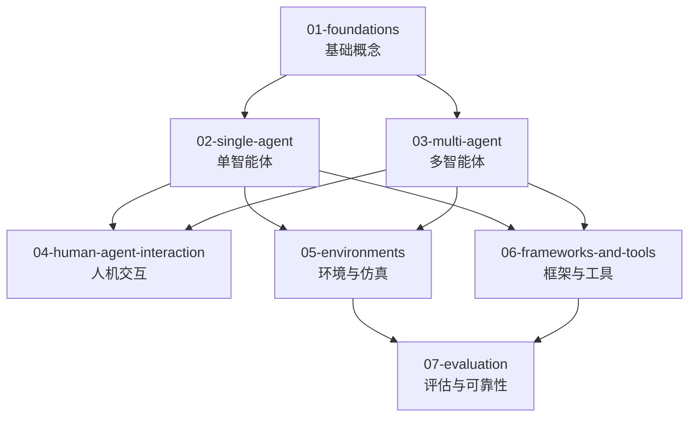

# AI 智能体 (Agentic AI)

LLM 驱动的自主智能系统：从单智能体到多智能体协作的认知能力、架构模式与工程实践。

## 分类依据

Agentic 目录按抽象层级组织：从基础概念到单智能体、多智能体，再到人机交互、环境、工具与评估：

- **01（基础）**：定义、分类、反应式 vs 审慎式、认知架构总论
- **02（单智能体）**：规划、记忆、工具使用、自我反思、架构模式
- **03（多智能体）**：协作、竞争、组织架构、共享记忆、协调与通信
- **04（人机交互）**：人与智能体的交互模式
- **05（环境）**：仿真环境、沙箱与安全、基准框架
- **06（框架与工具）**：开发框架、工具、实际项目
- **07（评估）**：任务完成度、安全与鲁棒性、人工评估

## 边界说明

| 内容 | 归属 | 说明 |
|------|------|------|
| 单智能体认知能力（planning/memory/tool-use/reflection） | `02-single-agent/` | 认知能力是架构的组成部分，不是独立层 |
| 多智能体特有问题（共享记忆、协调） | `03-multi-agent/` | 与单智能体的认知能力有本质区别 |
| Agent 驱动的 RAG | `../rag/03-advanced-patterns/agentic-rag/` | RAG 视角 |
| LLM 推理优化 | `../llm/04-serving/` | Agent 底层引擎 |

## 目录结构

```
agentic/
├── 01-foundations/                  # 基础概念
│   ├── definition-and-taxonomy/     # 定义与分类
│   ├── reactive-vs-deliberative/    # 反应式vs审慎式
│   └── cognitive-architectures/     # 认知架构总论
│
├── 02-single-agent/                 # 单智能体
│   ├── planning/                    # 规划
│   │   ├── task-decomposition/      # 任务分解
│   │   ├── plan-and-execute/        # 计划与执行
│   │   └── tree-of-thoughts/        # 思维树
│   ├── memory/                      # 记忆
│   │   ├── short-term-memory/       # 短期记忆
│   │   ├── long-term-memory/        # 长期记忆
│   │   └── retrieval-methods/       # 检索方法
│   ├── tool-use/                    # 工具使用
│   │   ├── api-calling/             # API调用
│   │   ├── code-interpreter/        # 代码解释器
│   │   └── web-browsing/            # 网页浏览
│   ├── self-reflection/             # 自我反思
│   │   ├── critique-models/         # 批评模型
│   │   └── iterative-refinement/    # 迭代优化
│   └── patterns/                    # 单agent架构模式
│       ├── react/                   # ReAct
│       ├── ra-aid/                  # RA-AID
│       └── autogpt-pattern/         # AutoGPT模式
│
├── 03-multi-agent/                  # 多智能体
│   ├── collaboration/               # 协作模式
│   ├── competition/                 # 竞争模式
│   ├── organizational/              # 组织架构
│   ├── shared-memory/               # 共享记忆
│   └── coordination/                # 协调与通信
│
├── 04-human-agent-interaction/      # 人机交互
│
├── 05-environments/                 # 环境与仿真
│   ├── simulated-environments/      # 仿真环境
│   ├── sandboxing-and-safety/       # 沙箱与安全
│   └── benchmarking-frameworks/     # 基准框架
│
├── 06-frameworks-and-tools/         # 框架与工具
│   ├── langgraph/                   # LangGraph
│   ├── autogen/                     # AutoGen
│   ├── crewai/                      # CrewAI
│   ├── claude-code/                 # Claude Code
│   ├── skill-based-agents/          # 基于技能的Agent
│   └── projects/                    # 实际项目
│       └── hermes-agent/            # Hermes Agent
│
└── 07-evaluation/                   # 评估与可靠性
    ├── task-completion-metrics/     # 任务完成度
    ├── safety-and-robustness/       # 安全与鲁棒性
    └── human-evaluation/            # 人工评估
```

## 开源仓库与工具存放指南

| 内容类型 | 放入目录 | 示例 |
|---------|---------|------|
| 智能体框架 | `06-frameworks-and-tools/` | LangGraph, AutoGen, CrewAI, Claude Code |
| 单智能体架构模式 | `02-single-agent/patterns/` | ReAct, RA-AID, AutoGPT |
| 多智能体协作系统 | `03-multi-agent/` | MetaGPT, ChatDev |
| 实际 Agent 项目 | `06-frameworks-and-tools/projects/` | Hermes Agent |
| 评估基准与论文 | `07-evaluation/` | AgentBench, SWE-bench |
| 环境仿真平台 | `05-environments/` | WebArena, OSWorld |

## 学习路径



## 相关资源

- [LLM](../llm/) — Agent 的核心引擎
- [RAG](../rag/) — Agent 的知识检索能力
- [知识图谱](../knowledge-graph/) — Agent 的结构化知识
- [具身智能](../embodied-intelligence/) — Agent 的物理落地

---

*最后更新: 2026-05-11*
