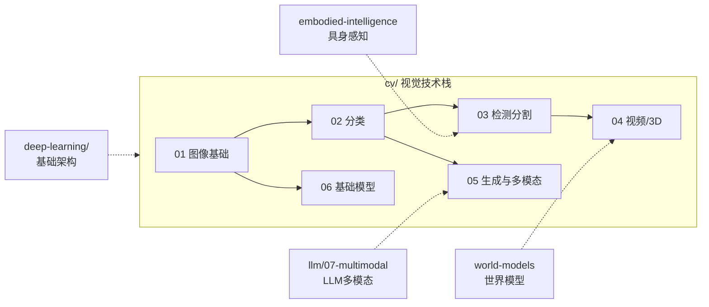

# 计算机视觉 (Computer Vision)

计算机视觉：从图像中提取、理解和生成视觉信息的技术体系，覆盖感知理解、生成与多模态、基础模型与工程化应用。

> **入口说明**：第一次进入时，先读本页的分类依据与边界说明建立整体方向；如需查找目录结构、子目录定位或学习路径，转向 [`index.md`](./index.md)。

## 分类依据

CV 目录按"从基础到应用、从感知到生成"的递进逻辑组织。

## 边界说明

| 内容 | 适合放 CV | 不适合放 CV |
|------|----------|------------|
| 视觉核心任务（分类、检测、分割、识别） | 02-04, 07 | — |
| 图像/视频生成（GAN、扩散模型、文生图） | 05 | 通用生成模型架构放 `deep-learning/03-architectures/generative-models/` |
| 视觉为中心的图文模型（BLIP、CLIP） | 05 | 核心创新在视觉编码/对齐 |
| LLM 为中心的多模态模型（LLaVA、Qwen-VL） | — | 放 `llm/07-multimodal/vlm/`，核心创新在 LLM 接入视觉的方式 |
| 跨谱系模型（BLIP-2） | — | Q-Former 属于"LLM 接入视觉"范式，放 `llm/07-multimodal/vlm/`；CV 侧通过链接引用 |
| 图像/视频生成（SD、DALL-E） | 05 | — |
| 视觉理解能力评估（检测、OCR） | 05 | 多模态指令跟随/推理评估放 `llm/07-multimodal/` |
| 音频/语音处理 | — | 放 `llm/07-multimodal/audio/` |
| 通用神经网络架构（CNN、Transformer 原理） | — | 放 `deep-learning/01-neural-network-fundamentals/`、`deep-learning/03-architectures/` |
| 3D 感知与重建 | 04 | 3D 生成放 `world-models/` |
| 机器人视觉感知 | — | 放 `embodied-intelligence/02-perception/` |

## 与其他目录的关系

- **deep-learning/** 提供 CNN、Transformer 等架构基础，CV 目录使用这些架构解决视觉任务
- **llm/07-multimodal/** 以 LLM 为中心的多模态，与 CV 的`05-generative-and-multimodal/` 互补（见上表）
- **embodied-intelligence/02-perception/** 聚焦机器人场景下的视觉感知，CV 的通用方法可作为其理论基础
- **world-models/** 的视频生成方向与 CV 的`04-video-and-3d-vision/` 有交集，WM 侧重环境建模与预测

- [深度学习基础](../deep-learning/) — CNN等基础架构
- [多模态LLM](../llm/07-multimodal/vlm/) — 视觉语言模型
- [具身智能](../embodied-intelligence/) — 视觉在机器人中的应用
- [世界模型](../world-models/) — 视频生成与预测

---

*最后更新: 2026-05-11*
