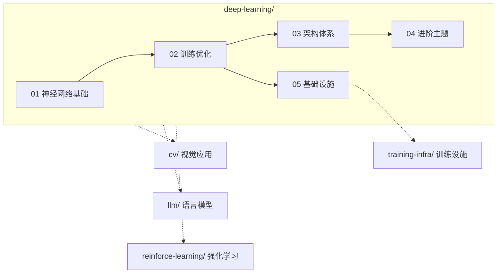

# 深度学习基础 (Deep Learning)

## 分类依据

Deep Learning 目录按"基础原理 → 训练方法 → 架构体系 → 前沿主题 → 工程支撑"组织：

- **01（神经网络基础）**：神经元、激活函数、损失函数等最底层概念
- **02（训练与优化）**：让网络真正"学起来"的核心技术
- **03（架构体系）**：按领域划分的主流网络架构（CNN、RNN、Transformer、生成模型）
- **04（进阶主题）**：特定方向的深入方法论
- **05（基础设施）**：GPU 计算、分布式训练等工程支撑

## 边界说明

| 内容 | 适合放 DL | 不适合放 DL |
|------|----------|------------|
| 神经网络底层概念（感知机、激活函数、损失函数） | 01 | — |
| 训练技术（反向传播、优化器、正则化） | 02 | 分布式训练放 `training-infra/` |
| 通用网络架构（CNN、RNN、Transformer 原理） | 03 | LLM 专属扩展（位置编码变体、MoE）放 `llm/01-foundations/` |
| 生成模型架构（GAN、VAE、扩散模型原理） | 03/generative-models/ | 图像生成应用（SD 出图、风格迁移）放 `cv/05-generative-and-multimodal/` |
| 具体模型实现（BLIP、Stable Diffusion） | — | 放对应领域目录（`cv/`、`llm/`） |
| 具体训练框架使用（PyTorch 代码、部署） | — | 放 `training-infra/03-frameworks-and-tools/` |
| 自监督学习、元学习等专项方法论 | 04 | — |

## 与其他目录的关系

- **cv/** 使用 DL 的 CNN、Transformer、生成模型架构解决视觉任务，DL 提供原理，CV 提供应用
- **llm/** 的 `01-foundations/transformer-architecture/` 是 DL `03-architectures/transformers/` 的 LLM 专属延伸
- **training-infra/** 侧重分布式训练、显存优化、框架选型等工程层面，DL `05-infra/` 只保留概念介绍
- **reinforce-learning/** 使用 DL 的神经网络作为函数逼近器，两者在策略网络、Q 网络处交汇

## 入口说明

- 想查目录结构、子目录定位时，转到 [`index.md`](./index.md)
- 想按阶段推进学习时，优先使用本页的学习路径

## 学习路径

**基础阶段**
- `01-neural-network-fundamentals/` — 感知机、激活函数、损失函数、自编码器
- `02-training-and-optimization/` — 反向传播、优化器、正则化

**进阶阶段**
- `03-architectures/` — CNN、RNN、Transformer、生成模型

**深入阶段**
- `04-advanced-topics/` — 自监督学习、元学习、NAS、持续学习
- `05-infra/` — GPU计算、分布式训练、框架对比

## 与仓库其他目录的关系

| 本目录内容 | 关联目录 | 说明 |
|-----------|---------|------|
| Transformer架构 | [../llm/01-foundations/transformer-architecture/](../llm/01-foundations/transformer-architecture/) | LLM基于Transformer扩展 |
| CNN/RNN | [../cv/02-image-classification/classic-backbones/](../cv/02-image-classification/classic-backbones/) | CV中的深度学习方法 |
| 训练技巧 | [../training-infra/](../training-infra/) | 分布式训练、显存优化 |
| GANs（生成模型架构） | [../cv/05-generative-and-multimodal/image-generation/](../cv/05-generative-and-multimodal/image-generation/) | 图像生成应用；GAN具体实现见DL `03/architectures/generative-models/gans/` |
| 自编码器（特征提取） | [../cv/06-foundation-models/contrastive-learning/](../cv/06-foundation-models/contrastive-learning/) | 无监督表征学习的对比方法 |
| Diffusion | [../cv/05-generative-and-multimodal/image-generation/](../cv/05-generative-and-multimodal/image-generation/) | 图像生成应用 |
| 生成模型 | [../world-models/04-large-scale-world-models/sora-and-video-generation/](../world-models/04-large-scale-world-models/sora-and-video-generation/) | 视频生成 |

---

*最后更新: 2026-05-11*
