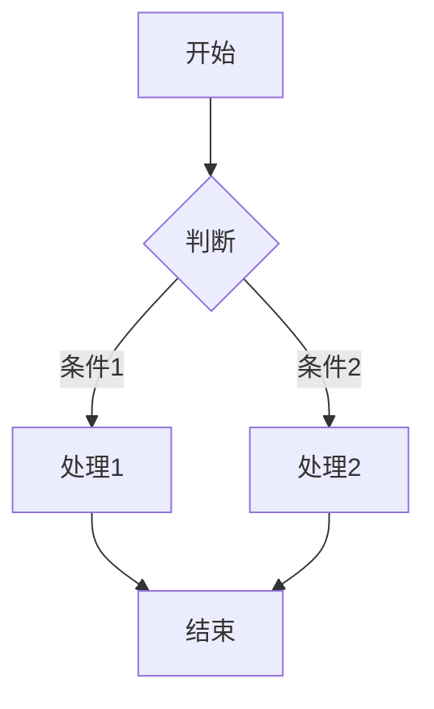
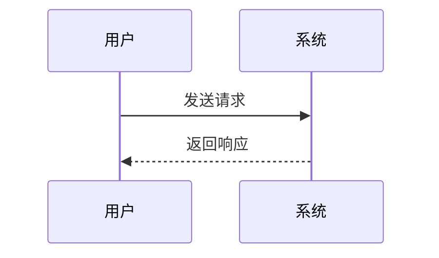

# Markdown 渲染测试文档

> 本文档用于测试 Markdown 渲染器的兼容性，包含各种标准 Markdown 元素和扩展语法。

---

## 一、标题测试

# 一级标题 (H1)
## 二级标题 (H2)
### 三级标题 (H3)
#### 四级标题 (H4)
##### 五级标题 (H5)
###### 六级标题 (H6)

---

## 二、段落与文本格式

普通段落文本。这是一段用于测试**粗体**、*斜体*、***粗斜体***、~~删除线~~、、<u>下划线</u>、以及`行内代码`的示例文本。

这是换行测试（行末两个空格）  
新的一行。

这是另起一段的示例。

---

## 三、列表测试

### 无序列表
- 项目 1
- 项目 2
  - 嵌套项目 2.1
  - 嵌套项目 2.2
    - 三级嵌套 2.2.1
- 项目 3

### 有序列表
1. 第一项
2. 第二项
   1. 嵌套 2.1
   2. 嵌套 2.2
3. 第三项

### 任务列表
- [x] 已完成任务
- [ ] 未完成任务
- [ ] 另一个待办项

### 定义列表
术语一
:   定义一的说明内容

术语二
:   定义二的说明内容

---

## 四、引用块

> 这是一段引用文本。
>
> > 嵌套引用块
> > 多行嵌套引用
>
> 回到外层引用

---

## 五、代码块

### 行内代码
使用 `console.log('Hello')` 输出信息。

### 代码围栏（无语言标识）
```
这是一个普通代码块
没有指定语言
```

### JavaScript
```javascript
function greet(name) {
  const message = `Hello, ${name}!`;
  console.log(message);
  return message;
}

greet('World');
```

### Python
```python
def fibonacci(n):
    if n <= 1:
        return n
    return fibonacci(n-1) + fibonacci(n-2)

# 测试
print([fibonacci(i) for i in range(10)])
```

### HTML
```html
<!DOCTYPE html>
<html>
<head>
  <title>测试页面</title>
</head>
<body>
  <h1>Hello World</h1>
</body>
</html>
```

### CSS
```css
.container {
  display: flex;
  justify-content: center;
  align-items: center;
  background: linear-gradient(45deg, #ff6b6b, #4ecdc4);
}
```

---

## 六、表格

### 基础表格
| 姓名 | 年龄 | 城市 |
|------|------|------|
| 张三 | 25   | 北京 |
| 李四 | 30   | 上海 |
| 王五 | 28   | 广州 |

### 对齐方式
| 左对齐 | 居中对齐 | 右对齐 |
|:-------|:--------:|-------:|
| 内容   |   内容   |   内容 |
| A      |    B     |      C |

### 复杂表格
| 功能 | 描述 | 状态 |
|:-----|:-----|:-----|
| 登录 | 用户认证功能 | ✅ 已完成 |
| 注册 | 新用户注册 | 🚧 开发中 |
| 找回密码 | 邮件重置密码 | ⏳ 待开始 |

---

## 七、链接与图片

### 文本链接
- [GitHub](https://github.com "GitHub主页")
- [Bilibili](https://www.bilibili.com/)
- 自动链接: <https://www.example.com>

### 引用式链接
[链接文本][ref1]
[另一个链接][ref2]

[ref1]: https://example.com "示例网站"
[ref2]: https://github.com "GitHub"

### 图片


### 带链接的图片
[](https://example.com)

---

## 八、分隔线

使用三个或更多星号、减号或下划线：

***

---

___

---

## 九、HTML 嵌入

<div style="padding: 10px; background-color: #f0f0f0;">
  <p>这是一个 <strong>HTML 区块</strong></p>
</div>

<details>
  <summary>点击展开/收起</summary>
  这是折叠内容。
</details>

---

## 十、特殊字符与转义

### 特殊符号
© ® ™ ° € £ ¥ § ¶ † ‡ • …

### 转义字符
\* 星号 \*  
\[ 方括号 \]  
\` 反引号 \`  
\\ 反斜杠 \\

---

## 十一、数学公式（LaTeX）

行内公式：$E = mc^2$

块级公式：
$$
\int_{-\infty}^{\infty} e^{-x^2} dx = \sqrt{\pi}
$$

矩阵：
$$
\begin{bmatrix}
1 & 2 & 3 \\
4 & 5 & 6 \\
7 & 8 & 9
\end{bmatrix}
$$

---

## 十二、图表（Mermaid）

### 流程图


### 时序图


---

## 十三、脚注

这里有一个脚注引用[^1]，还有另一个[^2]。

[^1]: 这是第一个脚注的内容。
[^2]: 这是第二个脚注，可以包含多行内容。
    这是脚注的第二行。

---

## 十四、Emoji 表情

:smile: :heart: :thumbsup: :rocket: :star: :fire:

🎉 🌟 💡 📝 ✅ ❌

---

## 十五、警告/提示框

> **提示** 💡
> 这是一个提示信息框。

> **注意** ⚠️
> 这是一个警告信息框。

> **重要** ❗
> 这是一个重要提示框。

---

*文档结束 - 用于 Markdown 渲染测试*
