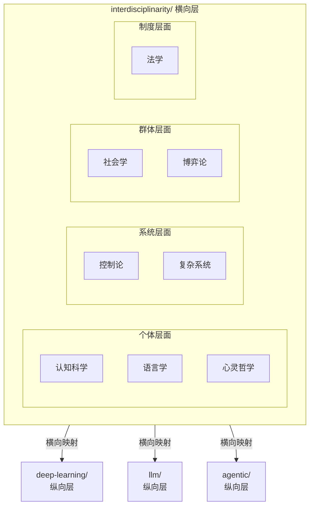

# 跨学科（Interdisciplinarity）

> 当技术纵深到一定程度，最关键的突破往往来自学科边界的碰撞。
> 本目录不按技术栈纵向组织，而是以**外部学科视角**横向切入，探讨其对 AI / ML 的启发与映射。

> **入口说明**：第一次进入时，先读本页的定位与排序逻辑建立整体方向；如需查看目录结构或按子目录/问题查找入口，转向 [`index.md`](./index.md)；如果不确定从哪开始，转向 [`roadmap.md`](./roadmap.md)。

## 排序逻辑

按 **个体认知 → 符号与语言 → 哲学反思 → 系统方法 → 宏观涌现 → 群体组织 → 策略与利益 → 制度与治理** 递进排列：

```
个体层面          01 认知科学与神经科学  ── 大脑如何工作
  │              02 语言学与语用学      ── 个体如何表达
  │              03 心灵哲学            ── 认知与语言的本体论反思
  ▼
系统层面          04 控制论与系统论      ── 系统如何调节
  │              05 复杂系统与涌现      ── 系统如何涌现
  ▼
群体层面          06 社会学与组织管理    ── 群体如何组织
  │              07 经济学与博弈论      ── 群体如何博弈
  ▼
制度层面          08 法学与治理          ── 群体如何约束
```

> **过渡说明**：从 05 复杂系统到 06 社会学，是从"自然系统的自发涌现"转向"人工群体的有意组织"——前者回答"秩序如何从无到有"，后者回答"秩序如何被设计维持"。

## 定位

现有仓库按技术领域纵向分层（ML → DL → LLM → Agent → …），本目录是**横向交叉层**：

- 同一跨学科主题可能关联多个技术目录（如认知科学同时关联 DL、LLM、Agent）
- 反过来，同一技术目录可被多个学科视角审视（如 Multi-Agent 同时被社会学和博弈论照亮）
- 各笔记中会链接到具体技术目录，形成网状引用

## 与纵向技术栈的关系



---

*最后更新: 2026-05-11*
