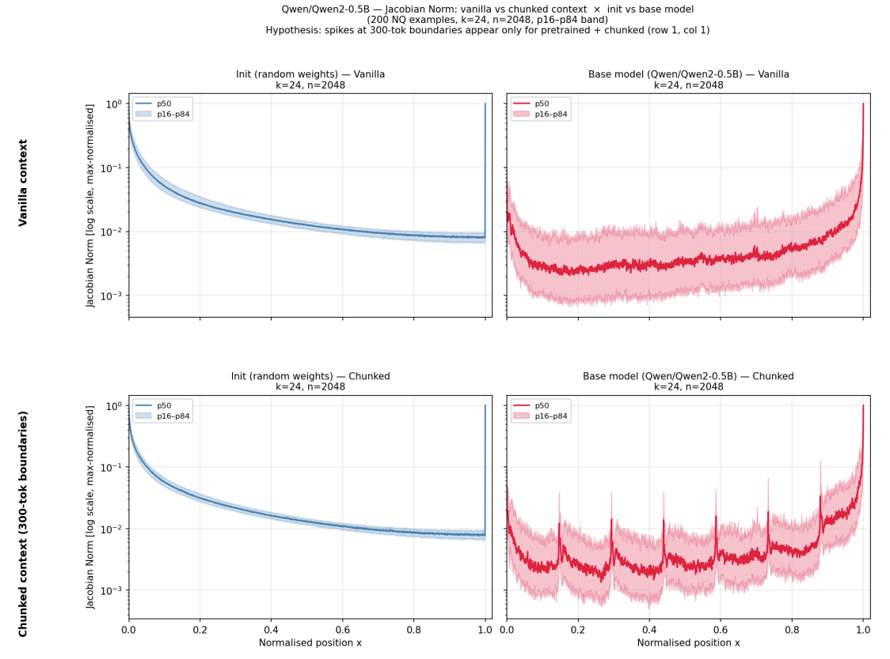

# Lost in the Middle at Birth: An Exact Theory of Transformer Position Bias

## 技术深度解析文档

> 论文原名：*Lost in the Middle at Birth: An Exact Theory of Transformer Position Bias*
> arXiv ID：[2603.10123](https://arxiv.org/abs/2603.10123)
> 提交日期：2026年3月10日

## 一、论文基本信息

| 属性 | 内容 |
|------|------|
| **标题** | Lost in the Middle at Birth: An Exact Theory of Transformer Position Bias |
| **作者** | Borun D. Chowdhury |
| **机构** | Meta（通过文献分析和arXiv页面的机构隶属信息推断） |
| **arXiv提交日期** | 2026年3月10日 |
| **学科分类** | Machine Learning (cs.LG); Artificial Intelligence (cs.AI); Computation and Language (cs.CL) |
| **篇幅** | 11页, 7张图表 |
| **arXiv ID** | 2603.10123v1 |
| **DOI** | 10.48550/arXiv.2603.10123 |

> **基金支持**：论文致谢部分提及Simons Foundation资助。

## 二、研究背景与核心问题

### 2.1 一个需要解释的现象

自Liu等人（2024）在TACL论文中首次系统定义“Lost-in-the-Middle”现象以来，这一U型性能曲线已成为大语言模型（LLM）长上下文处理能力研究中最受关注的现象之一。实验上，模型的检索准确率在输入序列两端最高，在中间区域最低；注意力权重的分布也呈现出完全相同的U型特征。

但在此之前，学术界对这一现象的解释基本上分成两个阵营。第一个阵营归因于**Softmax学习伪迹**——模型在训练过程中“学会了”赋予开头和结尾token不相称的高注意力权重。第二个阵营归因于**位置编码**——如RoPE等位置编码在数学上天然具有距离衰减效应，导致模型对距离当前生成位置较远的中间token关注不足。这两种解释都隐含着一个共同假设：U型位置偏差是**训练出来**的，或者是**位置编码引入**的。它们因此共享一个共同的推论：我们可以通过改进训练数据分布、调整位置编码或进行事后校准来“消除”这个问题。

### 2.2 论文的核心问题

本论文向这一共识发出了根本性的挑战——不是质疑Lost-in-the-Middle现象的存在，而是挑战其**起源**的解释。论文的核心问题是：U型位置偏差是否**根本不需要**训练或位置编码就能存在？它是否已经在Transformer架构被定义的那一刻就写入了基因中，是模型从出生的那一刻就携带的“先天性特征”？

论文提出了一个单刀直入的核心论点：

> “the U-shape is already present at initialization, before any training or positional encoding takes effect. It is an inherent geometric property of the causal decoder with residual connections.”

翻译：U型偏差在模型初始化时、在任何训练开始之前、在任何位置编码生效之前就已经存在。它是因果解码器与残差连接固有的几何属性。

这意味着，所有关于Lost-in-the-Middle的解释，如果只关注Softmax学习或RoPE距离衰减，都只看到了冰山以上的部分。冰山之下是一个更深层、更基础的结构性根源。

## 三、核心论点：U型偏差的结构必然性

### 3.1 从“后天习得”到“先天固有”的范式转换

论文的核心贡献在于完成了一次根本性的认知转换。

在Chowdhury之前，学术界主流研究者的思维框架是：

> 现象（U型偏差） → 可能原因 → 训练数据/Softmax学习/位置编码 → 解决方案

而本论文提出的思维框架是：

> 现象（U型偏差） ← 根本原因 ← 因果掩码 + 残差连接 ← 固化于架构初始化

论文的核心主张因此极为清晰：这个偏差并不仅是被训练出来的，而是**架构初始化时刻就通过数学必然性被编码的**。这不只是一个统计偏见，而是一个**拓扑基线**——一个因架构本身的结构而无法逃脱的注意力分布默认状态。即使使用随机初始化的权重，且完全不使用RoPE等位置编码，U型位置偏差仍然存在。论文更进一步指出：

> “standard training does not overcome the topological valley, confirming that the U-shape persists as an architectural baseline under standard pretraining objectives.”

换言之：标准的预训练无法“翻越”这个拓扑谷。U型偏差会持续作为架构基线存在——不是因为模型学得不够好，而是因为架构从根源上就把它写入了DNA。

### 3.2 数学框架：Cesàro矩阵的迭代幂次

为了从数学上证明这一论点，论文采用了优雅而有力的建模工具。论文将多层因果注意力模型化为**Cesàro矩阵的迭代幂次**。Cesàro矩阵是数值线性代数中的一个基本矩阵，在序列平均化问题中天然出现。其核心形式是下三角矩阵，每个非零元素代表对各位置的影响分布。将多层注意力表示为Cesàro矩阵的迭代幂次，本质上是在建模信息在多层因果架构中的持续平均化传播——每一层都在前一层的基础上再次应用平均化算子，使信息逐步在序列中扩散和分布。

由此，论文推导出了**连续极限下的闭式影响力密度**。这一推导的核心洞察是：因果掩码和残差连接的共同作用导致了三种截然不同量级的效应在输入序列上的叠加：

| 效应 | 来源 | 数学量级 | 特征 |
|------|------|---------|------|
| **Primacy Tail（首因尾）** | 因果掩码 | $O(\log n)$ 对数发散 | 序列开头的影响力缓慢衰减，形成长尾 |
| **Recency Delta（近因δ）** | 残差连接 | $O(1)$ 常数锚点 | 最后一个token上孤立的$O(1)$量级锚点 |
| **中间死区** | 两种力在中间的相互抵消 | $O(1/(H-1)!)$ 阶乘级衰减 | 中间区域的影响力呈阶乘量级骤降 |

## 四、三成分结构深度解析

### 4.1 Primacy Tail（首因尾）

Primacy Tail效应是因果掩码直接作用的产物。其数学特征为影响力从序列头部起始点开始呈**对数发散**——即开头位置的token在后续信息的梯度传播中拥有与众不同的“权重优势”，这种优势缓慢衰减但不完全消失。具体机制如下：在因果注意力架构中，早期的token（特别是第一个token）由于没有前驱，在整个多层传播过程中独占地接收所有后续信息的贡献，这一累积效应产生了一个对数级衰减的长尾分布。

论文发现，Primacy Tail具有“内容无关性”——其强度与token的实际语义内容完全无关，只由该token在序列中的位置决定。这是U型偏差“不可消除”的最强证据：如果偏差是由训练数据或语义内容驱动的，那么通过调整数据分布或校准注意力有可能消除它；但如果偏差是由数学结构先天决定的，那么消除它的唯一方法是改变结构本身。

### 4.2 Recency Delta（近因δ）

Recency Delta效应与Primacy Tail形成不对称的对应——它由残差连接直接作用产生，其数学形式是**在最后一个token处孤立的$O(1)$常数锚点**。与其他位置的缓慢衰减不同，最后一个token的影响力不依赖于扩散过程，而是作为一个固定量级的孤立峰值出现。无论序列多长，最后一个token都会保持一个恒定的、不受序列长度影响的影响力锚点。

论文揭示的核心洞见是：Primacy Tail和Recency Delta的成因本质上是**正交**的。Primacy Tail来自因果掩码（注意力拓扑）；Recency Delta来自残差连接（信息保留的结构特性）。这表明首因效应和近因效应虽然都体现在U型曲线上，却源于不同的架构机制——它们的“数学基因”根本不同。这一区别对于设计针对性的缓解策略至关重要：试图用一个统一的机制来同时消除首因效应和近因效应，可能从根本上就是无效的。

### 4.3 中间死区：阶乘灾难

论文对中间区域的分析是最令人震撼的部分。影响力在U型曲线中间区域的衰减并非人们可能想象中的普通指数衰减或线性衰减，而是**$O(1/(H-1)!)$量级的阶乘衰减**，其中H是网络深度。

这一量级的数学含义极为严峻。阶乘增长是数学中最快的增长速度之一：1! = 1，10! ≈ 3.6×10⁶，20! ≈ 2.4×10¹⁸。当$(H-1)!$位于分母时，其倒数呈阶乘级衰减。这意味着即使对于中等深度的网络（如32层Transformer），中间区域的梯度影响和检索能力已经衰减到天文数字级小的程度，模型从根本上无法有效从中间位置检索信息。

论文将这一现象形象地称为“**structural hostility**”——架构上的结构性敌意。这不是训练不足或数据不充分的问题，而是架构本身对中间位置信息处理设置了难以逾越的数学障碍。值得注意的是，中间死区的成因不是某一种机制单独作用的结果，而是首因尾和近因δ两种力在中间区域**相互抵消**的产物——开头的影响力在向中间传播时自然衰减，结尾的锚点在向中间反向传播时也自然衰减，两者在中间区域相遇时的相互抑制创造了这个极端低洼区。

## 五、实验验证

**图注**：Jacobian范数可视化——Qwen2-0.5B（H=24, L=2048）在初始化与预训练状态下的对比。上图行为普通上下文（单篇文档截断），下图行为分块上下文（300词元片段拼接）。左列为初始化状态，右列为预训练状态。阴影区域表示第16-84百分位的置信区间。

### 5.1 实验设计

论文的实证部分采用了一个简洁而有力的设计方案。为了证明U型偏差是先于训练存在的，论文选取了两个主流架构——**Qwen2**和**GPT-2**——并进行了**未训练架构**的测量。具体做法是在模型初始化后、未经任何训练的"第0步"时刻，直接测量模型在不同位置上的梯度影响力和检索能力分布。

关键对照组设计是**位置编码消融实验**：分别在启用RoPE和不启用RoPE的情况下测量初始模型的U型分布，以验证位置编码是否对该现象的起源有实质性贡献。论文同时比较了初始模型（Step 0）与经过标准预训练的模型，以验证训练是否能够克服偏差。

### 5.2 Figure 2深度解读：四象限对比分析

Figure 2通过Jacobian范数（输入-输出雅可比矩阵的范数）可视化不同位置输入对最终输出的"影响力"。横轴为序列位置，纵轴为影响力强度。这张图以四象限形式呈现了核心实验发现：

#### 5.2.1 初始化状态（左列）：U形偏差的先天性证据

**左上（普通上下文）与左下（分块上下文）**展示了未经训练的Qwen2-0.5B在两种输入条件下的表现：

- **核心观察**：无论上下文是普通还是分块，影响力曲线都呈现**平滑的U形**——开头和结尾位置影响力高，中间区域显著凹陷。
- **关键证据**：分块上下文的文档边界处（0, 300, 600...）**没有出现任何异常尖峰**。曲线完全平滑，对内容变化和边界位置毫无感知。
- **理论意义**：这直接证明了U形偏差在训练前就已存在，是模型结构的"先天性特征"。由于此时模型参数完全随机，且未接触任何训练数据，U形分布只能源于架构本身的几何属性（因果掩码+残差连接）。

#### 5.2.2 预训练状态（右列）：训练无法消除结构性偏差

右上图（普通上下文）展示了预训练模型在连贯长文档上的表现：

- **核心观察**：宏观U形结构**完全保留**，曲线形态与初始化状态几乎一致。
- **关键差异**：曲线整体更加平滑，没有明显的局部波动——模型对内容变化保持"无感知"状态。
- **理论意义**：标准预训练无法"填平"中间死区。这与论文的核心论点一致：U形偏差是拓扑基线，训练只能在其上叠加微调，无法从根本上改变结构决定的分布形态。

右下图（分块上下文）是Figure 2最具启发性的部分：

- **核心观察**：在保持宏观U形的同时，**在文档边界处（0, 300, 600...）出现了多个尖锐的尖峰**。
- **关键对比**：这些尖峰在初始化状态（左下）完全不存在，是预训练过程中**后天习得**的。
- **理论意义**：这些尖峰代表了模型习得的"**内容不连续探测器**"。为了克服中间位置的结构性低影响力，模型学会了一种补偿策略——在内容发生剧变的位置（文档边界）部署注意力尖峰，以便快速抓取关键信息。然而，这种学习并未改变宏观的U形结构，模型在大部分中间位置的检索能力依然很弱。

### 5.3 关键实验发现

基于Figure 2的四象限对比，论文得出了以下关键发现：

**发现一：U形偏差在初始化时已存在**

未训练的Qwen2和GPT-2架构在Step 0时已表现出清晰的U型位置分布。禁用RoPE后U型分布依然存在，且形态与启用RoPE时几乎相同——论文原文明确写道："it is identical with or without RoPE"。这直接驳斥了"U型偏差主要来自RoPE距离衰减"的流行假设。

**发现二：中间死区的阶乘级抑制**

中间区域的梯度影响力与网络深度H的阶乘成反比，即$O(1/(H-1)!)$。这是一个衰减极其迅猛的量级：当H=24时，$(H-1)! \approx 2.6 \times 10^{22}$，中间位置的影响力已经衰减到天文数字级小的程度。这解释了为什么即使经过预训练，模型也难以"填平"中间的凹陷——在训练中，中间位置词元的梯度已被结构本身极大地衰减。

**发现三：模型习得内容不连续探测能力**

分块上下文中的边界尖峰证明，模型在训练中学会了检测主题或文档边界，并通过在这些位置分配更高注意力来弥补中间位置的弱势。这是一种后天习得的补偿策略，但并未改变U形偏差的结构性本质。

**发现四：标准预训练无法克服拓扑谷**

论文比较了初始化模型与预训练模型，结论是"standard training does not overcome the topological valley"。U型偏差因此不是一个可以通过更好的预训练来解决的"学习不足"问题。

## 六、扩展思考：实验现象的深层启示

### 6.1 普通上下文 vs 分块上下文：实践选择的权衡

Figure 2的对比设计引发了一个实践问题：在实际应用中，应该选择哪种上下文组织方式？

| 维度 | 普通上下文 | 分块上下文 |
|------|-----------|-----------|
| **内容连贯性** | 高（单篇完整文档） | 低（多篇无关片段拼接） |
| **信息检索** | 中间位置检索能力弱（U形底部） | 边界处有注意力尖峰，有利于定位文档切换点 |
| **长文档理解** | 更适合（保留原文逻辑关系） | 会破坏文内因果和指代关系 |
| **多文档处理** | 不适合（无法区分文档边界） | 可利用边界尖峰快速区分信息来源 |
| **典型应用** | 长篇小说、单篇论文分析 | 跨文档问答、RAG多段落拼接、新闻归类 |

**核心洞察**：

论文通过对比揭示的是结构性缺陷的普适性，而非推荐某种上下文"更好"。两种上下文的实验都显示宏观U形始终存在——证明"中间遗忘"是Transformer的固有问题，与输入内容是否连贯无关。

- **普通上下文**的平滑曲线说明：即使内容完全连贯，中间位置的信息仍被系统性抑制。
- **分块上下文**的边界尖峰说明：模型学会了利用内容不连续来"自救"，但这是一种局部补偿，U形洼地依然存在。

**实践建议**：
- 处理单篇长文档时，使用普通上下文以保留逻辑连贯性
- 处理多篇独立短文本时，分块上下文能让模型利用边界尖峰区分信息来源
- 但无论哪种方式，中间位置的信息都会被系统性忽视——这是架构层面的瓶颈，无法通过上下文组织方式彻底解决

### 6.2 从实验现象到理论反思

Figure 2的实验设计本身也值得关注。论文选择对比"普通上下文"和"分块上下文"，不仅是为了验证U形偏差的先天性，更是为了揭示一个深层问题：**模型能否通过训练习得补偿策略来克服结构性限制？**

分块上下文中的边界尖峰给出了一个复杂的答案：模型确实学会了在内容剧变处部署注意力尖峰，这是一种"聪明的"补偿机制。但这种学习有其局限性——它只能在局部（边界处）产生效果，无法改变全局的U形分布。这暗示了一个更普遍的原理：**架构设定的拓扑基线构成了模型行为的"硬边界"，训练只能在这个边界内进行局部优化，而无法突破边界本身**。

这一洞察对于理解深度学习的能力边界具有普遍意义：当我们观察到模型在某些任务上表现不佳时，需要区分这是"训练不足"还是"架构不可能"。Figure 2的实验框架提供了一种判断方法——如果在初始化时问题就已存在，那么它很可能是架构层面的固有限制。

## 七、与相关工作的理论关系

### 6.1 对Hsieh et al.（2024）Found in the Middle的深化

Hsieh等人的工作识别了位置注意力偏差，并提出了通过校准注意力分数减去位置偏差来缓解问题的方法。其核心假设是偏差主要源于位置编码（RoPE）和学习中的Softmax伪迹。本论文在此基础上的贡献是：阐明了其校准工作的“基线”。Hsieh等人通过实验观察到偏差并进行工程干预；本论文则在数学上证明了偏差的来源，解释了为什么他们的方法需要减去偏差（因为偏差是结构先天的）。论文特别声明：“We do not claim that this bias is insurmountable, nor that interventions such as RoPE modifications are useless”。这意味着，论文无意否定现有缓解方法的价值，而是在提供这些方法在数学上的依据和边界。

### 6.2 对Salvatore et al.（2025）“需求适应论”的互补与张力

Salvatore等人的工作提出Lost-in-the-Middle是预训练数据中不同信息检索需求的适应性产物。该理论的出发点是模型有“学习”的空间——模型通过适应数据分布来发展出U型特征。本论文提供了一个与“需求适应论”存在微妙张力的补充解释：Salvatore等人的观点论证了U型偏差在训练中被强化和塑造的可能；本论文则证明U型偏差在训练前就已存在，无论数据分布如何。这两种视角可被整合为：**结构初始化偏差（本论文）提供了偏差的“骨架”；数据驱动的适应（Salvatore）为这个骨架“添加血肉”——强化和精细化偏差的最终形态**。结构的骨架决定了偏差的基本形状，数据分布则在其上塑造具体的弯曲程度和局部细节。

### 6.3 与Herasimchyk et al.（2026）残差感知理论的独立证实

同期发表的“A Residual-Aware Theory of Position Bias in Transformers”（Herasimchyk et al., 2026）与本论文形成了重要的独立互证关系。该工作从不同的数学路径得出了高度一致的结论：“At finite depth, we prove that causal Transformers induce a U-shaped position bias, with attention concentrating on early and late tokens. This provides a principled architectural explanation for the Lost-in-the-Middle phenomenon.”两个独立的研究团队从不同的理论框架出发，得出了一致的U型偏差结构起源结论。这显著提升了理论的可信度——当两个独立的数学推导汇聚于同一结论时，偶然性的可能大大降低。

## 八、对RAG系统设计的意义

### 7.1 根本上重置了期望

U型放置策略（Byerly & Khashabi，2025）认为，我们不需要消除位置偏见，而应该将其转化为优势。Found in the Middle（Hsieh et al., 2024）认为，我们需要通过校准来减去位置偏差。本论文则提供了理解这些策略有效性的全新视角。

论文带来的最深刻的实践启示是：不要期望通过调整文档顺序、注意力校准或任何不修改架构的手段来“消除”U型偏差——因为它是一个数学必然的结构基线。这意味着：即使经过最精妙的校准，某些固有偏差可能仍然无法消除。RAG工程师需要对此有现实的认知。

### 7.2 设计上的新思路

论文为RAG系统的架构设计提供了几个新的思路：

- **根本性解决方案**：如果U型偏差源于因果掩码+残差连接的结构性组合，那么**改变这个组合**（例如，修改因果掩码的不对称性，或调整残差连接的强度分布）可能在根本上消除或重塑U型偏差。这为下一代的LLM架构设计提供了一个明确的研究方向。

- **预期管理**：对于现有架构，RAG工程师应该**管理对“位置无关”性能的期望**。中间死区的数学量级（阶乘衰减）表明，即使经过最聪明的输入重排，中部长上下文的信息利用仍然是一个结构性的瓶颈。

- **架构选择**：在比较不同LLM架构时，U型偏差的强度应该成为一个架构比较的关键维度。论文为这种比较提供了一个明确的理论基础。

- **评分Scaling的数学基础**：SIW等方法（Chu et al., 2025）通过缩放初始token权重来缓解初始显著性偏差。本论文提供了这种做法的深层理论支持：初始token的结构特殊性和其影响力传播机制在Cesàro矩阵框架中有明确的数学表达。

## 九、结论与未来方向

### 9.1 核心结论：从症状治疗到病因根治的范式转换

本论文通过严格的数学分析证明，"Lost in the Middle"现象是深度自回归Transformer的**结构性必然**。因果掩码保证了首因效应（Primacy Tail），残差连接保证了近因锚点（Recency Delta）——两者共同构成了U形偏差的拓扑基础。

这一发现暗示了学术界应对上下文退化问题的**范式转换**：

> 由于U形偏差是架构与生俱来的拓扑特征，而非位置编码引入的伪影，像"扁平化RoPE"这样的架构微调只能治疗症状。要根治这一问题，训练范式必须被显式设计为能够克服$O(1/(H-1)!)$的初始化偏差。

### 9.2 专门训练范式的探索方向

未来工作的关键方向是评估**专门训练范式**能否迫使非线性的Score Pathway完全弥合这一拓扑鸿沟：

- **中间上下文课程学习（Middle-Context Curriculum Learning）**：设计渐进式训练策略，让模型从短序列开始，逐步适应在更长序列的中间位置检索信息

- **目标损失加权（Targeted Loss Weighting）**：对中间位置的预测损失施加更高权重，强制模型提升中间位置的信息利用能力

- **"大海捞针"数据过采样（Needle-in-a-Haystack Oversampling）**：在训练数据中增加需要从中部上下文检索关键信息的样本比例

通过提供因果-残差基线的精确闭式计算，本文为未来研究者提供了其优化策略必须克服的**精确物理阻力**（precise physical headwinds）。

### 9.3 实证验证的后续工作

未来的实证工作应聚焦于：

- **在开源模型中直接测量输入-输出Jacobian范数**：例如在Llama 3等模型中验证首因尾的对数缩放和近因涂抹的指数缩放

- **结构修改的实验测试**：验证是否可以通过改变残差连接模式或修改因果掩码来改变U型偏差

- **非常深层网络的分析**：当网络深度达到千层级别时，中间死区可能使信息利用完全不可行

- **跨模态验证**：检验Vision Transformer、视频理解模型等多模态架构是否呈现相同的偏差模式

### 9.4 局限性与开放问题

论文坦率地承认了以下局限：

**理论局限**：分析通过证明Score Pathway在初始化时消失，干净地隔离了线性Value Pathway。但对于完全训练后的网络，分析依赖于Jacobian的实证观察，而非对训练后Softmax的闭式数学边界。

**实证局限**：验证仅聚焦于标准预训练分布。确定Score Pathway在激进的、位置定向的微调（position-targeted fine-tuning）下能够覆盖拓扑基线的上限，仍然是一个开放的实证问题。

**核心开放问题**：训练后的非线性Score Pathway产生的内容特定局部尖峰会如何与宏观U型结构相互作用？论文明确将这个问题确定为关键挑战："quantifying how much the Score Pathway can, in principle, overcome the topological baseline under aggressive, position-targeted fine-tuning."

## 十、核心要点与理论贡献汇总

| 维度 | 核心内容 |
|------|---------|
| **核心主张** | U型位置偏差在模型初始化时即已存在，训练和位置编码不创造它，只在它上面叠加细微调整 |
| **根本原因** | 因果掩码 + 残差连接的结构几何属性 |
| **数学工具** | Cesàro矩阵的迭代幂次建模 |
| **三成分结构** | Primacy Tail（对数级）、Recency Delta（$O(1)$常数锚点）、中间死区（阶乘级$1/(H-1)!$衰减） |
| **实证验证** | Qwen2和GPT-2的Step 0测量；RoPE无关性验证；初始化模型 vs 预训练模型比较 |
| **与其他理论的关系** | 为Found in the Middle、需求适应论、U型放置策略等提供“基线” |
| **对RAG的启示** | 中间死区的阶乘量级表明这是一个结构瓶颈，不能仅靠校准消除 |
| **开放性挑战** | Score Pathway在微调中克服拓扑基线的能力上限 |

论文的独创性在于它带来的理论视角的根本性转换。它将Lost-in-the-Middle从一个**通过学习可以解决的问题**，重新定义为一个**架构的自然特征**。这并不意味着它是不可解决的，但它意味着解决它的方式必须是结构性的，而不是基于数据或校准的。

## 十一、参考文献

1. Chowdhury, B. D. (2026). Lost in the Middle at Birth: An Exact Theory of Transformer Position Bias. *arXiv preprint*, arXiv:2603.10123. [https://arxiv.org/abs/2603.10123](https://arxiv.org/abs/2603.10123)

2. Liu, N. F., Lin, K., Hewitt, J., Paranjape, A., Bevilacqua, M., Petroni, F., & Liang, P. (2024). Lost in the Middle: How Language Models Use Long Contexts. *Transactions of the Association for Computational Linguistics*, 12, 157-173. arXiv:2307.03172

3. Hsieh, C.-Y., Chuang, Y.-S., Li, C.-L., Wang, Z., Le, L. T., Kumar, A., Glass, J., Ratner, A., Lee, C.-Y., Krishna, R., & Pfister, T. (2024). Found in the Middle: Calibrating Positional Attention Bias Improves Long Context Utilization. In *Findings of the Association for Computational Linguistics: ACL 2024*. arXiv:2406.16008

4. Salvatore, N., Wang, H., & Zhang, Q. (2025). Lost in the Middle: An Emergent Property from Information Retrieval Demands in LLMs. arXiv:2510.10276

5. Herasimchyk, H., Labryga, R., Prusina, T., & Laue, S. (2026). A Residual-Aware Theory of Position Bias in Transformers. *arXiv preprint*, arXiv:2602.16837

6. Byerly, A., & Khashabi, D. (2025). Gold Panning: Turning Positional Bias into Signal for Multi-Document LLM Reasoning. arXiv:2510.09770

7. Chu, J., et al. (2025). Uncovering the Role of Initial Saliency in U-Shaped Attention Bias: Scaling Initial Token Weight for Enhanced Long-Text Processing. arXiv:2512.13109

8. Wu, X., Wang, Y., Jegelka, S., & Jadbabaie, A. (2025). On the Emergence of Position Bias in Transformers. *arXiv preprint*, arXiv:2502.01951

9. Xiao, G., Tian, Y., Chen, B., Han, S., & Lewis, M. (2023). Efficient Streaming Language Models with Attention Sinks. arXiv:2309.17453