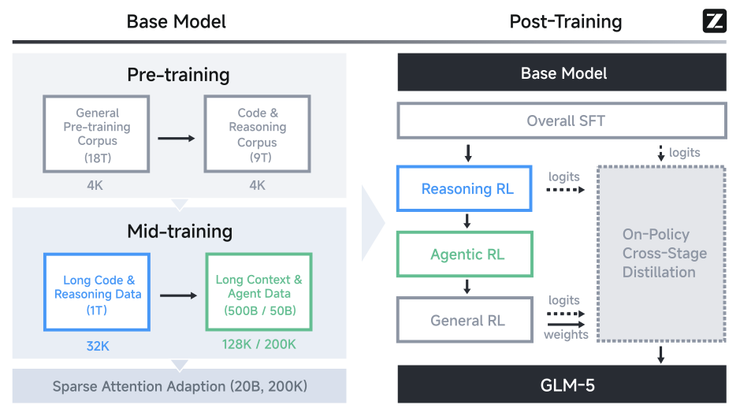
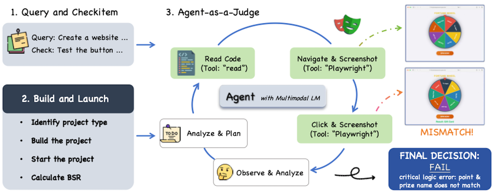

# GLM-5 技术报告研究

> **标题**：`GLM-5: from Vibe Coding to Agentic Engineering` 
> **来源**：arXiv
> **arXiv**：`2602.15763`
> **DOI**：`10.48550/arXiv.2602.15763`
> **全文入口**：https://arxiv.org/abs/2602.15763
> **文档类型**：Report object study
> **当前状态**：Based on the original arXiv paper `2602.15763`
> **主要材料**：arXiv 原报告全文
> **最后整理**：2026-07-05

---

[TOC]

## 一、阅读说明

本文档把 `GLM-5: from Vibe Coding to Agentic Engineering` 这份原报告本身当作研究对象，适合已经知道 `GLM-5.x` 大致背景、想继续深入报告技术细节的读者。

如果只想快速理解版本关系，优先读 [`glm-5.x-evolution.md`](./glm-5.x-evolution.md)；如果要理解报告如何论证 `GLM-5` 的模型架构、训练流程、RL 系统和评测设计，再读本文。

需要先保留一个边界：本文研究的是 `GLM-5` technical report，不等于 `GLM-5.1` 或 `GLM-5.2` 的独立技术报告。报告中的训练细节、参数规模和 benchmark 结果，不能自动外推到后续版本。

## 二、TL;DR

- `GLM-5` 报告的主线不是单纯发布一个更强代码模型，而是把路线从 `vibe coding` 推向 `agentic engineering`
- 模型侧的关键变化包括更大规模 MoE、DSA / sparse attention、长上下文扩展，以及围绕长程任务的效率设计
- 训练侧分成 pre-training、mid-training、post-training，并在 mid-training 中显式强化 long-context agentic data、repo-level code 和 issue-PR 数据
- Post-training 采用 progressive alignment strategy，把 Multi-task SFT、Reasoning RL、Agentic RL、General RL 和 Cross-stage Distillation 串成分阶段能力收敛流程
- RL 系统侧的重点不是单个奖励函数，而是 GRPO + IcePop、异步 agentic RL、TITO、Direct Double-sided Importance Sampling、DP-aware routing 等组合设计
- 评测侧用 CC-Bench-V2 与 ARC benchmarks 共同支撑结论：前者检验真实 agentic engineering 工作流，后者把 GLM-5 放回更广的 frontier model 对比
- 阅读本文时应区分“报告原文事实”“本文为便于阅读做的结构化重组”和“仍待进一步核验的技术细节”

## 三、术语预备

| 术语 | 本文中的含义 |
|------|--------------|
| `vibe coding` | 偏短交互、单次或局部代码生成的使用形态 |
| `agentic engineering` | 更长链路、更持续执行、更多工具参与的工程任务形态 |
| `DSA` | DeepSeek Sparse Attention，通过 indexer 检索 top-k key-value 条目来降低长上下文 attention 成本 |
| `MoE` | Mixture-of-Experts，只激活部分专家以扩大总参数规模并控制单次计算成本 |
| `MTP` | Multi-Token Prediction，报告中作为模型结构和推理效率相关组件出现 |
| `GRPO` / `IcePop` | RL 算法骨架与 training-inference mismatch 控制机制 |
| `TITO` | Token-in-Token-out，直接复用 rollout 产生的 tokenization 与 token stream 来支撑异步 agentic RL |
| `CC-Bench-V2` | 报告提出的 agentic engineering 评测套件，重点看模型在真实工作流中能否完成端到端任务 |

## 四、报告核心问题

报告要解决的核心问题不是"GLM-5 比前代强多少"，而是：

- 为什么路线要从 `vibe coding` 转向 `agentic engineering`
- 如何把大模型从单次代码生成工具推进到更长程、更结构化、更持续执行的智能体工程基础设施
- 在保持长上下文理解与推理能力的同时，如何控制训练与推理成本
- 如何把模型能力、系统工程与评测设计一起组织成面向真实 agent 场景的方案

报告的核心对象是"一条技术路线及其实现论证"，而不只是一个模型发布公告。

## 五、报告技术主线

### 5.1 路线转向：从 vibe coding 到 agentic engineering

报告明确提出一种路线转向：不再把模型主要理解为单次代码生成或浅层辅助工具，而是放到更长链路、更持续执行、更多工具参与的 `agentic engineering` 场景里理解。

报告比一般模型发布更强调：
- 长程任务
- coding 与 tool-use 的协同
- 在真实工程任务中持续保持约束、上下文与执行状态

### 5.2 架构与效率设计

#### 5.2.1 DSA (DeepSeek Sparse Attention)

GLM-5 采用 DSA 替代传统密集 O(L²) attention。DSA 的核心机制：

**机制与效率**

- **Indexer 检索**：引入额外的 indexer 模块，检索 top-k 最相关的 key-value 条目，仅在检索到的子集上计算 attention
- **内容感知**：与固定模式（如 sliding window）不同，DSA 根据内容动态判定 token 重要性，决定哪些 token 需要被关注
- **效率提升**：在长序列上减少约 1.5-2× 的 attention 计算量；报告引用 DeepSeek-V3.2-Exp 继续预训练引入 DSA 的结果，写明其在保持与 dense predecessor 相同 benchmark performance 的同时，支撑了“长上下文中约 90% 的 attention entries 是冗余的”这一判断

**引入与训练路径**

- **训练路径**：报告明确写出 DSA 通过 continued pre-training 从 dense base model 引入，采用两阶段策略：`dense warm-up and sparse training adaptation`
- **Warm-up**：DSA training 从 mid-training 结束时的 base model 开始；warm-up 阶段训练 `1000` steps，每步使用 `14` 个长度 `202,752` 的序列，最大学习率为 `5e-3`
- **Sparse adaptation**：随后按 mid-training 的训练数据与超参数继续训练 `20B` tokens

**长上下文对照**

- **长上下文对照结果**：报告给出 MLA 与 DSA base model 在 `MQ-NIAH-128k / MV-NIAH-128k / SQuAD-128k / HotpotQA-128k` 上的对照：`MLA = 100.0 / 95.5 / 79.7 / 66.3`，`DSA = 100.0 / 97.0 / 86.0 / 63.0`
- **SFT 对照**：报告写明用同一份 SFT 数据分别 fine-tune DSA 与 MLA 后，两者在 training loss 和 evaluation benchmarks 上打平

**RL 稳定性与实现约束**

- **RL 稳定性**：检索到的 top-k 结果对 RL 稳定性至关重要，类似于 MoE 模型中使用 routing replay 保持 activated top-k experts 以确保 training-inference consistency
- **Top-k 规模**：报告在 RL 部分明确写出 indexer 使用的 `k = 2048`
- **Deterministic top-k**：报告写明在 RL 阶段默认使用 `torch.topk` 作为 DSA Indexer 的 top-k operator；相较于 SGLang DSA Indexer 中使用的 non-deterministic CUDA-based top-k，`torch.topk` 虽然稍慢，但结果确定、输出更一致，并带来明显 RL 收益
- **非确定性实现的影响**：报告写明其他 non-deterministic top-k operators（如 CUDA 或 TileLang implementations）会在 RL 的前几步后导致性能剧烈下降，并伴随 entropy sharply drop
- **Indexer 参数处理**：报告写明 RL 阶段默认冻结 indexer parameters，以加速训练并防止 indexer 内部出现不稳定学习

**实现线索**

- **Lightning Indexer 实现线索**：报告在中文芯片适配案例中补充写到 `Lightning Indexer` 将 `score calculation`、`ReLU` 与 `TopK` 融合为单个 kernel，以允许计算与内存访问重叠
- **Sparse Flash Attention 实现线索**：同一部分还写到其 sparse attention kernel 会并行处理 `TopK tokens` 的选择与 sparse attention computation

DSA 相对 GLM-4.5 的标准 MoE 效率改进路线，目标不是单纯省算力，而是在不牺牲长上下文保真度与推理深度的前提下降低计算开销。

#### 5.2.2 MoE 规模与结构

- 总参数：`744B`（GLM-4.5 为 `355B`）
- 激活参数：`40B`（GLM-4.5 为 `32B`）
- 总专家数：`256`（GLM-4.5 为 `160`）
- 路由专家（routed experts）：`8`
- 共享专家（shared experts）：`1`
- MoE 层数：`75`（GLM-4.5 为 `89`）——减少层数以降低 expert parallelism communication overhead
- Dense 层：`3`，MTP 层：`1`
- Hidden Dim：`6144`（GLM-4.5 为 `5120`）
- MoE Intermediate Dim：`2048`（GLM-4.5 为 `1536`）
- Vocabulary Size：`154880`（GLM-4.5 为 `151552`）

#### 5.2.3 注意力结构变化

| 字段 | GLM-4.5 | GLM-5 |
|------|---------|-------|
| QK Head Dim | 128 | 192 |
| V Head Dim | 128 | 256 |
| Attention Heads | 96 | 64 |
| Key-Value Heads | 8 | –（移除） |
| Indexer Attn Heads | – | 32 |
| Indexer Head Dim | – | 128 |
| Q LoRA Dim | – | 2048 |
| KV LoRA Dim | – | 512 |

GLM-5 移除了 GLM-4.5 中的 Key-Value Heads（原为 8），新增了 Indexer Attn Heads（32 个，Head Dim 128）和 Q/KV LoRA Dim。这组变化说明 DSA 不是抽象口号——indexer 和 LoRA 维度已经写入模型结构定义中。

#### 5.2.4 参数统计口径

报告明确说明：参数统计计入 MTP 层参数，不计入词嵌入和输出层。这解释了为什么 `744B` 不应与别处的 `753B` / `754B` 直接混写——不同来源可能采用了不同的统计边界。

### 5.3 训练流程

#### 5.3.1 Pre-training

- 总训练 token 预算：`28.5T`（base model 全部阶段合计）
- Pre-training 阶段：`27T` tokens
- 数据策略：优先引入 code 和 reasoning 数据
- 结构：pre-training + mid-training 两阶段

#### 5.3.2 Mid-training

**Context extension 阶段**

- 逐步将上下文长度从 `4K` 推进到 `200K`
- 分阶段：`32K (1T tokens)` → `128K (500B tokens)` → `200K (50B tokens)`
- 相比 GLM-4.5：在 `128K` 之外新增 `200K` stage，用于 ultra-long documents 和 complex multi-file codebases

**长上下文数据构造**

- 数据焦点：long-context agentic data，同时包含 natural data 与 synthetic data
- Natural data：从 books、academic papers、general pre-training corpora 中的 documents 构建，经过 multi-stage filtering（`PPL`、`deduplication`、`length`）以及 knowledge-intensive domains upsampling
- Synthetic data：受 `NextLong` 与 `EntropyLong` 启发，通过多种技术显式制造 long-range dependencies
- Interleaved packing：将 highly similar texts 聚合后做交错穿插（如 `A1+B1+C1+A2+B2+C2` 而非 `A全部+B全部+C全部`），把相关信息分散到长上下文不同位置，促使模型学习跨段定位与关联，缓解 lost-in-the-middle phenomenon
- `200K` stage 补充：额外加入少量 MRCR-like data（扩展 OpenAI 原始范式），用于增强 extended multi-turn dialogues 中的 recall
- 数据分布调整：long documents 与 synthetic agent trajectories 在 later stages 被 up-sample；报告写明 `200K` stage 也进一步提升了 `128K` context window 内的表现

**软件工程数据**

- 延续将 repo-level code files、commit diffs、GitHub issues、pull requests 与 relevant source files 拼接为统一训练序列的范式
- Issue-PR 扩展：放宽 repository-level filtering criteria 后，得到约 `10 million issue–PR pairs`
- Issue 级过滤：强化 individual issue-level quality filtering 以降低噪声
- Relevant files 扩展：为每个 issue–PR pair 检索更大规模 relevant files，增强 development context 覆盖
- 数据规模：过滤后约 `160B unique tokens`

#### 5.3.3 Post-training

图：GLM-5 整体训练流程。

Post-training 的目标，是把 base model 进一步变成一个具备 robust reasoning、coding 与 agentic abilities 的 highly capable assistant。

Post-training 采用 progressive alignment strategy：

1. **Multi-task SFT**：引入 interleaved thinking modes
2. **Reasoning RL**：专门化推理能力强化
3. **Agentic RL**：agent 任务能力强化
4. **General RL**：human-style alignment 收束
5. **On-policy Cross-stage Distillation**：贯穿整个 pipeline 的最终精炼

报告把 reasoning、agentic ability、general assistant behavior 拆成有次序的能力收敛过程，而非一次性联合优化；并将 on-policy cross-stage distillation 放在最终 refinement 阶段，用于缓解 capability regression，同时吸收前面各阶段的收益。

相比 `GLM-4.5`，`GLM-5` 在 SFT 阶段显著扩大了 `Agent` 与 `Coding` 数据规模。

**SFT 语料构成**

- **General Chat**：question answering、writing、role-playing、translation、multi-turn dialogue、long-context interactions；报告并写明该类数据会把 response style 调整得比 `GLM-4.5` 更 logical and concise，role-playing 数据也被扩展到更广的多语言与多角色配置，并通过若干 evaluation dimensions 配合 automatic / human filtering 做数据筛选
- **Reasoning**：mathematical、programming、scientific reasoning；其中 logical reasoning 会构造 verifiable problems，并通过 rejection sampling 合成高质量数据，mathematics 与 science 则采用 difficulty-based filtering，仅保留对 `GLM-4.7` 足够有挑战的问题
- **Coding & Agent**：frontend and backend engineering code、tool calling、coding agents、search agents、general-purpose agents；报告写明该类数据会构造大量 执行环境（execution environments）以获取 high-quality trajectories，并特别强调 real-world scenarios 与 long-horizon tasks；同时用 expert reinforcement learning 与 rejection sampling 进一步改进 SFT data，并保留 erroneous trajectory segments 但在 loss 中将其 mask 掉，以学习 error correction 而不强化错误动作

**SFT 配置与 thinking modes**

- 最大 context length 扩展到 `202,752` tokens
- 配合 updated chat template，模型支持三种 thinking characteristics：`Interleaved Thinking`、`Preserved Thinking`、`Turn-level Thinking`
  - `Interleaved Thinking`：在每次 response 和 tool call 之前先进行 thinking，用于提升指令跟随与生成质量
  - `Preserved Thinking`：在 coding agent 场景中自动保留对轮对话中的所有 thinking blocks，复用已有 reasoning 而不是从头重推，从而减少 information loss 与 inconsistencies，并更适合 long-horizon、complex tasks
  - `Turn-level Thinking`：支持在同一轮对话会话中按 turn 控制 reasoning 的开启与关闭；对较轻量的请求可关闭 thinking 以降低延迟与成本，对复杂任务则可开启 reasoning 以提升准确性与稳定性

通过在 actions 之间插入 thinking，并在多轮交互中维持 reasoning 的连续性，GLM-5 在复杂任务上表现出更稳定、也更可控的行为。

Reasoning RL 阶段主要包括：

- 采用 mixed RL training，覆盖四个 domain：`mathematics`、`science`、`code`、`tool-integrated reasoning (TIR)`
  - mathematics / science：数据来自 open-source datasets 以及与 external annotation vendors 共建的数据，并经过 difficulty filtering；报告写明保留的是 `GLM-4.7` 只能少量答对或持续答错、但仍可被更强 teacher models 解出的题目
  - code：覆盖 competitive programming style tasks 与 scientific coding tasks；前者主要来自 `Codeforces`、`TACO`、`SYNTHETIC-2-RL`，后者则来自 internal problem pools，并通过将问题分解为最小可执行代码实现来构造
  - TIR：复用更高难度的 mathematics / science RL data，并加入与 annotation vendors 共建、明确设计为需借助 external tools 回答的 STEM questions
- 奖励来源：按 domain 和 source 指派 judge models 或 evaluation systems，输出 binary outcome rewards
- 数据混合：四个 domain 的 mixture 保持大致均衡，并在 mixed RL setting 下持续观察到各 domain 上稳定且显著的收益

General RL 阶段主要包括：

- 优化目标拆为三个维度：`foundational correctness`、`emotional intelligence`、`task-specific quality`
  - `foundational correctness`：作为 response quality 的基础层，主要针对 instruction-following failures、logical inconsistencies、factual inaccuracies、knowledge hallucinations、language disfluencies 等问题，目标是先把回答拉到基本可用的基线水平
  - `emotional intelligence`：关注 core correctness 之外的 user experience，目标是让回答更 empathetic、insightful，并更接近自然人类交流
  - `task-specific quality`：在 correctness 之上做细粒度优化，使回答不只停留在“基本正确、勉强可用”，而是在具体任务中进一步达到真正高质量的完成度；覆盖 writing、text processing、subjective / objective question answering、role-playing、translation 等任务
- 奖励系统由三类信号组成：`rule-based reward functions`、`outcome reward models (ORMs)`、`generative reward models (GRMs)`
  - 报告强调三类信号各有 strengths / weaknesses，它们的组合是实现稳定、高效、可扩展 General RL training 的关键
- 报告写明 human-authored responses 被显式引入，作为 stylistic and qualitative anchors
  - 其动机是避免 purely model-generated optimization 逐渐收敛到过于 "model-like" 的表达模式，例如过度冗长、公式化、或缺少熟练人类写作中的细微差异

Agentic RL 阶段主要包括：

- 目标任务是 `coding` 与 `search agent` tasks，采用 `fully asynchronous and decoupled RL framework`
- 核心动机是解决 naive synchronous RL 在 long-horizon agent rollouts 中造成的严重 GPU idle time
- 具体训练设计、目标函数、异步稳定性机制与基础设施归属见 §5.4.2

**各阶段质量标准对照**

> 以下为报告各阶段质量标准的跨阶段重组织，便于实践对照；非报告原文的独立章节。

- SFT 阶段：`General Chat` 强调更 logical and concise 的 response style，配合 instruction following、linguistic expressiveness、creativity、logical coherence、long-dialogue consistency 等维度做数据筛选；`Reasoning` 强调 verifiable problems、rejection sampling 与 difficulty-based filtering；`Coding & Agent` 强调 execution environments、real-world scenarios、long-horizon tasks，以及对 erroneous trajectory segments 的保留与 masking
- Reasoning RL 阶段：可验证、足够有挑战、并能被 domain-specific judges 或 evaluation systems 判定优劣的推理结果
- General RL 阶段：`foundational correctness`（回答先达到基本可用）、`emotional intelligence`（回答更接近自然人类交流）、`task-specific quality`（不只正确，而且在具体任务中完成得更好）
- Agentic RL 与评测阶段：长链路任务中的真实完成效果，而不只是局部回答看起来正确

### 5.4 RL 算法与训练系统

#### 5.4.1 RL 算法

报告中的标准 RL 阶段采用 `GRPO + IcePop`。其中，GRPO 提供 group-wise policy optimization 的基本骨架；IcePop 则负责处理 `training-inference mismatch`，也就是训练侧重算 token 概率时的分布，和 rollout / 推理侧实际生成 token 时的分布不一致。

这点容易和 KL regularization 混淆。IcePop 在这里比较的不是当前策略模型与 reference model 的距离，而是同一个 old policy 在 `train` 与 `infer` 两种口径下对同一 token 的概率差异。换句话说，它关心的不是“新策略是否离参考策略太远”，而是“这条 rollout 轨迹拿回训练系统后，token 概率是否还能和生成它时的推理口径对得上”。

如果这种 train / infer 口径差异过大，某些 token 的梯度更新会被不可靠的分布偏差放大。IcePop 因此更像一个 token-level 训练信号筛选门：rollout 轨迹先由 $\pi_{\text{old}}^{\text{infer}}$ 生成；训练时再用 $\pi_{\text{old}}^{\text{train}}$ 重算同一 token 的概率，得到 mismatch ratio $\rho_{i,t}$；$\rho_{i,t}$ 落在可接受区间内时保留该 token 的 loss 贡献，偏差过大时将贡献置零。

报告还写明，GLM-5 相比原始 IcePop 移除了 KL regularization 项，以加速 RL 改进。也就是说，这里的稳定性主要依赖 `pop(·)` 对 train / infer mismatch 的过滤，而不是额外用 KL 项持续拉住策略分布。

**总体目标函数**

$$
\mathcal{L}(\theta)=
-\mathbb{E}_{
x \sim \mathcal{D},
\{y_i\}_{i=1}^{G} \sim \pi^{\text{infer}}_{\theta_{\text{old}}}(\cdot \mid x)
}
\Bigg[
\frac{1}{G}
\sum_{i=1}^{G}
\frac{1}{|y_i|}
\sum_{t=1}^{|y_i|}
\operatorname{pop}
(\rho_{i,t}, 1/\beta, \beta) \\
\cdot
\min\!\left(
r_{i,t}\hat{A}_{i,t},
\operatorname{clip}\!\left(
r_{i,t},
1-\epsilon_{\text{low}},
1+\epsilon_{\text{high}}
\right)
\hat{A}_{i,t}
\right)
\Bigg],
$$

这条 loss 可以拆成两层看：$\operatorname{pop}(\rho_{i,t}, 1/\beta, \beta)$ 决定这个 token 的训练信号是否可信；后面的 PPO-style clipped objective 决定当前策略 $\pi_\theta$ 如何相对 old policy 更新。

**Mismatch ratio 与 `pop(·)`**

$$
\rho_{i,t}
=
\frac{
\pi_{\theta_{\text{old}}}^{\text{train}}(y_{i,t} \mid x, y_{i,<t})
}{
\pi_{\theta_{\text{old}}}^{\text{infer}}(y_{i,t} \mid x, y_{i,<t})
}.
$$

$$
\operatorname{pop}(\rho_{i,t}, 1/\beta, \beta)
=
\begin{cases}
\rho_{i,t}, & 1/\beta \le \rho_{i,t} \le \beta, \\
0, & \text{otherwise}.
\end{cases}
$$

这里的 $\rho_{i,t}$ 对当前参数更新来说是固定筛选因子：它只由 old policy 的 `train` / `infer` 概率口径决定。报告给出的超参数是 $\beta=2$，即 mismatch ratio 超出 $[1/2, 2]$ 区间时，该 token 的贡献被置零。

**Policy ratio**

$$
r_{i,t}
=
\frac{
\pi_\theta^{\text{train}}(y_{i,t}\mid x,y_{i,<t})
}{
\pi_{\theta_{\text{old}}}^{\text{train}}(y_{i,t}\mid x,y_{i,<t})
}.
$$

小写 $r_{i,t}$ 不是 reward，而是 policy ratio。它衡量当前策略相对 old policy 在训练口径下对同一 token 的概率变化幅度，因此和 KL regularization 一样，都有防止策略更新过猛的作用；区别在于 KL 更像整体分布距离约束，而这里的 clipped objective 是在 token / sample 级别限制 policy ratio 的有效更新范围。

**Advantage**

$$
\hat{A}_{i,t}
=
\frac{
R_i - \operatorname{mean}(R_1,\dots,R_G)
}{
\operatorname{std}(R_1,\dots,R_G)
}.
$$

大写 $R_i$ 才是第 $i$ 条 response / trajectory 的 reward，承接任务级别的好坏判断；$\hat{A}_{i,t}$ 则把这个 reward 放到同组样本里归一化，形成真正指引优化方向的 advantage。

因此，这个目标函数里可以把 $\operatorname{pop}(\rho)$ 理解为“训练信号可信度过滤”，把 $r_{i,t}$ 和 clipped objective 理解为“策略更新幅度控制”，把 $R_i / \hat{A}_{i,t}$ 理解为“任务奖励与优化方向”。标准 RL 阶段采用 group size = 32、batch size = 32，并保持完全 on-policy。

#### 5.4.2 Agentic RL 异步训练设计与 Cross-stage Distillation

**Agentic RL：**

**优化目标与基本定义**

- **基础算法**：报告写明采用 group-wise policy optimization algorithm
- **优化目标**：对每个问题 $x$，从 previous policy $\pi_{\text{old}}$ 采样 $K$ 条 agent traces $\{y_1, \dots, y_K\}$
- **目标函数**：

$$
L(\theta)
   = \mathbb{E}_{x\sim\mathcal{D}}\!\left[
        \frac{1}{K}\sum_{i=1}^{K}
        \left(
            r(x,y_i) - \bar{r}(x)
        \right)
     \right],
$$

- **均值奖励定义**：

$$
\bar{r}(x) \;=\; \frac{1}{K}\sum_{i=1}^{K} r\bigl(x,y_i\bigr)
$$

**异步训练与基础设施**

- **loss 计算边界**：报告明确写出 only model-generated tokens are used for optimization，environment feedback is ignored in loss computation
- **异步训练设计**：training engine 与 inference engine 部署在不同 GPU devices；inference engine 持续生成 trajectories，达到 predefined threshold 后送入 training engine 更新
- **Policy lag 控制**：rollout engine 使用的权重会与 training engine 周期性同步；training engine 每 `K` 次 gradient updates 把新权重推回 inference engine
- **Optimizer 处理**：报告写明 inference engine 每次权重更新后 reset optimizer
- **Server-based multi-task training**：各任务将 rollout / reward logic 作为独立 microservice 注册到 central orchestrator，由其控制 per-task rollout ratio 与 generation speed
- **统一轨迹表示**：所有 agentic tasks 的 trajectories 被标准化为 unified `message-list representation`
- **并发能力**：orchestrator 支持 `over 1k concurrent rollouts`
- **TITO 机制**：`Token-in-Token-out` 直接消费 inference engine 产生的 exact tokenization 与 decoded-token stream；报告写明 TITO Gateway 会记录 each trajectory's token IDs and metadata
- **Direct Double-sided Importance Sampling 的动机**：在 asynchronous setting 下，单条 trajectory 生成过程中 rollout engine 可能经历多次更新，导致精确追踪 $\pi_{\theta_{\text{old}}}$ 代价过高，需要避免维护大量历史 checkpoints
- **Importance ratio 定义**：

$$
r_t(\theta) = \exp\left( \log \pi_\theta(a_t|s_t) - \log \pi_{\text{rollout}}(a_t|s_t) \right)
$$

- **Token-level clipping 目标函数**：

$$
L(\theta) = \mathbb{E}_t \left[ f(r_t(\theta), \epsilon_l, \epsilon_h) \hat{A}_t \log \pi_{\theta}(a_t|s_t) \right]
$$

- **Calibration function**：

$$
f(x; \epsilon_\ell, \epsilon_h) = 
    \begin{cases} 
    x, & \text{if } 1-\epsilon_\ell < x < 1+\epsilon_h \\
    0, & \text{otherwise}
    \end{cases}
$$

**稳定性与过滤机制**

- **策略含义**：报告写明它复用 rollout 阶段生成的 log-probabilities 作为 direct behavior proxy，并通过双边 masking 丢弃超出 trust region 的 token
- **Off-policy sample 过滤**：记录 response 对应的 model version sequence $(w_0, \ldots, w_k)$；若当前 policy version $w'$ 与最旧 rollout version 的差超过阈值 $\tau$，则丢弃该样本
- **Noisy sample 过滤**：若样本失败原因来自 environment collapse，则排除；对 group-based sampling，当移除失败样本后 group 不完整时，若 valid samples 超过 group size 一半则重复填充，否则丢弃整个 group
- **DP-aware routing**：对同一 rollout ID 使用 consistent hashing 绑定固定 DP rank，并配合 lightweight dynamic load rebalancing，以减少 cross-rank cache misses 与冗余 prefill

**Cross-stage Distillation：**

**Teacher 与训练组织**

- **机制**：on-policy distillation，使用 teacher model 的 logits 作为监督信号
- **Teacher 来源**：报告明确写出 preceding training stages 的 final checkpoints 作为 teacher models
- **Prompt 来源**：training prompts 从对应 teacher 的 RL training sets 中采样，并按 appropriate proportions 混合
- **Teacher logits 获取**：当前通过 inference engine 获取 teacher logits（未来计划迁移到 training engine 并统一采用 MLA 的 MQA 模式）
- **Advantage 计算**：直接从与 teacher model 的差距计算 advantage，不再需要大 group 采样
- **Advantage 替换公式**：

$$
\hat{A}_{i,t} = \text{sg}\left[\log\frac{\pi_{\theta_{\text{teacher}}}^{\text{infer}}(y_{i,t}\mid x,y_{i,<t})}{\pi_\theta^{\text{train}}(y_{i,t}\mid x,y_{i,<t})}\right].
$$

**配置与目标**

- **`sg` 含义**：报告说明 `sg` 表示 stop gradient operation（例如 `.detach()`）
- **Distillation 阶段配置**：group size = 1，batch size = 1024
- **可行性说明**：报告明确写出这一阶段不再需要为每个 prompt 维持 large group samples 来估计 advantage，因为 advantage 直接来自与 teacher models 的差距
- **目标**：缓解 cumulative degradation、catastrophic forgetting / capability regression，在吸收后续阶段收益时保住前一阶段的 reasoning edge 或 agentic ability

三者关系：异步 RL 基础设施提供运行效率 → sequential RL pipeline 安排能力对齐顺序 → cross-stage distillation 降低阶段切换带来的能力回退。

#### 5.4.3 RL 训练基础设施：slime Framework

- **框架名称**：slime
- **核心能力**：高度可定制的 rollout 接口 + server-based rollout execution
- **支持的 rollout 逻辑**：multi-turn interaction loops、tool invocation、environment feedback handling、verifier-guided branching
- **统一训练栈**：reasoning RL、general RL、agentic RL、on-policy distillation 全部在同一个训练栈内完成，无需 task-specific forks

#### 5.4.4 工程优化与 GPU 适配

- 从底层 kernel 到上层 inference framework 的完整工程优化
- 适配 7 个国产 GPU 平台：Huawei Ascend、Moore Threads、Hygon、Cambricon、Kunlunxin、MetaX、Enflame

### 5.5 评测方法与基准设计

#### 5.5.1 CC-Bench-V2

CC-Bench-V2 是报告专门提出的内部评测套件，评估模型在真实 agentic engineering 环境中能否完成端到端任务。

**评测覆盖三类任务：**

- **Frontend**：先用 pipeline 构建前端项目，检查 syntax、dependency、compatibility 错误；然后用 Agent-as-a-Judge 通过 GUI agent（配备 Playwright 和 bash tools）模拟用户交互，验证端到端正确性
- **Backend**：贴近真实 workflow 的 end-to-end completion
- **Long-horizon task**：长程任务执行

**评测协议：**
- 完全移除人工标注
- 使用 Claude Code 和其他 agent harness
- 结合 unit tests 与 Agent-as-a-Judge 技术
- 评测单位不是"单题回答"，而是"agent 在可验证环境里是否完成了一项工作"

图：Agent-as-a-Judge 评测流程。

**报告中的具体结果：**

- Frontend 总体：报告正文另写明 `GLM-5 achieves 98.0% BSR`
- Backend 任务规模：报告明确写出 backend evaluation 共 `85` 个任务，覆盖 `Python`、`Go`、`C++`、`Rust`、`Java`、`TypeScript` 六种语言；任务类型包括 `feature implementation`、`bug fixes`、`regression repair`、`performance optimization`
- Frontend 场景范围：报告写明 frontend benchmark 覆盖 `landing pages`、`management dashboards`、`data visualization`、`graphics and animations`、`online productivity tools`、`interactive games`、`form-driven workflows`，并覆盖 `HTML`、`React`、`Vue`、`Svelte`、`Next.js`
- Frontend 数据规模：appendix 明确写出 frontend benchmark 最终包含 `220` 个 high-quality frontend coding tasks
- Frontend 场景分布：`Business Systems 42 / 167 check-items`、`Web Games 40 / 163`、`SVG/Canvas 32 / 166`、`Creative Tools 28 / 160`、`Showcase Pages 27 / 115`、`Forms & Tables 26 / 93`、`Data Visualization 25 / 85`
- Frontend 技术栈分布：`HTML 113 / 490 check-items`、`React 58 / 249`、`Vue 49 / 210`
- Frontend 验证可靠性：报告写明 Agent-as-a-Judge 与 human experts 在 `130` 个 check-items 上 point-wise consistency 为 `94%`，在 `8` 个 frontier models 的 ranking consistency 上 Spearman correlation 为 `85.7%`
- Repo Exploration 协议：报告写明 `Pass@1` 取三次运行平均；问题以自然语言业务语义描述，不直接提文件名、类名、函数名
- Chained Tasks 构造规则：报告写明只保留带 tests、包含 `3--15 commits`、且为 linear history 的 merged PR；随后做 semantic grouping、patch triage、problem statement generation、task classification 与 environment validation

| 任务 | GLM-5 | GLM-4.7 | Claude Opus 4.5 |
|------|------:|------:|------:|
| Frontend / HTML (ISR) | 38.9 | 35.4 | 52.2 |
| Frontend / HTML (CSR) | 76.3 | 64.9 | 82.2 |
| Frontend / React (ISR) | 34.6 | 17.2 | 39.7 |
| Frontend / React (CSR) | 71.0 | 49.4 | 70.7 |
| Frontend / Vue (ISR) | 32.7 | 24.5 | 46.9 |
| Frontend / Vue (CSR) | 77.1 | 53.8 | 74.3 |
| Build / React (BSR) | 100 | 65.0 | 95.0 |
| Build / Vue (BSR) | 100 | 70.0 | 100 |
| Build / Svelte (BSR) | 100 | 60.0 | 90.0 |
| Build / Next.js (BSR) | 95.0 | 70.0 | 80.0 |
| Backend / Engineering (Pass@1) | 25.8 | 19.6 | 26.9 |
| Long-horizon / Repo Exploration (Pass@1) | 65.6 | 47.8 | 64.5 |
| Long-horizon / Chained Tasks (Pass@1) | 52.3 | 43.0 | 61.6 |

**结果：** GLM-5 在 frontend、backend、long-horizon 任务上显著优于 GLM-4.7，缩小了与 Claude Opus 4.5 的差距。

#### 5.5.2 ARC Benchmarks

报告在 ARC benchmarks 上将 GLM-5 与以下模型对比：

- GLM-4.7
- DeepSeek-V3.2
- Kimi-K2.5
- Claude Opus 4.5
- Gemini 3 Pro
- GPT-5.2 (xhigh)

报告中的 ARC 主表如下：

| Benchmark | GLM-5 | GLM-4.7 | DeepSeek-V3.2 | Kimi-K2.5 | Claude Opus 4.5 | Gemini 3 Pro | GPT-5.2 (xhigh) |
|------|------:|------:|------:|------:|------:|------:|------:|
| HLE | 30.5 | 24.8 | 25.1 | 31.5 | 28.4 | 37.2 | 35.4 |
| HLE (w/ Tools) | 50.4 | 42.8 | 40.8 | 51.8 | 43.4* | 45.8* | 45.5* |
| AIME 2026 I | 92.7 | 92.9 | 92.7 | 92.5 | 93.3 | 90.6 | - |
| HMMT Feb. 2025 | 97.9 | 97.1 | 92.5 | 95.4 | 92.9 | 97.3 | 99.4 |
| HMMT Nov. 2025 | 96.9 | 93.5 | 90.2 | 91.1 | 91.7 | 93.0 | 97.1 |
| IMO-AnswerBench | 82.5 | 82.0 | 78.3 | 81.8 | 78.5 | 83.3 | 86.3 |
| GPQA-Diamond | 86.0 | 85.7 | 82.4 | 87.6 | 87.0 | 91.9 | 92.4 |
| LongBench v2 | 64.5 | 59.1 | 59.8 | 61.0 | 64.4 | 68.2 | 59.8 |
| SWE-bench Verified | 77.8 | 73.8 | 73.1 | 76.8 | 80.9 | 76.2 | 80.0 |
| SWE-bench Multilingual | 73.3 | 66.7 | 70.2 | 73.0 | 77.5 | 65.0 | 72.0 |
| Terminal-Bench 2.0 (Terminus-2) | 56.2 / 60.7† | 41.0 | 39.3 | 50.8 | 59.3 | 54.2 | 54.0 |
| Terminal-Bench 2.0 (Claude Code) | 56.2 / 61.1† | 32.8 | 46.4 | - | 57.9 | - | - |
| CyberGym | 43.2 | 23.5 | 17.3 | 41.3 | 50.6 | 39.9 | - |
| BrowseComp | 62.0 | 52.0 | 51.4 | 60.6 | 37.0 | 37.8 | - |
| BrowseComp (w/ Context Manage) | 75.9 | 67.5 | 67.6 | 74.9 | 57.8 | 59.2 | 65.8 |
| BrowseComp-ZH | 72.7 | 66.6 | 65.0 | 62.3 | 62.4 | 66.8 | 76.1 |
| $\tau^2$-Bench | 89.7 | 87.4 | 85.3 | 80.2 | 91.6 | 90.7 | 85.5 |
| MCP-Atlas (Public Set) | 67.8 | 52.0 | 62.2 | 63.8 | 65.2 | 66.6 | 68.0 |
| Tool-Decathlon | 39.2 | 23.8 | 35.2 | 27.8 | 43.5 | 36.4 | 46.3 |
| Vending-Bench 2 | \$4,432 | \$2,377 | \$1,034 | \$1,198 | \$4,967 | \$5,478 | \$3,591 |
| GDPval-AA Elo | 1,409 | 1,198 | 1,195 | 1,288 | 1,400 | 1,201 | 1,462 |

补充说明：

- `*`：报告注明 HLE with Tools 中带 `*` 的结果来自 full set of HLE
- `†`：报告注明 Terminal-Bench 2.0 中带 `†` 的结果是在 verified version 上评测，修复了部分 ambiguous instructions
- MCP-Atlas：报告正文明确写出是对 `500-task public set` 重新评测，并将 timeout 从 `4 minutes` 延长到 `10 minutes per task`

GLM-5 在开源模型中达到 SOTA，缩小了与 proprietary models 的差距。

#### 5.5.3 两套评测的互补关系

- ARC benchmarks：把 GLM-5 放回更广的 frontier model 比较
- CC-Bench-V2：证明这些能力是否真正迁移到了真实 agent 工作流中

CC-Bench-V2 补上了从"benchmark 能力"到"真实 agent 工程执行"之间的论证链。

### 5.6 GLM-4.5 至 GLM-5 结构规格差异

完整对比表：

| 字段 | GLM-4.5 | GLM-5 |
|------|---------|-------|
| Total Parameters | 355B | 744B |
| Activated Parameters | 32B | 40B |
| Dense Layers | 3 | 3 |
| MoE Layers | 89 | 75 |
| MTP Layers | 1 | 1 |
| Hidden Dim | 5120 | 6144 |
| Dense Intermediate Dim | 12288 | 12288 |
| MoE Intermediate Dim | 1536 | 2048 |
| QK Head Dim | 128 | 192 |
| V Head Dim | 128 | 256 |
| Q LoRA Dim | – | 2048 |
| KV LoRA Dim | – | 512 |
| Attention Heads | 96 | 64 |
| Key-Value Heads | 8 | – |
| Indexer Attn Heads | – | 32 |
| Indexer Head Dim | – | 128 |
| Experts (total) | 160 | 256 |
| Routed Experts | 8 | 8 |
| Shared Experts | 1 | 1 |
| Vocabulary Size | 151552 | 154880 |

关键变化分组：

- **规模扩张**：总参数翻倍（355B→744B），激活参数提升（32B→40B），专家数增加（160→256）
- **层级调整**：MoE 层数减少（89→75）以降低 expert parallelism communication overhead
- **注意力重构**：移除 Key-Value Heads，新增 Indexer Attn Heads 和 Indexer Head Dim，QK/V Head Dim 扩大
- **新增低秩维度**：Q LoRA Dim=2048、KV LoRA Dim=512（GLM-4.5 中不存在）
- **参数口径**：计入 MTP 层，不计入词嵌入和输出层

## 六、版本外推边界

- 不把 GLM-5 报告中的训练细节、参数规模、benchmark 表现自动外推到 GLM-5.1 或 GLM-5.2
- 不因为 GLM-5.1 / GLM-5.2 回引这份报告，就把它们也当成各自拥有独立 technical report
- 不把报告里的技术路线背景，直接写成后续版本已经独立验证过的完整事实

## 七、后续研究方向

当前版本已从原报告提取了主要技术内容，但仍可继续深化的方向：

1. DSA indexer 的 relevance scoring 公式级细节
2. Agentic RL 中 Direct Double-sided Importance Sampling 的显式超参数取值（若报告其他部分有给出）
3. CC-Bench-V2 long-horizon 子集的样本数量
4. 报告其余附录表格与更多评测细节的系统化回填

## Evidence

- Status: Verified
- Sources:
  - https://arxiv.org/abs/2602.15763
  - https://arxiv.org/html/2602.15763v2
  - https://arxiv.org/src/2602.15763v2
- Trace: Technical details extracted from arXiv HTML and LaTeX source package. The LaTeX source was used to recover formulas, architecture spec tables, and training hyperparameters not directly extractable from the HTML rendering.
- Needs:
  - DSA indexer 的 relevance scoring 公式级细节；当前原报告只进一步暴露了 `score calculation + ReLU + TopK` 的 fused-kernel 线索
  - Explicit Agentic RL clipping hyperparameters if the original report states them elsewhere
  - CC-Bench-V2 long-horizon 子集的样本数量；frontend 部分已可从 appendix 恢复到 `220` tasks、7 类场景分布与 `HTML/React/Vue` 技术栈统计，但原报告仍未显式给出 long-horizon 子集样本数量
