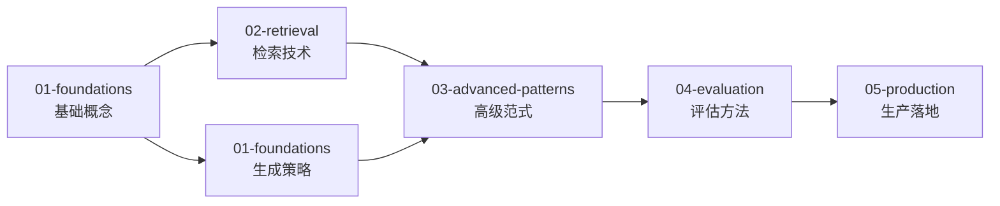

# RAG (检索增强生成)

检索增强生成：通过外部知识检索提升 LLM 的事实准确性和时效性。

> **推荐阅读**：先按本页的分类依据与目录结构建立整体方向，再按 [学习路径](#学习路径) 顺序深入各子目录。

## 分类依据

RAG 目录按"基础 → 检索 → 高级范式 → 评估 → 生产"组织。检索是 RAG 的差异化核心；03 中的 llm-wiki 等方向虽暂列于此，但关注的是查询前的知识预编译和持久化，而非经典的查询时检索拼接。

- **01（基础）**：RAG 概念、朴素 RAG、管线总览、上下文构建、生成策略
- **02（检索）**：分块、嵌入、向量数据库、高级检索方法
- **03（高级范式）**：图增强、自反思、Agent 驱动、模块化、多模态等范式，含代表实现；另含少量与 RAG 相邻但不完全等同的方向（如 llm-wiki）。这类目录讨论的是知识组织范式，不承接 `PageIndex` 这类可独立成立的检索框架主条目
- **04（评估）**：端到端指标、公开基准
- **05（生产）**：框架、缓存与扩展、安全与隐私

## 边界说明

| 内容 | 归属 | 说明 |
|------|------|------|
| Prompt 工程 | [../llm/04-serving/prompt-engineering/](../llm/04-serving/prompt-engineering/) | 通用技术 |
| LLM 推理优化 | [../llm/04-serving/](../llm/04-serving/) | 通用推理优化 |
| 知识图谱通用构建方法 | [../knowledge-graph/02-construction/](../knowledge-graph/02-construction/) | 实体抽取、关系抽取等基础方法 |
| 知识图谱在 RAG 中的应用 | `03-advanced-patterns/graph-rag/` | GraphRAG 等方案集中在此 |
| Agent 体系知识 | [../agentic/](../agentic/) | Agent 驱动 RAG 在 `03-advanced-patterns/agentic-rag/` |

## 目录结构

```
rag/
├── 01-foundations/                  # 基础
│   ├── what-is-rag/                 # RAG概念与动机
│   ├── naive-rag/                   # 朴素RAG
│   ├── rag-pipeline-overview/       # 管线总览
│   ├── context-integration/         # 上下文构建与注入
│   ├── generation-strategies/       # 生成策略
│   └── evaluation-of-generation/    # 生成质量评估
│
├── 02-retrieval/                    # 检索
│   ├── chunking-strategies/         # 分块策略
│   │   ├── fixed-size/
│   │   └── semantic-chunking/
│   ├── embedding-models/            # 嵌入模型
│   │   ├── dense-embeddings/
│   │   └── sparse-embeddings/
│   ├── vector-databases/            # 向量数据库
│   └── advanced-retrieval/          # 高级检索
│       ├── hybrid-retrieval/
│       ├── multi-hop-retrieval/
│       ├── recursive-retrieval/
│       ├── reranking/
│       └── page-index/
│
├── 03-advanced-patterns/            # 高级范式（含代表实现）
│   ├── graph-rag/                   # 图增强RAG（含Microsoft GraphRAG）
│   ├── self-reflective-rag/         # 自反思RAG（含Self-RAG、Corrective RAG）
│   ├── agentic-rag/                 # Agent驱动RAG
│   ├── modular-rag/                 # 模块化RAG
│   ├── multimodal-rag/              # 多模态RAG
│   └── llm-wiki/                    # LLM Wiki / 知识编译范式（非狭义 RAG，见该目录 README）
│
├── 04-evaluation/                   # 评估
│   ├── end-to-end-metrics/
│   └── public-benchmarks/
│
└── 05-production/                   # 生产与生态
    ├── frameworks/
    ├── caching-and-scaling/
    └── security-and-privacy/
```

## 开源仓库与工具存放指南

| 仓库/工具 | 放入目录 | 说明 |
|-----------|---------|------|
| 具体 RAG 范式的代表实现 | `03-advanced-patterns/` 对应子目录 | GraphRAG、HippoRAG 等与范式放在一起 |
| 通用 RAG 框架（LlamaIndex, LangChain RAG 等） | `05-production/frameworks/` | 工程化框架 |
| RAG 评估套件（RAGAS, TruLens 等） | `04-evaluation/` | 评估工具 |

## 学习路径



## 相关资源

- [LLM 推理](../llm/04-serving/) — 生成模块优化
- [知识图谱](../knowledge-graph/) — 结构化知识源
- [LLM 评估](../llm/05-evaluation/) — 通用评估方法
- [Agentic AI](../agentic/) — Agent 驱动的 RAG 范式

---

*最后更新: 2026-05-11*
